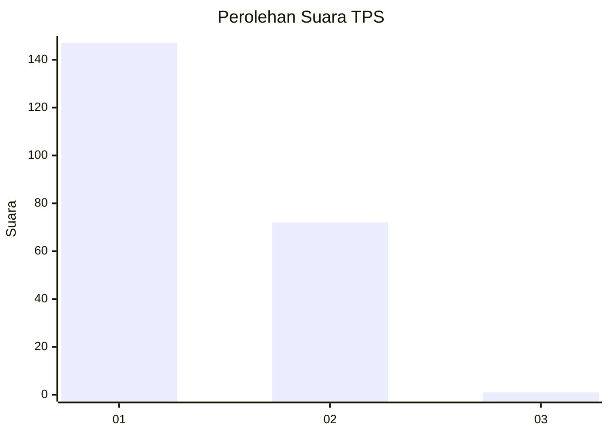
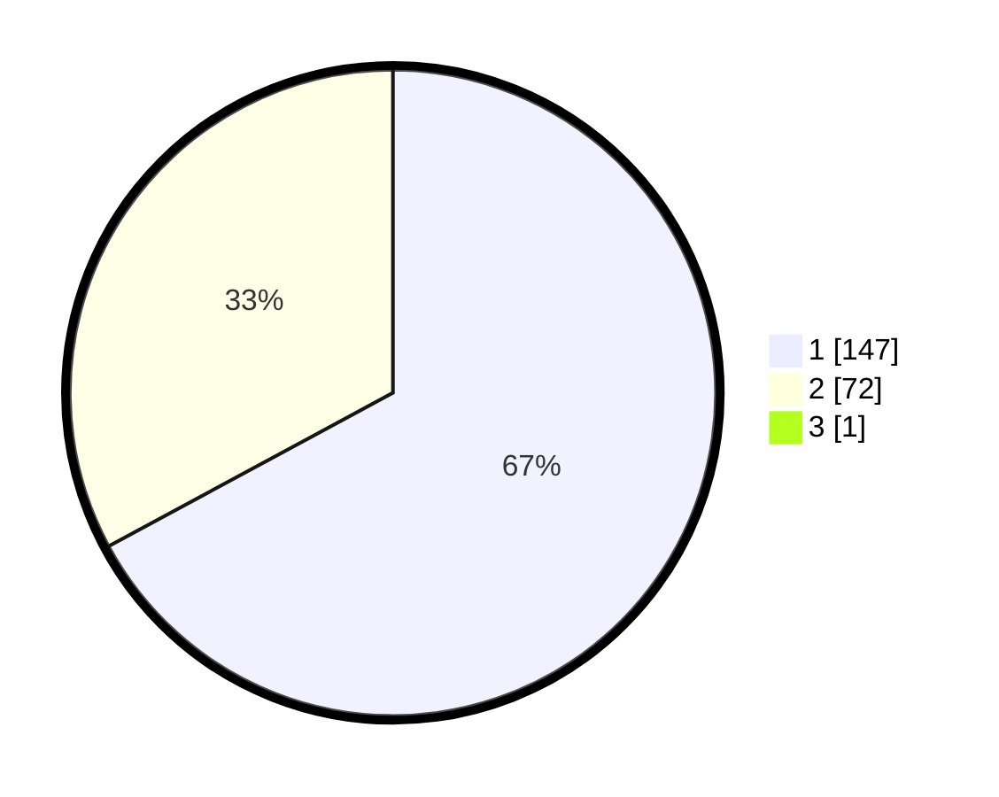

# Hasil

## Grafik

## Tabel

| No. | Nama Paslon    | Suara | Suara (raw) | Persentase |
|:--- |:-------------- | -----:| -----------:| ----------:|
| 1   | ANIES MUHAIMIN | 147   | [147][p-1]  | 66,82      |
| 2   | PRABOWO GIBRAN | 72    | [72][p-2]   | 32,73      |
| 3   | GANJAR MAHFUD  | 1     | [1][p-3]    | 0,45       |

[p-1]: https://github.com/gigit-pemilu/pemilu-2024-11-aceh/blob/main/pilpres/hitung-suara/sub/11-aceh/sub/07-pidie/sub/29-glumpang-baro/sub/2003-kumbang-unoe/sub/001-tps/sub/paslon-1.txt
[p-2]: https://github.com/gigit-pemilu/pemilu-2024-11-aceh/blob/main/pilpres/hitung-suara/sub/11-aceh/sub/07-pidie/sub/29-glumpang-baro/sub/2003-kumbang-unoe/sub/001-tps/sub/paslon-2.txt
[p-3]: https://github.com/gigit-pemilu/pemilu-2024-11-aceh/blob/main/pilpres/hitung-suara/sub/11-aceh/sub/07-pidie/sub/29-glumpang-baro/sub/2003-kumbang-unoe/sub/001-tps/sub/paslon-3.txt

## Foto C Plano

https://sirekap-obj-formc.kpu.go.id/0bdf/pemilu/ppwp/11/07/29/20/03/1107292003001-20240214-203417--c8253a34-7eed-4909-97cc-91ff9635c44a.jpg

https://sirekap-obj-formc.kpu.go.id/0bdf/pemilu/ppwp/11/07/29/20/03/1107292003001-20240214-203715--7943f0eb-f82c-4715-8cbb-d5e46599bd40.jpg

https://sirekap-obj-formc.kpu.go.id/0bdf/pemilu/ppwp/11/07/29/20/03/1107292003001-20240215-073052--47007ae2-8717-4af6-9d78-6d2a7f68c758.jpg

## Metadata

| Key        | Value               |
| ---------- | ------------------- |
| Time Stamp | 2024-02-17 18:00:00 |

