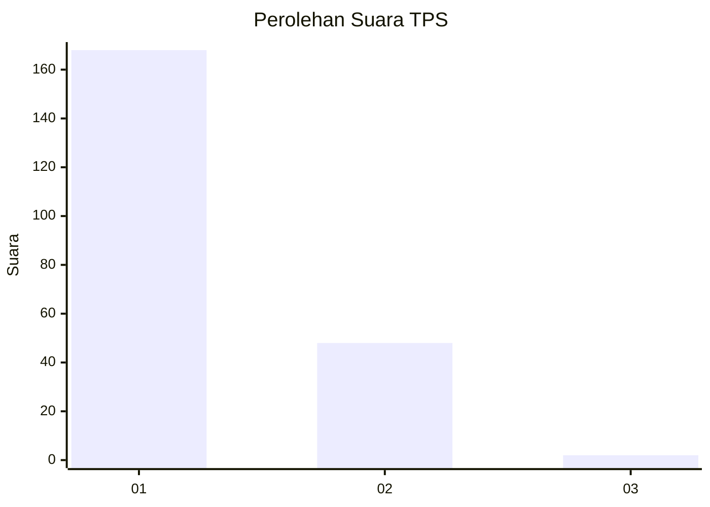
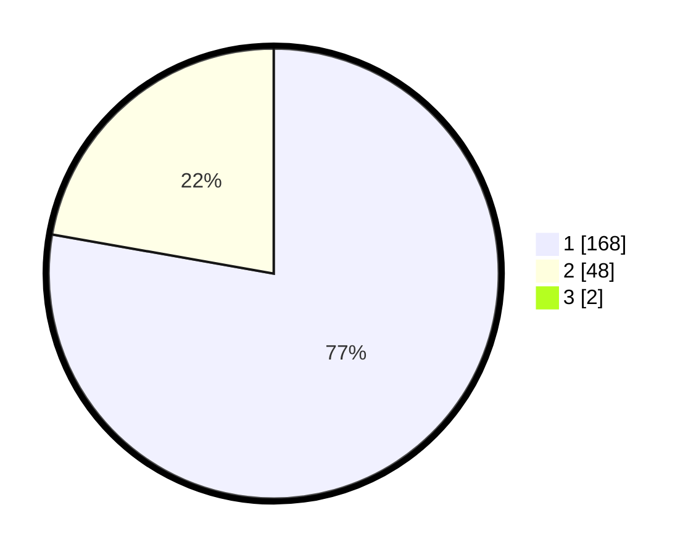

# Hasil

## Grafik

## Tabel

| No. | Nama Paslon    | Suara | Suara (raw) | Persentase |
|:--- |:-------------- | -----:| -----------:| ----------:|
| 1   | ANIES MUHAIMIN | 168   | [168][p-1]  | 77,06      |
| 2   | PRABOWO GIBRAN | 48    | [48][p-2]   | 22,02      |
| 3   | GANJAR MAHFUD  | 2     | [2][p-3]    | 0,92       |

[p-1]: https://github.com/gigit-pemilu/pemilu-2024-11-aceh/blob/main/pilpres/hitung-suara/sub/11-aceh/sub/07-pidie/sub/29-glumpang-baro/sub/2003-kumbang-unoe/sub/002-tps/sub/paslon-1.txt
[p-2]: https://github.com/gigit-pemilu/pemilu-2024-11-aceh/blob/main/pilpres/hitung-suara/sub/11-aceh/sub/07-pidie/sub/29-glumpang-baro/sub/2003-kumbang-unoe/sub/002-tps/sub/paslon-2.txt
[p-3]: https://github.com/gigit-pemilu/pemilu-2024-11-aceh/blob/main/pilpres/hitung-suara/sub/11-aceh/sub/07-pidie/sub/29-glumpang-baro/sub/2003-kumbang-unoe/sub/002-tps/sub/paslon-3.txt

## Foto C Plano

https://sirekap-obj-formc.kpu.go.id/b528/pemilu/ppwp/11/07/29/20/03/1107292003002-20240215-002110--0619e00b-4ef1-46ca-9e56-542431c1b27b.jpg

https://sirekap-obj-formc.kpu.go.id/b528/pemilu/ppwp/11/07/29/20/03/1107292003002-20240215-003212--0332d9e8-2945-417b-918c-71b758a52327.jpg

https://sirekap-obj-formc.kpu.go.id/b528/pemilu/ppwp/11/07/29/20/03/1107292003002-20240215-003321--05f0a8cb-31fc-4741-aef6-84cb0b15122d.jpg

## Metadata

| Key        | Value               |
| ---------- | ------------------- |
| Time Stamp | 2024-02-24 22:31:28 |

