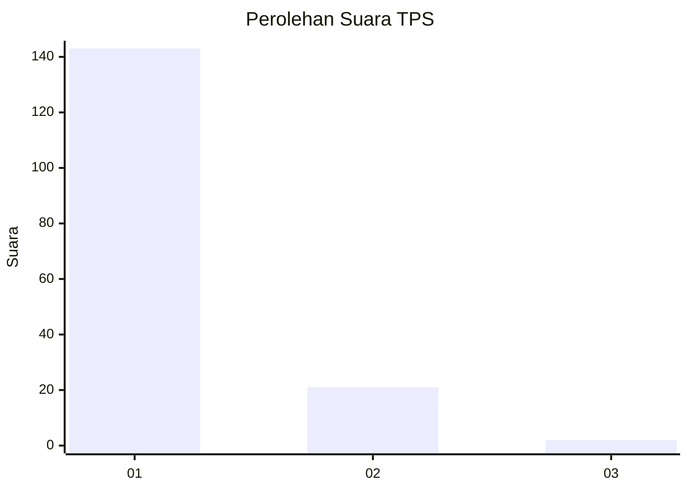
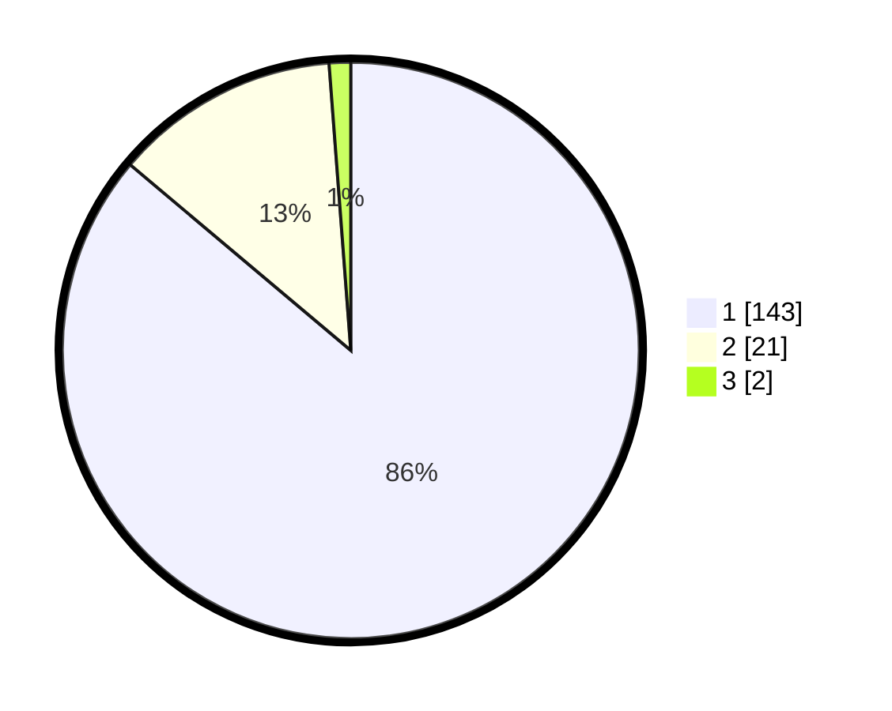

# Hasil

## Grafik

## Tabel

| No. | Nama Paslon    | Suara | Suara (raw) | Persentase |
|:--- |:-------------- | -----:| -----------:| ----------:|
| 1   | ANIES MUHAIMIN | 143   | [143][p-1]  | 86,14      |
| 2   | PRABOWO GIBRAN | 21    | [21][p-2]   | 12,65      |
| 3   | GANJAR MAHFUD  | 2     | [2][p-3]    | 1,20       |

[p-1]: https://github.com/gigit-pemilu/pemilu-2024-11-aceh/blob/main/pilpres/hitung-suara/sub/11-aceh/sub/07-pidie/sub/29-glumpang-baro/sub/2004-sagoe/sub/001-tps/sub/paslon-1.txt
[p-2]: https://github.com/gigit-pemilu/pemilu-2024-11-aceh/blob/main/pilpres/hitung-suara/sub/11-aceh/sub/07-pidie/sub/29-glumpang-baro/sub/2004-sagoe/sub/001-tps/sub/paslon-2.txt
[p-3]: https://github.com/gigit-pemilu/pemilu-2024-11-aceh/blob/main/pilpres/hitung-suara/sub/11-aceh/sub/07-pidie/sub/29-glumpang-baro/sub/2004-sagoe/sub/001-tps/sub/paslon-3.txt

## Foto C Plano

https://sirekap-obj-formc.kpu.go.id/6634/pemilu/ppwp/11/07/29/20/04/1107292004001-20240215-000930--2f17305d-b1ad-4f6b-af2f-599d78687257.jpg

https://sirekap-obj-formc.kpu.go.id/6634/pemilu/ppwp/11/07/29/20/04/1107292004001-20240214-234900--b280909b-b3d1-41f3-a64f-62f4d5aa5066.jpg

https://sirekap-obj-formc.kpu.go.id/6634/pemilu/ppwp/11/07/29/20/04/1107292004001-20240214-235217--6439d830-696e-43e7-81ec-57ddd1e1858a.jpg

## Metadata

| Key        | Value               |
| ---------- | ------------------- |
| Time Stamp | 2024-02-24 22:31:28 |

