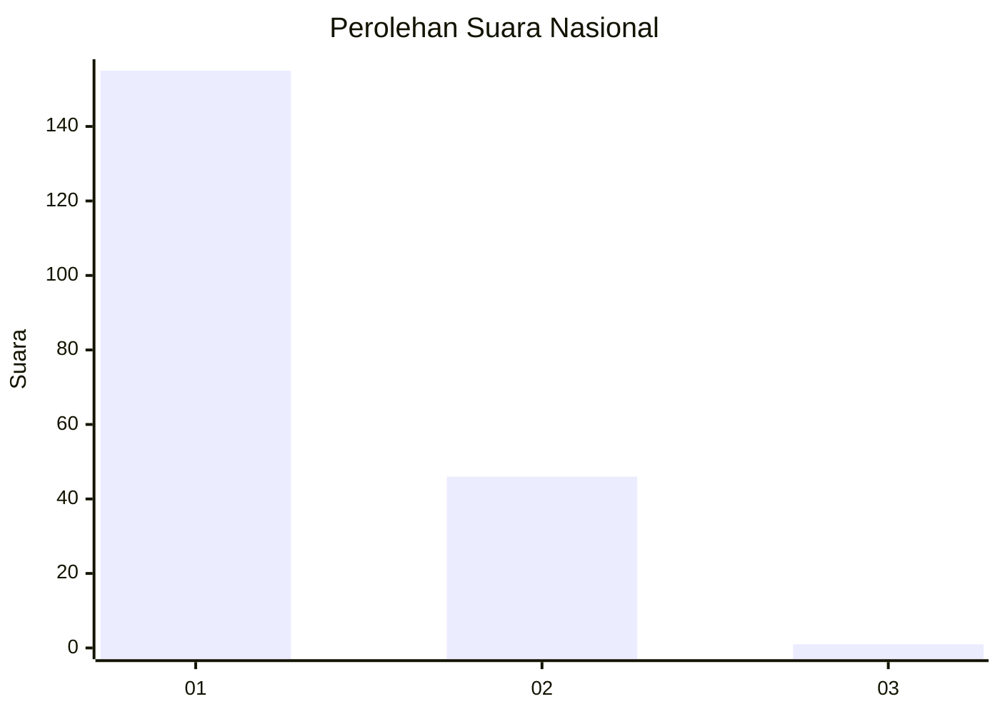
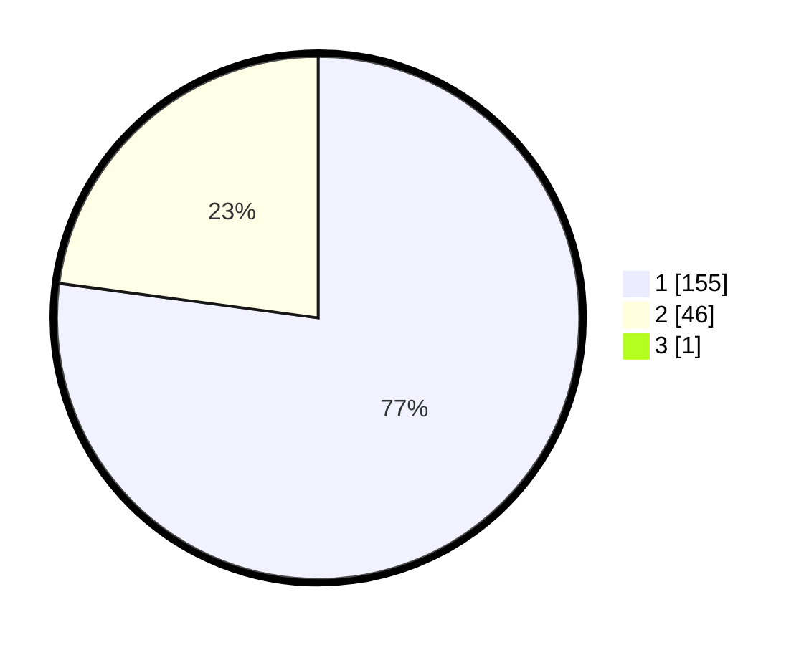

# Hasil

## Grafik

## Tabel

| No. | Nama Paslon    | Suara | Suara (raw) | Persentase |
|:--- |:-------------- | -----:| -----------:| ----------:|
| 1   | ANIES MUHAIMIN | 155   | [155][p-1]  | 76,73      |
| 2   | PRABOWO GIBRAN | 46    | [46][p-2]   | 22,77      |
| 3   | GANJAR MAHFUD  | 1     | [1][p-3]    | 0,50       |

[p-1]: https://github.com/gigit-pemilu/pemilu-2024/blob/main/pilpres/hitung-suara/sub/11-aceh/sub/07-pidie/sub/29-glumpang-baro/sub/2004-sagoe/sub/002-tps/sub/paslon-1.txt
[p-2]: https://github.com/gigit-pemilu/pemilu-2024/blob/main/pilpres/hitung-suara/sub/11-aceh/sub/07-pidie/sub/29-glumpang-baro/sub/2004-sagoe/sub/002-tps/sub/paslon-2.txt
[p-3]: https://github.com/gigit-pemilu/pemilu-2024/blob/main/pilpres/hitung-suara/sub/11-aceh/sub/07-pidie/sub/29-glumpang-baro/sub/2004-sagoe/sub/002-tps/sub/paslon-3.txt

## Foto C Plano

https://sirekap-obj-formc.kpu.go.id/fc62/pemilu/ppwp/11/07/29/20/04/1107292004002-20240214-203332--e9ef7c8d-8942-40c7-9679-45235fe97108.jpg

https://sirekap-obj-formc.kpu.go.id/fc62/pemilu/ppwp/11/07/29/20/04/1107292004002-20240214-155909--31e09f35-b05e-430a-ad06-1a6b3f02874f.jpg

https://sirekap-obj-formc.kpu.go.id/fc62/pemilu/ppwp/11/07/29/20/04/1107292004002-20240214-200853--f65a7efc-e9e8-410f-b947-d1d2e463d8db.jpg

## Metadata

| Key        | Value               |
| ---------- | ------------------- |
| Time Stamp | 2024-02-17 12:00:00 |

## DATA PEMILIH TETAP

Jumlah pemilih dalam DPT: **200**.
 * L: **86**.
 * P: **164**.

## DATA PENGGUNA HAK PILIH

Jumlah pengguna hak pilih dalam DPT: **200**.
 * L: **86**.
 * P: **134**.

Jumlah pengguna hak pilih dalam DPTb: **1**.
 * L: **0**.
 * P: **81**.

Jumlah pengguna hak pilih dalam DPK: **3**.
 * L: **7**.
 * P: **0**.

Jumlah pengguna hak pilih: **204**.
 * L: **84**.
 * P: **665**.

## JUMLAH SUARA SAH DAN TIDAK SAH

JUMLAH SELURUH SUARA SAH: **202**.

JUMLAH SUARA TIDAK SAH: **2**.

JUMLAH SELURUH SUARA SAH DAN SUARA TIDAK SAH: **204**.

