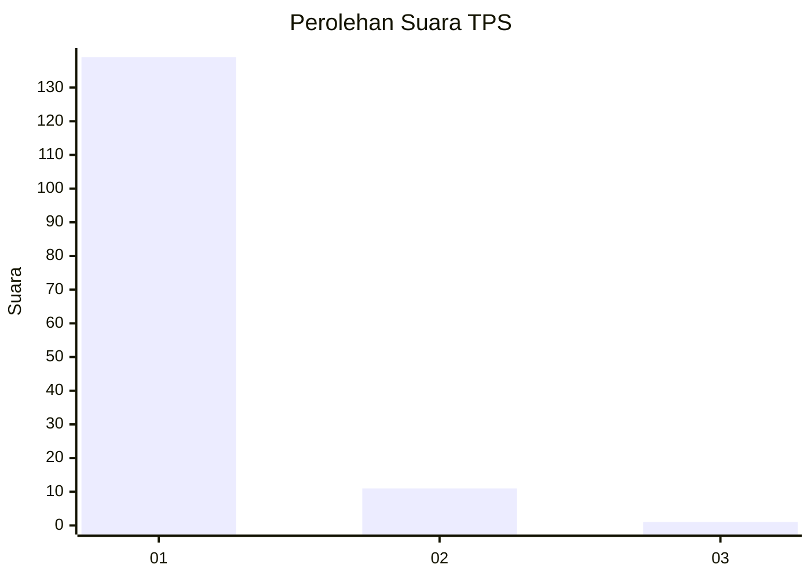
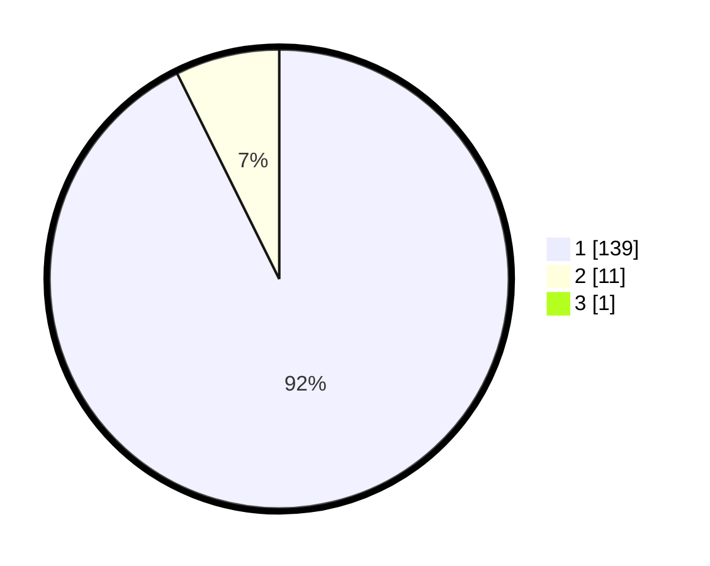

# Hasil

## Grafik

## Tabel

| No. | Nama Paslon    | Suara | Suara (raw) | Persentase |
|:--- |:-------------- | -----:| -----------:| ----------:|
| 1   | ANIES MUHAIMIN | 139   | [139][p-1]  | 92,05      |
| 2   | PRABOWO GIBRAN | 11    | [11][p-2]   | 7,28       |
| 3   | GANJAR MAHFUD  | 1     | [1][p-3]    | 0,66       |

[p-1]: https://github.com/gigit-pemilu/pemilu-2024-11-aceh/blob/main/pilpres/hitung-suara/sub/11-aceh/sub/07-pidie/sub/29-glumpang-baro/sub/2007-sukon-paku/sub/001-tps/sub/paslon-1.txt
[p-2]: https://github.com/gigit-pemilu/pemilu-2024-11-aceh/blob/main/pilpres/hitung-suara/sub/11-aceh/sub/07-pidie/sub/29-glumpang-baro/sub/2007-sukon-paku/sub/001-tps/sub/paslon-2.txt
[p-3]: https://github.com/gigit-pemilu/pemilu-2024-11-aceh/blob/main/pilpres/hitung-suara/sub/11-aceh/sub/07-pidie/sub/29-glumpang-baro/sub/2007-sukon-paku/sub/001-tps/sub/paslon-3.txt

## Foto C Plano

https://sirekap-obj-formc.kpu.go.id/ce8e/pemilu/ppwp/11/07/29/20/07/1107292007001-20240215-011816--48a2fd92-99a7-4a86-b94a-91423348ac14.jpg

https://sirekap-obj-formc.kpu.go.id/ce8e/pemilu/ppwp/11/07/29/20/07/1107292007001-20240215-012031--538fce87-ec25-4168-a561-332e0ddcc8cf.jpg

https://sirekap-obj-formc.kpu.go.id/ce8e/pemilu/ppwp/11/07/29/20/07/1107292007001-20240215-012147--b0a1fb3b-a1fe-44c1-a47f-a0cc788bd773.jpg

## Metadata

| Key        | Value               |
| ---------- | ------------------- |
| Time Stamp | 2024-02-17 19:30:00 |

