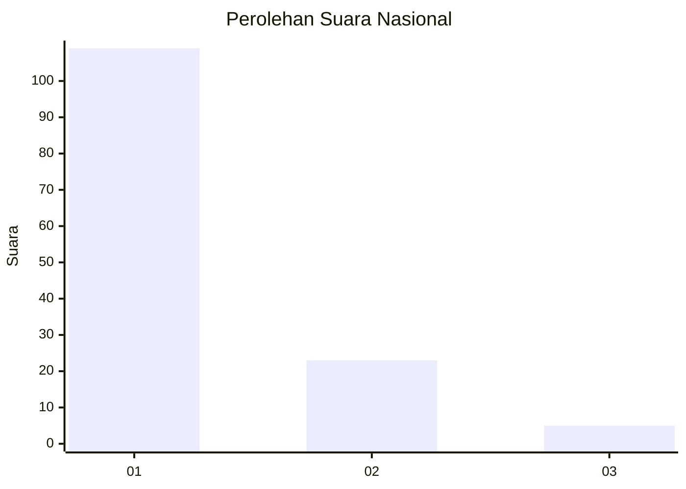
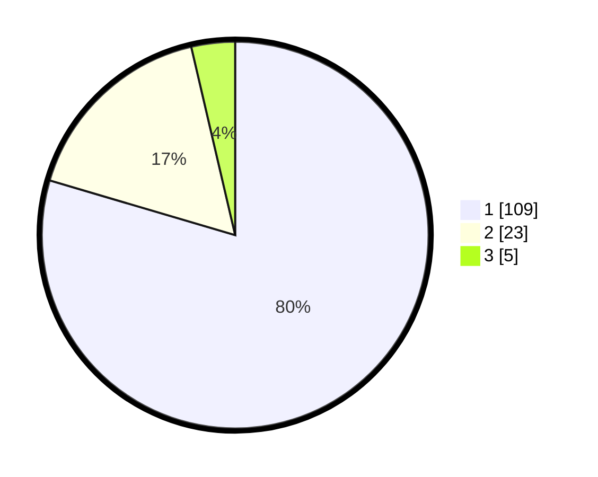

# Hasil

## Grafik

## Tabel

| No. | Nama Paslon    | Suara | Suara (raw) | Persentase |
|:--- |:-------------- | -----:| -----------:| ----------:|
| 1   | ANIES MUHAIMIN | 109   | [109][p-1]  | 79,56      |
| 2   | PRABOWO GIBRAN | 23    | [23][p-2]   | 16,79      |
| 3   | GANJAR MAHFUD  | 5     | [5][p-3]    | 3,65       |

[p-1]: https://github.com/gigit-pemilu/pemilu-2024/blob/main/pilpres/hitung-suara/sub/11-aceh/sub/07-pidie/sub/29-glumpang-baro/sub/2007-sukon-paku/sub/002-tps/sub/paslon-1.txt
[p-2]: https://github.com/gigit-pemilu/pemilu-2024/blob/main/pilpres/hitung-suara/sub/11-aceh/sub/07-pidie/sub/29-glumpang-baro/sub/2007-sukon-paku/sub/002-tps/sub/paslon-2.txt
[p-3]: https://github.com/gigit-pemilu/pemilu-2024/blob/main/pilpres/hitung-suara/sub/11-aceh/sub/07-pidie/sub/29-glumpang-baro/sub/2007-sukon-paku/sub/002-tps/sub/paslon-3.txt

## Foto C Plano

https://sirekap-obj-formc.kpu.go.id/b14d/pemilu/ppwp/11/07/29/20/07/1107292007002-20240214-185455--25a1215b-bd41-46db-8bbc-6a155517abc5.jpg

https://sirekap-obj-formc.kpu.go.id/b14d/pemilu/ppwp/11/07/29/20/07/1107292007002-20240214-184953--daf0217e-ba58-4c78-ba78-23b8501908b7.jpg

https://sirekap-obj-formc.kpu.go.id/b14d/pemilu/ppwp/11/07/29/20/07/1107292007002-20240214-185224--adb5c910-23e1-4fcc-9030-d348481f3df4.jpg

## Metadata

| Key        | Value               |
| ---------- | ------------------- |
| Time Stamp | 2024-02-17 19:30:00 |

