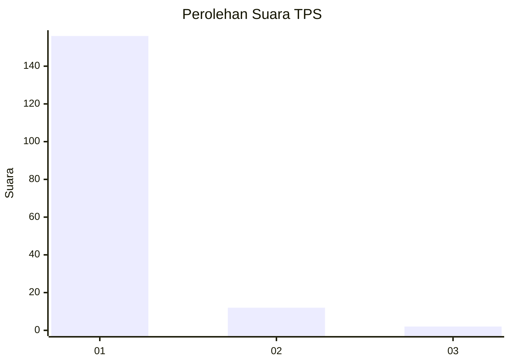
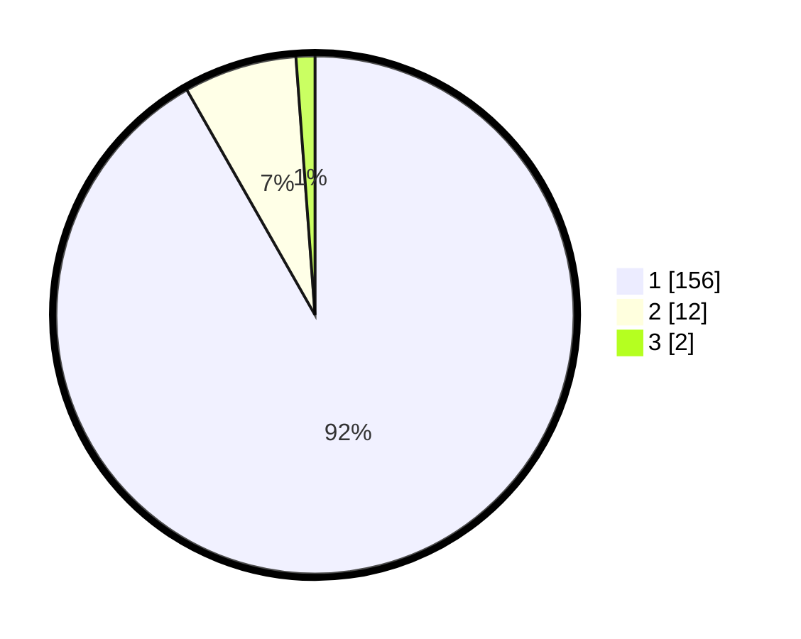

# Hasil

## Grafik

## Tabel

| No. | Nama Paslon    | Suara | Suara (raw) | Persentase |
|:--- |:-------------- | -----:| -----------:| ----------:|
| 1   | ANIES MUHAIMIN | 156   | [156][p-1]  | 91,76      |
| 2   | PRABOWO GIBRAN | 12    | [12][p-2]   | 7,06       |
| 3   | GANJAR MAHFUD  | 2     | [2][p-3]    | 1,18       |

[p-1]: https://github.com/gigit-pemilu/pemilu-2024-11-aceh/blob/main/pilpres/hitung-suara/sub/11-aceh/sub/07-pidie/sub/29-glumpang-baro/sub/2008-pulo-iboih/sub/002-tps/sub/paslon-1.txt
[p-2]: https://github.com/gigit-pemilu/pemilu-2024-11-aceh/blob/main/pilpres/hitung-suara/sub/11-aceh/sub/07-pidie/sub/29-glumpang-baro/sub/2008-pulo-iboih/sub/002-tps/sub/paslon-2.txt
[p-3]: https://github.com/gigit-pemilu/pemilu-2024-11-aceh/blob/main/pilpres/hitung-suara/sub/11-aceh/sub/07-pidie/sub/29-glumpang-baro/sub/2008-pulo-iboih/sub/002-tps/sub/paslon-3.txt

## Foto C Plano

https://sirekap-obj-formc.kpu.go.id/c8df/pemilu/ppwp/11/07/29/20/08/1107292008002-20240215-022921--5cb9557e-2958-4ed5-b7d7-1c7828af962d.jpg

https://sirekap-obj-formc.kpu.go.id/c8df/pemilu/ppwp/11/07/29/20/08/1107292008002-20240215-020812--dacf21c9-e055-42ba-98ca-93f14d63308f.jpg

https://sirekap-obj-formc.kpu.go.id/c8df/pemilu/ppwp/11/07/29/20/08/1107292008002-20240215-020947--61ad17f6-62bc-4745-a50f-c34808cbd882.jpg

## Metadata

| Key        | Value               |
| ---------- | ------------------- |
| Time Stamp | 2024-02-16 21:01:00 |

