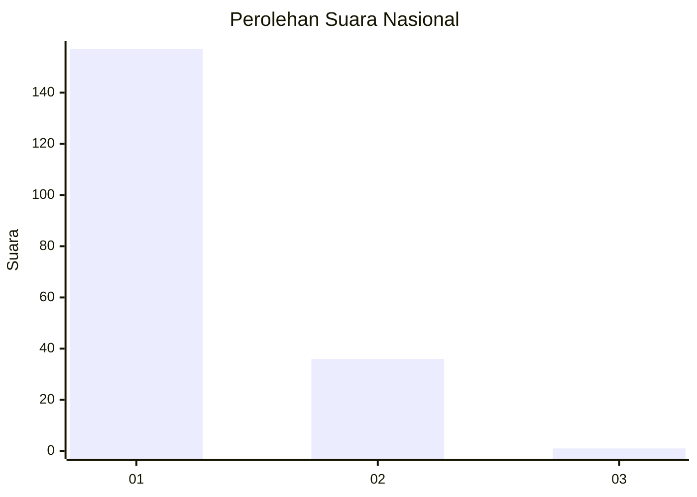
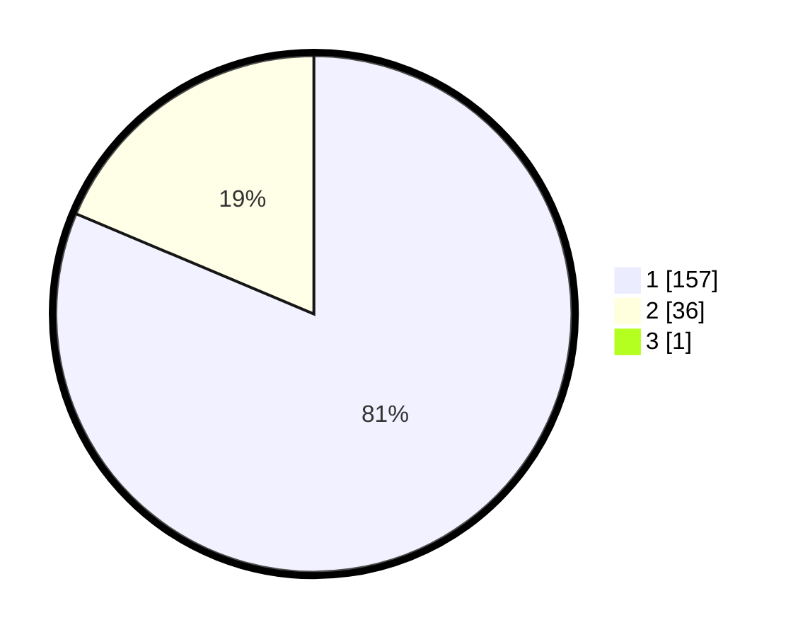

# Hasil

## Grafik

## Tabel

| No. | Nama Paslon    | Suara | Suara (raw) | Persentase |
|:--- |:-------------- | -----:| -----------:| ----------:|
| 1   | ANIES MUHAIMIN | 157   | [157][p-1]  | 80,93      |
| 2   | PRABOWO GIBRAN | 36    | [36][p-2]   | 18,56      |
| 3   | GANJAR MAHFUD  | 1     | [1][p-3]    | 0,52       |

[p-1]: https://github.com/gigit-pemilu/pemilu-2024/blob/main/pilpres/hitung-suara/sub/11-aceh/sub/07-pidie/sub/29-glumpang-baro/sub/2009-sangget/sub/001-tps/sub/paslon-1.txt
[p-2]: https://github.com/gigit-pemilu/pemilu-2024/blob/main/pilpres/hitung-suara/sub/11-aceh/sub/07-pidie/sub/29-glumpang-baro/sub/2009-sangget/sub/001-tps/sub/paslon-2.txt
[p-3]: https://github.com/gigit-pemilu/pemilu-2024/blob/main/pilpres/hitung-suara/sub/11-aceh/sub/07-pidie/sub/29-glumpang-baro/sub/2009-sangget/sub/001-tps/sub/paslon-3.txt

## Foto C Plano

https://sirekap-obj-formc.kpu.go.id/42d9/pemilu/ppwp/11/07/29/20/09/1107292009001-20240215-030152--ceaf70d3-b53f-4c40-9cd0-9895255f0162.jpg

https://sirekap-obj-formc.kpu.go.id/42d9/pemilu/ppwp/11/07/29/20/09/1107292009001-20240215-030449--6aa18091-b1c6-4f46-a0d3-2aeb77767092.jpg

https://sirekap-obj-formc.kpu.go.id/42d9/pemilu/ppwp/11/07/29/20/09/1107292009001-20240215-030635--4031f0f1-73fa-4d64-ad10-207e594bee5e.jpg

## Metadata

| Key        | Value               |
| ---------- | ------------------- |
| Time Stamp | 2024-02-24 22:31:28 |

