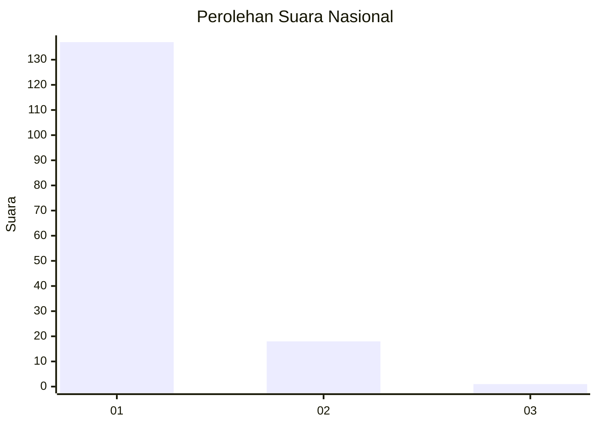
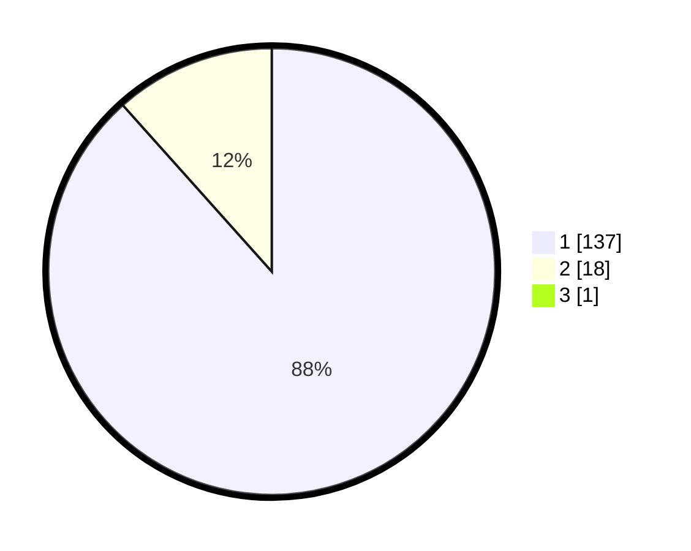

# Hasil

## Grafik

## Tabel

| No. | Nama Paslon    | Suara | Suara (raw) | Persentase |
|:--- |:-------------- | -----:| -----------:| ----------:|
| 1   | ANIES MUHAIMIN | 137   | [137][p-1]  | 87,82      |
| 2   | PRABOWO GIBRAN | 18    | [18][p-2]   | 11,54      |
| 3   | GANJAR MAHFUD  | 1     | [1][p-3]    | 0,64       |

[p-1]: https://github.com/gigit-pemilu/pemilu-2024/blob/main/pilpres/hitung-suara/sub/11-aceh/sub/07-pidie/sub/29-glumpang-baro/sub/2009-sangget/sub/002-tps/sub/paslon-1.txt
[p-2]: https://github.com/gigit-pemilu/pemilu-2024/blob/main/pilpres/hitung-suara/sub/11-aceh/sub/07-pidie/sub/29-glumpang-baro/sub/2009-sangget/sub/002-tps/sub/paslon-2.txt
[p-3]: https://github.com/gigit-pemilu/pemilu-2024/blob/main/pilpres/hitung-suara/sub/11-aceh/sub/07-pidie/sub/29-glumpang-baro/sub/2009-sangget/sub/002-tps/sub/paslon-3.txt

## Foto C Plano

https://sirekap-obj-formc.kpu.go.id/3705/pemilu/ppwp/11/07/29/20/09/1107292009002-20240215-025031--f20997ec-6299-4eaa-9aba-84fc5ea57688.jpg

https://sirekap-obj-formc.kpu.go.id/3705/pemilu/ppwp/11/07/29/20/09/1107292009002-20240215-025232--1cfcb295-d8ad-44b0-a803-1adc32e1684e.jpg

https://sirekap-obj-formc.kpu.go.id/3705/pemilu/ppwp/11/07/29/20/09/1107292009002-20240215-025403--d29a4dd3-fad8-494c-b9e3-590c6b08abcd.jpg

## Metadata

| Key        | Value               |
| ---------- | ------------------- |
| Time Stamp | 2024-02-17 19:30:00 |

