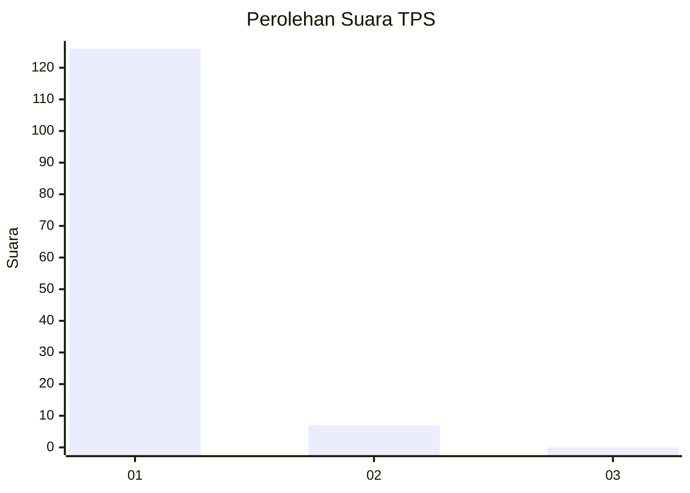
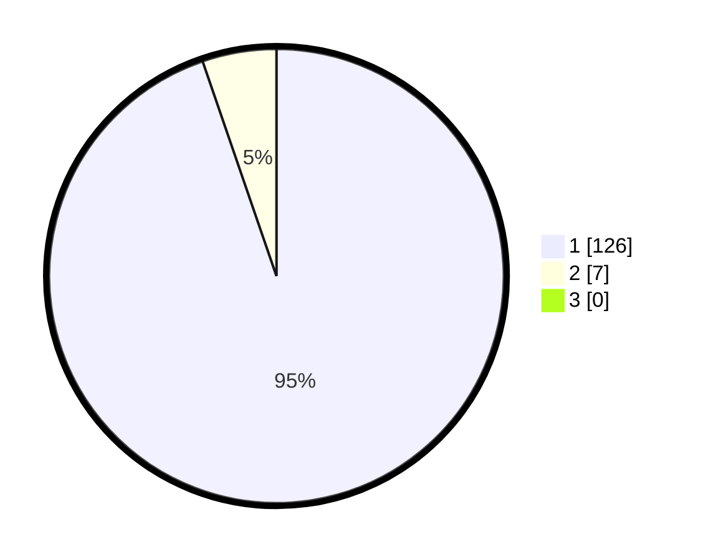

# Hasil

## Grafik

## Tabel

| No. | Nama Paslon    | Suara | Suara (raw) | Persentase |
|:--- |:-------------- | -----:| -----------:| ----------:|
| 1   | ANIES MUHAIMIN | 126   | [126][p-1]  | 94,74      |
| 2   | PRABOWO GIBRAN | 7     | [7][p-2]    | 5,26       |
| 3   | GANJAR MAHFUD  | 0     | [0][p-3]    | 0,00       |

[p-1]: https://github.com/gigit-pemilu/pemilu-2024-11-aceh/blob/main/pilpres/hitung-suara/sub/11-aceh/sub/07-pidie/sub/29-glumpang-baro/sub/2012-pulo-panjoe/sub/001-tps/sub/paslon-1.txt
[p-2]: https://github.com/gigit-pemilu/pemilu-2024-11-aceh/blob/main/pilpres/hitung-suara/sub/11-aceh/sub/07-pidie/sub/29-glumpang-baro/sub/2012-pulo-panjoe/sub/001-tps/sub/paslon-2.txt
[p-3]: https://github.com/gigit-pemilu/pemilu-2024-11-aceh/blob/main/pilpres/hitung-suara/sub/11-aceh/sub/07-pidie/sub/29-glumpang-baro/sub/2012-pulo-panjoe/sub/001-tps/sub/paslon-3.txt

## Foto C Plano

https://sirekap-obj-formc.kpu.go.id/32ac/pemilu/ppwp/11/07/29/20/12/1107292012001-20240215-035315--6b4a8516-2a83-4027-8180-6ea9f128ef1c.jpg

https://sirekap-obj-formc.kpu.go.id/32ac/pemilu/ppwp/11/07/29/20/12/1107292012001-20240215-044105--1ea3aa67-7657-4554-b64a-1f5d43c150d4.jpg

https://sirekap-obj-formc.kpu.go.id/32ac/pemilu/ppwp/11/07/29/20/12/1107292012001-20240215-034935--ff1dd4f6-20ec-4c50-a840-5fc33084bab9.jpg

## Metadata

| Key        | Value               |
| ---------- | ------------------- |
| Time Stamp | 2024-02-24 22:31:28 |

