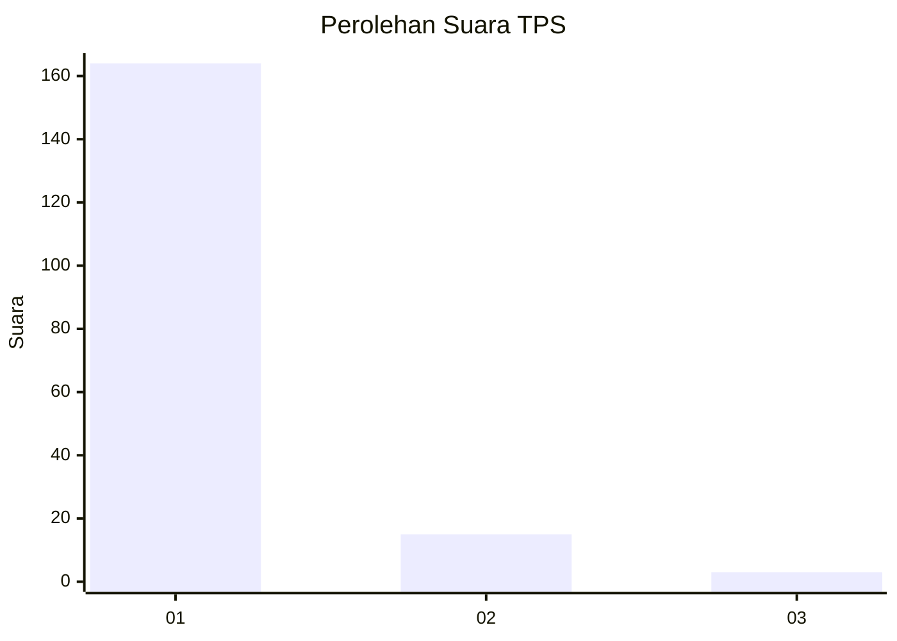
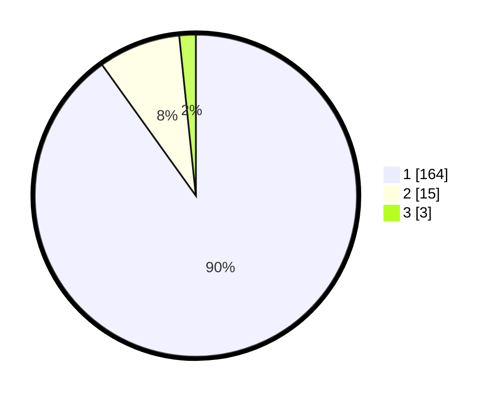

# Hasil

## Grafik

## Tabel

| No. | Nama Paslon    | Suara | Suara (raw) | Persentase |
|:--- |:-------------- | -----:| -----------:| ----------:|
| 1   | ANIES MUHAIMIN | 164   | [164][p-1]  | 90,11      |
| 2   | PRABOWO GIBRAN | 15    | [15][p-2]   | 8,24       |
| 3   | GANJAR MAHFUD  | 3     | [3][p-3]    | 1,65       |

[p-1]: https://github.com/gigit-pemilu/pemilu-2024-11-aceh/blob/main/pilpres/hitung-suara/sub/11-aceh/sub/07-pidie/sub/29-glumpang-baro/sub/2014-daboih/sub/001-tps/sub/paslon-1.txt
[p-2]: https://github.com/gigit-pemilu/pemilu-2024-11-aceh/blob/main/pilpres/hitung-suara/sub/11-aceh/sub/07-pidie/sub/29-glumpang-baro/sub/2014-daboih/sub/001-tps/sub/paslon-2.txt
[p-3]: https://github.com/gigit-pemilu/pemilu-2024-11-aceh/blob/main/pilpres/hitung-suara/sub/11-aceh/sub/07-pidie/sub/29-glumpang-baro/sub/2014-daboih/sub/001-tps/sub/paslon-3.txt

## Foto C Plano

https://sirekap-obj-formc.kpu.go.id/f3d7/pemilu/ppwp/11/07/29/20/14/1107292014001-20240215-125010--508ec5b9-d728-48e0-818f-2dba21ab8753.jpg

https://sirekap-obj-formc.kpu.go.id/f3d7/pemilu/ppwp/11/07/29/20/14/1107292014001-20240215-025043--e7d102a3-dc99-412b-b556-3d1f78bd71de.jpg

https://sirekap-obj-formc.kpu.go.id/f3d7/pemilu/ppwp/11/07/29/20/14/1107292014001-20240215-025235--aff5c59b-83bc-4c94-a073-626c30d6a89b.jpg

## Metadata

| Key        | Value               |
| ---------- | ------------------- |
| Time Stamp | 2024-02-16 02:00:27 |

