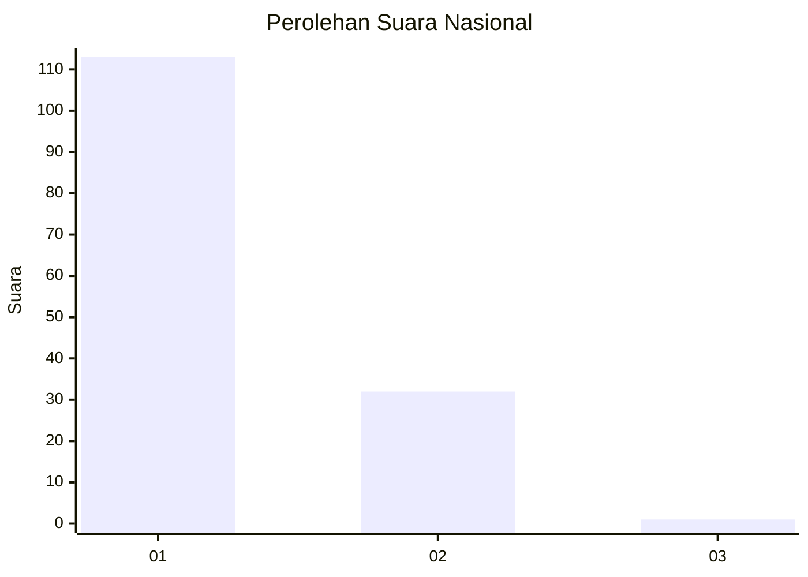
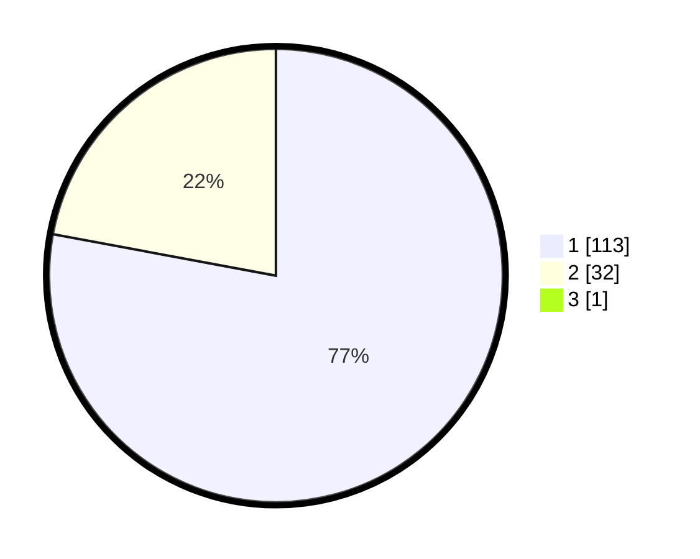

# Hasil

## Grafik

## Tabel

| No. | Nama Paslon    | Suara | Suara (raw) | Persentase |
|:--- |:-------------- | -----:| -----------:| ----------:|
| 1   | ANIES MUHAIMIN | 113   | [113][p-1]  | 77,40      |
| 2   | PRABOWO GIBRAN | 32    | [32][p-2]   | 21,92      |
| 3   | GANJAR MAHFUD  | 1     | [1][p-3]    | 0,68       |

[p-1]: https://github.com/gigit-pemilu/pemilu-2024/blob/main/pilpres/hitung-suara/sub/11-aceh/sub/07-pidie/sub/29-glumpang-baro/sub/2016-glumpang-bungkok/sub/001-tps/sub/paslon-1.txt
[p-2]: https://github.com/gigit-pemilu/pemilu-2024/blob/main/pilpres/hitung-suara/sub/11-aceh/sub/07-pidie/sub/29-glumpang-baro/sub/2016-glumpang-bungkok/sub/001-tps/sub/paslon-2.txt
[p-3]: https://github.com/gigit-pemilu/pemilu-2024/blob/main/pilpres/hitung-suara/sub/11-aceh/sub/07-pidie/sub/29-glumpang-baro/sub/2016-glumpang-bungkok/sub/001-tps/sub/paslon-3.txt

## Foto C Plano

https://sirekap-obj-formc.kpu.go.id/07dc/pemilu/ppwp/11/07/29/20/16/1107292016001-20240215-031548--9edf7d5a-455d-4997-b613-7078ba37959e.jpg

https://sirekap-obj-formc.kpu.go.id/07dc/pemilu/ppwp/11/07/29/20/16/1107292016001-20240215-032227--b7abf5cf-dff1-4a23-a4d3-f77755cb2009.jpg

https://sirekap-obj-formc.kpu.go.id/07dc/pemilu/ppwp/11/07/29/20/16/1107292016001-20240215-032653--da328a54-8b41-46cb-b8c4-8c1bfe228e01.jpg

## Metadata

| Key        | Value               |
| ---------- | ------------------- |
| Time Stamp | 2024-02-24 22:31:28 |

