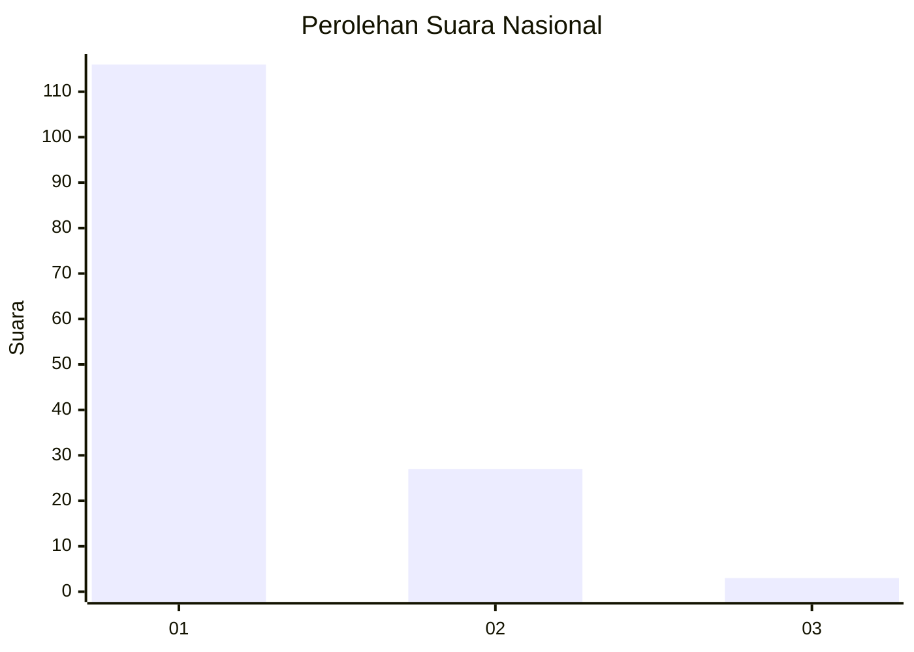
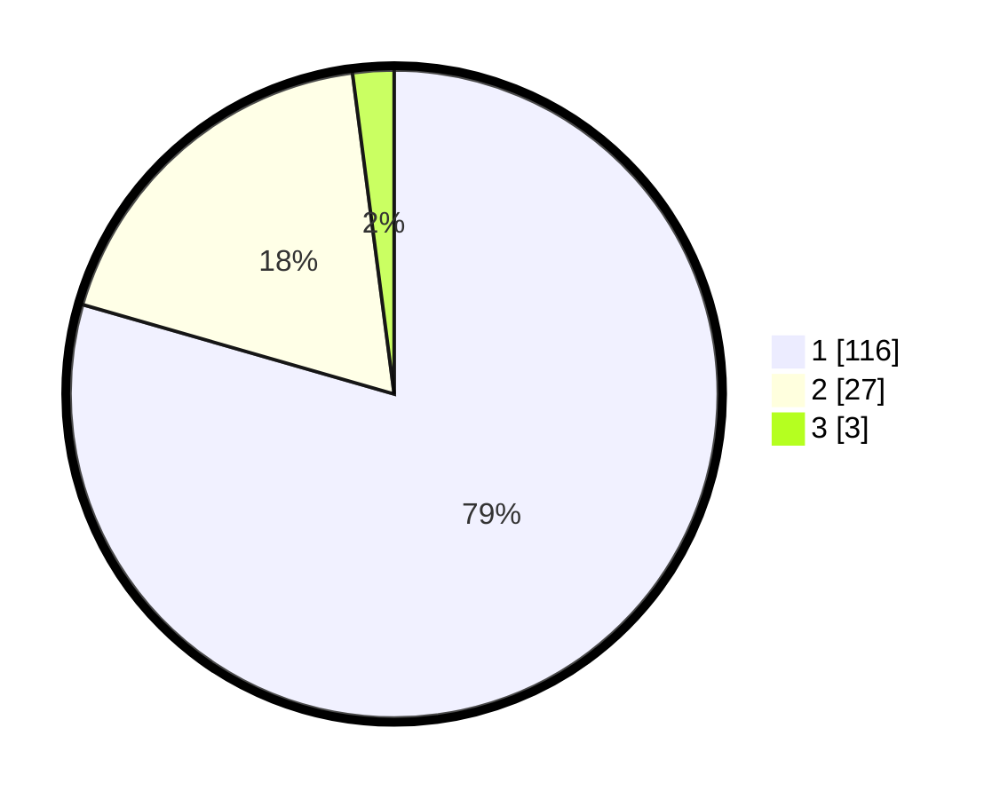

# Hasil

## Grafik

## Tabel

| No. | Nama Paslon    | Suara | Suara (raw) | Persentase |
|:--- |:-------------- | -----:| -----------:| ----------:|
| 1   | ANIES MUHAIMIN | 116   | [116][p-1]  | 79,45      |
| 2   | PRABOWO GIBRAN | 27    | [27][p-2]   | 18,49      |
| 3   | GANJAR MAHFUD  | 3     | [3][p-3]    | 2,05       |

[p-1]: https://github.com/gigit-pemilu/pemilu-2024/blob/main/pilpres/hitung-suara/sub/11-aceh/sub/07-pidie/sub/29-glumpang-baro/sub/2016-glumpang-bungkok/sub/002-tps/sub/paslon-1.txt
[p-2]: https://github.com/gigit-pemilu/pemilu-2024/blob/main/pilpres/hitung-suara/sub/11-aceh/sub/07-pidie/sub/29-glumpang-baro/sub/2016-glumpang-bungkok/sub/002-tps/sub/paslon-2.txt
[p-3]: https://github.com/gigit-pemilu/pemilu-2024/blob/main/pilpres/hitung-suara/sub/11-aceh/sub/07-pidie/sub/29-glumpang-baro/sub/2016-glumpang-bungkok/sub/002-tps/sub/paslon-3.txt

## Foto C Plano

https://sirekap-obj-formc.kpu.go.id/0ab7/pemilu/ppwp/11/07/29/20/16/1107292016002-20240215-024806--27a9af98-2674-4d59-b1a2-98b011ee2a8a.jpg

https://sirekap-obj-formc.kpu.go.id/0ab7/pemilu/ppwp/11/07/29/20/16/1107292016002-20240215-025155--39a7ab1e-8613-4877-b4c2-00927ae8ad30.jpg

https://sirekap-obj-formc.kpu.go.id/0ab7/pemilu/ppwp/11/07/29/20/16/1107292016002-20240215-025331--948bb2d6-e24e-4a25-ae0a-78257291f6a3.jpg

## Metadata

| Key        | Value               |
| ---------- | ------------------- |
| Time Stamp | 2024-02-17 19:30:00 |

