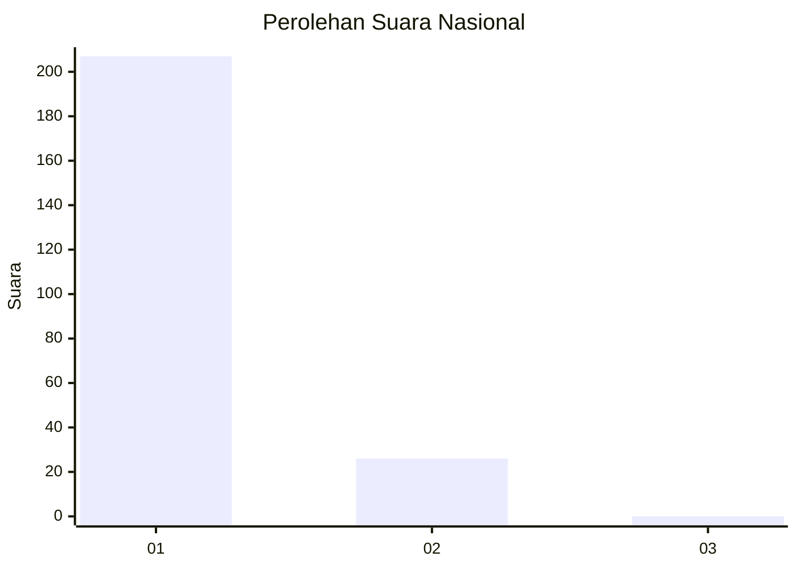
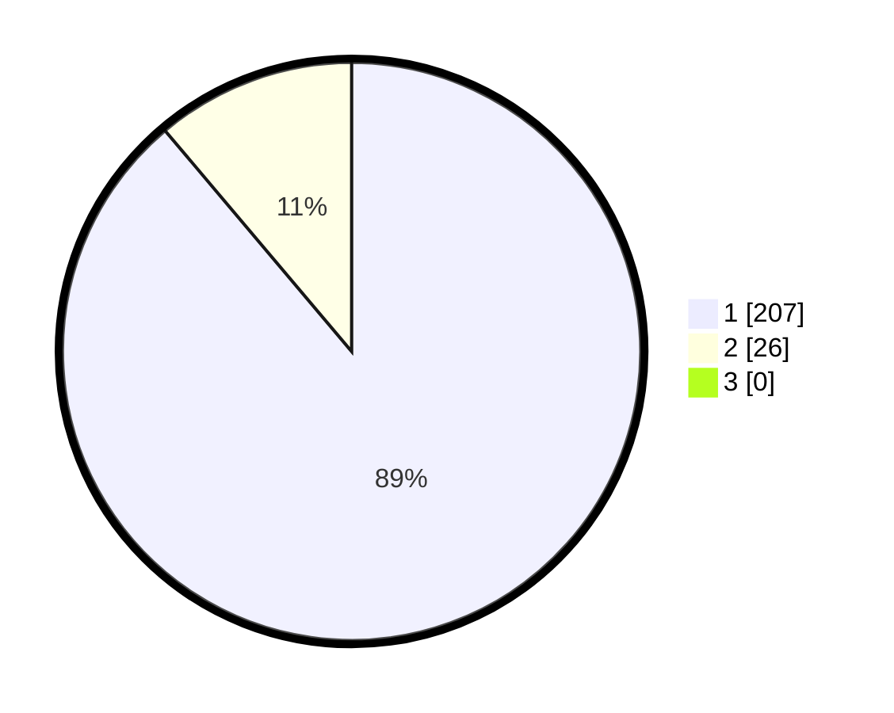

# Hasil

## Grafik

## Tabel

| No. | Nama Paslon    | Suara | Suara (raw) | Persentase |
|:--- |:-------------- | -----:| -----------:| ----------:|
| 1   | ANIES MUHAIMIN | 207   | [207][p-1]  | 88,84      |
| 2   | PRABOWO GIBRAN | 26    | [26][p-2]   | 11,16      |
| 3   | GANJAR MAHFUD  | 0     | [0][p-3]    | 0,00       |

[p-1]: https://github.com/gigit-pemilu/pemilu-2024/blob/main/pilpres/hitung-suara/sub/11-aceh/sub/07-pidie/sub/29-glumpang-baro/sub/2017-ukee/sub/003-tps/sub/paslon-1.txt
[p-2]: https://github.com/gigit-pemilu/pemilu-2024/blob/main/pilpres/hitung-suara/sub/11-aceh/sub/07-pidie/sub/29-glumpang-baro/sub/2017-ukee/sub/003-tps/sub/paslon-2.txt
[p-3]: https://github.com/gigit-pemilu/pemilu-2024/blob/main/pilpres/hitung-suara/sub/11-aceh/sub/07-pidie/sub/29-glumpang-baro/sub/2017-ukee/sub/003-tps/sub/paslon-3.txt

## Foto C Plano

https://sirekap-obj-formc.kpu.go.id/1577/pemilu/ppwp/11/07/29/20/17/1107292017003-20240215-093815--7276064d-eeca-4614-b4eb-244c68fe5743.jpg

https://sirekap-obj-formc.kpu.go.id/1577/pemilu/ppwp/11/07/29/20/17/1107292017003-20240215-094009--a6abada6-d2d1-4f71-bbd1-46bb7fe29c4b.jpg

https://sirekap-obj-formc.kpu.go.id/1577/pemilu/ppwp/11/07/29/20/17/1107292017003-20240215-094118--a363de6e-dbeb-4017-bcac-05b2468e7fdc.jpg

## Metadata

| Key        | Value               |
| ---------- | ------------------- |
| Time Stamp | 2024-02-17 19:30:00 |

