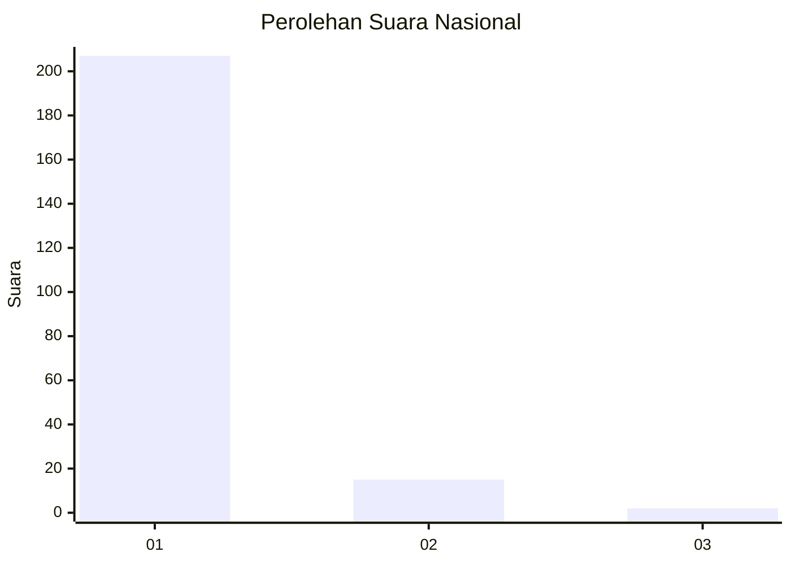
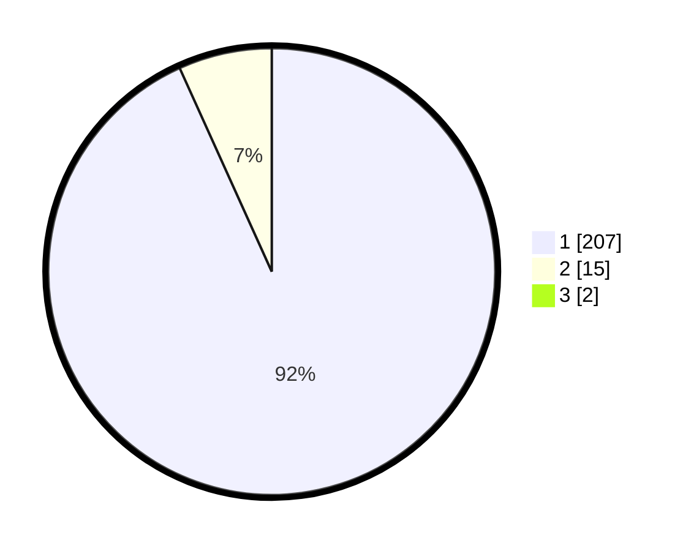

# Hasil

## Grafik

## Tabel

| No. | Nama Paslon    | Suara | Suara (raw) | Persentase |
|:--- |:-------------- | -----:| -----------:| ----------:|
| 1   | ANIES MUHAIMIN | 207   | [207][p-1]  | 92,41      |
| 2   | PRABOWO GIBRAN | 15    | [15][p-2]   | 6,70       |
| 3   | GANJAR MAHFUD  | 2     | [2][p-3]    | 0,89       |

[p-1]: https://github.com/gigit-pemilu/pemilu-2024/blob/main/pilpres/hitung-suara/sub/11-aceh/sub/07-pidie/sub/29-glumpang-baro/sub/2020-seukee/sub/001-tps/sub/paslon-1.txt
[p-2]: https://github.com/gigit-pemilu/pemilu-2024/blob/main/pilpres/hitung-suara/sub/11-aceh/sub/07-pidie/sub/29-glumpang-baro/sub/2020-seukee/sub/001-tps/sub/paslon-2.txt
[p-3]: https://github.com/gigit-pemilu/pemilu-2024/blob/main/pilpres/hitung-suara/sub/11-aceh/sub/07-pidie/sub/29-glumpang-baro/sub/2020-seukee/sub/001-tps/sub/paslon-3.txt

## Foto C Plano

https://sirekap-obj-formc.kpu.go.id/bc0a/pemilu/ppwp/11/07/29/20/20/1107292020001-20240214-211402--90389e81-4256-4681-9f13-fb5a71b042b6.jpg

https://sirekap-obj-formc.kpu.go.id/bc0a/pemilu/ppwp/11/07/29/20/20/1107292020001-20240214-211455--d241421e-c5c1-4407-b31a-661de5ac5eca.jpg

https://sirekap-obj-formc.kpu.go.id/bc0a/pemilu/ppwp/11/07/29/20/20/1107292020001-20240214-211549--3a8108ed-c9fb-44cb-b0df-d7dd683025ad.jpg

## Metadata

| Key        | Value               |
| ---------- | ------------------- |
| Time Stamp | 2024-02-17 19:30:00 |

