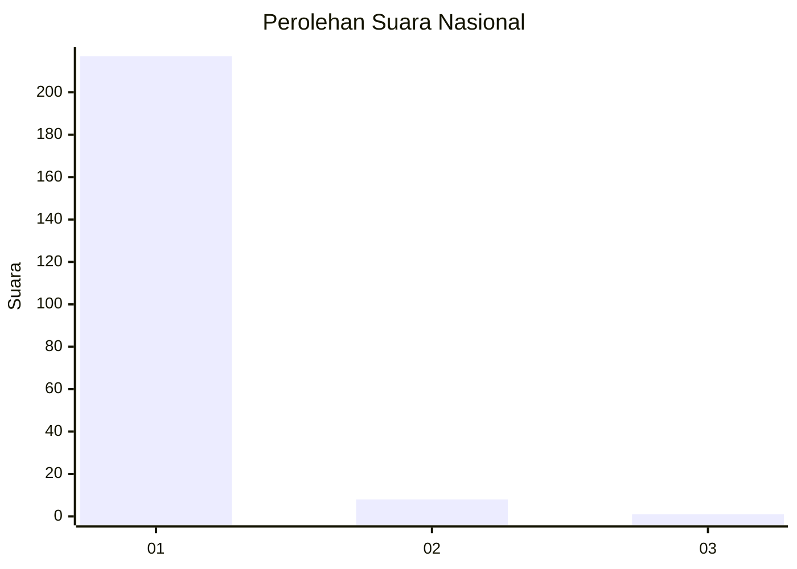
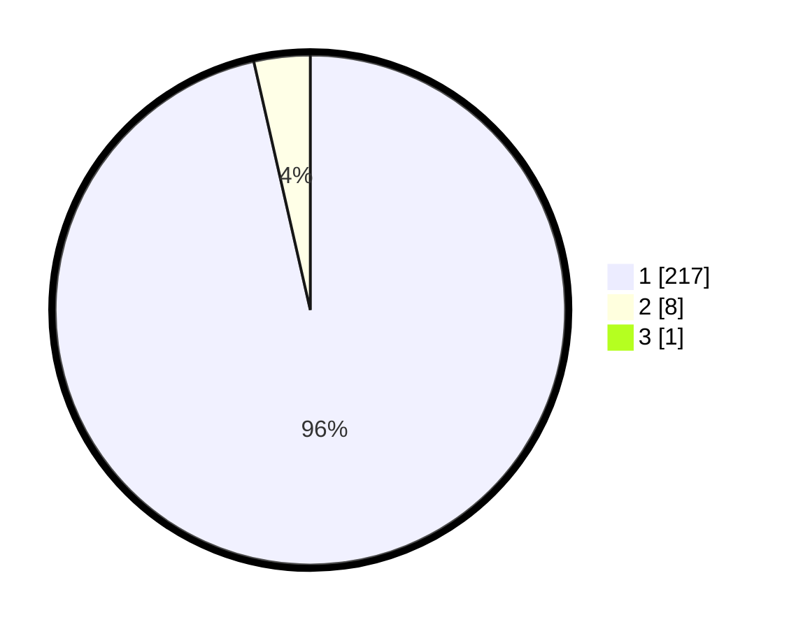

# Hasil

## Grafik

## Tabel

| No. | Nama Paslon    | Suara | Suara (raw) | Persentase |
|:--- |:-------------- | -----:| -----------:| ----------:|
| 1   | ANIES MUHAIMIN | 217   | [217][p-1]  | 96,02      |
| 2   | PRABOWO GIBRAN | 8     | [8][p-2]    | 3,54       |
| 3   | GANJAR MAHFUD  | 1     | [1][p-3]    | 0,44       |

[p-1]: https://github.com/gigit-pemilu/pemilu-2024/blob/main/pilpres/hitung-suara/sub/11-aceh/sub/07-pidie/sub/29-glumpang-baro/sub/2021-bungong/sub/001-tps/sub/paslon-1.txt
[p-2]: https://github.com/gigit-pemilu/pemilu-2024/blob/main/pilpres/hitung-suara/sub/11-aceh/sub/07-pidie/sub/29-glumpang-baro/sub/2021-bungong/sub/001-tps/sub/paslon-2.txt
[p-3]: https://github.com/gigit-pemilu/pemilu-2024/blob/main/pilpres/hitung-suara/sub/11-aceh/sub/07-pidie/sub/29-glumpang-baro/sub/2021-bungong/sub/001-tps/sub/paslon-3.txt

## Foto C Plano

https://sirekap-obj-formc.kpu.go.id/5be7/pemilu/ppwp/11/07/29/20/21/1107292021001-20240215-011927--eba76421-bc7f-44b2-bf40-12a362184e29.jpg

https://sirekap-obj-formc.kpu.go.id/5be7/pemilu/ppwp/11/07/29/20/21/1107292021001-20240215-012207--1e0fdba9-cf57-42ef-b36b-2d036ab1aef0.jpg

https://sirekap-obj-formc.kpu.go.id/5be7/pemilu/ppwp/11/07/29/20/21/1107292021001-20240215-012649--b470a9e7-08cb-45f9-a1a5-3cc21f62da41.jpg

## Metadata

| Key        | Value               |
| ---------- | ------------------- |
| Time Stamp | 2024-02-17 19:30:00 |

