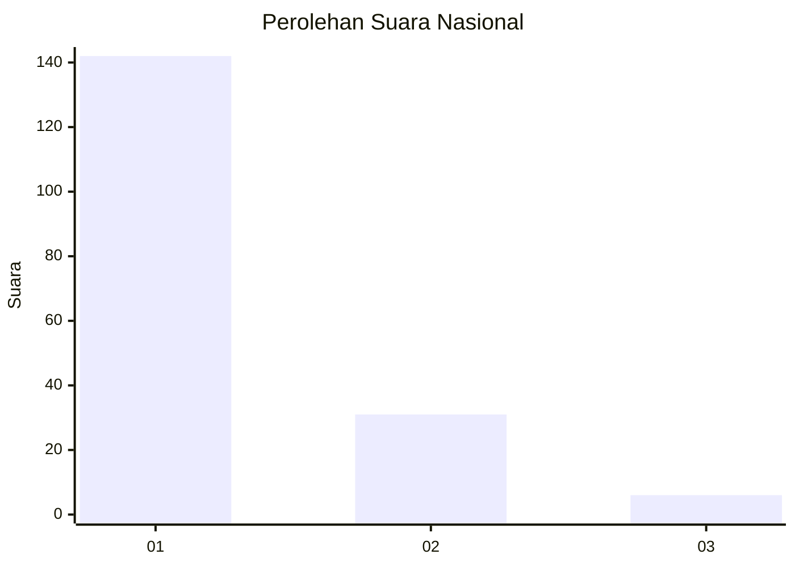
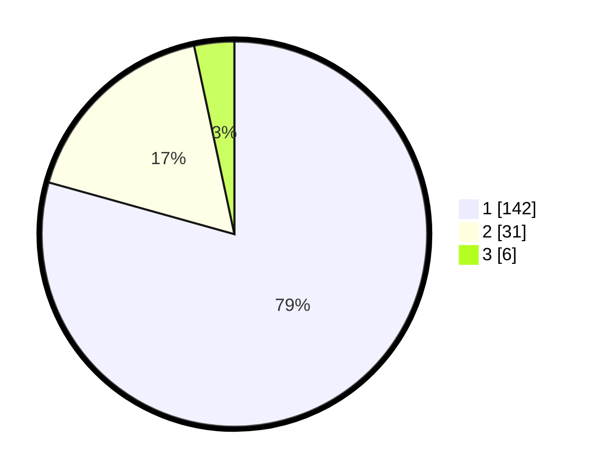

# Hasil

## Grafik

## Tabel

| No. | Nama Paslon    | Suara | Suara (raw) | Persentase |
|:--- |:-------------- | -----:| -----------:| ----------:|
| 1   | ANIES MUHAIMIN | 142   | [142][p-1]  | 79,33      |
| 2   | PRABOWO GIBRAN | 31    | [31][p-2]   | 17,32      |
| 3   | GANJAR MAHFUD  | 6     | [6][p-3]    | 3,35       |

[p-1]: https://github.com/gigit-pemilu/pemilu-2024/blob/main/pilpres/hitung-suara/sub/11-aceh/sub/07-pidie/sub/31-titeue/sub/2001-lingkok/sub/001-tps/sub/paslon-1.txt
[p-2]: https://github.com/gigit-pemilu/pemilu-2024/blob/main/pilpres/hitung-suara/sub/11-aceh/sub/07-pidie/sub/31-titeue/sub/2001-lingkok/sub/001-tps/sub/paslon-2.txt
[p-3]: https://github.com/gigit-pemilu/pemilu-2024/blob/main/pilpres/hitung-suara/sub/11-aceh/sub/07-pidie/sub/31-titeue/sub/2001-lingkok/sub/001-tps/sub/paslon-3.txt

## Foto C Plano

https://sirekap-obj-formc.kpu.go.id/bcb6/pemilu/ppwp/11/07/31/20/01/1107312001001-20240215-091347--c3f06f6a-8a42-452e-8509-9acb608b5f23.jpg

https://sirekap-obj-formc.kpu.go.id/bcb6/pemilu/ppwp/11/07/31/20/01/1107312001001-20240215-074012--be87850d-9484-493e-8278-d7b93b0d7ea7.jpg

## Metadata

| Key        | Value               |
| ---------- | ------------------- |
| Time Stamp | 2024-02-24 22:31:28 |

