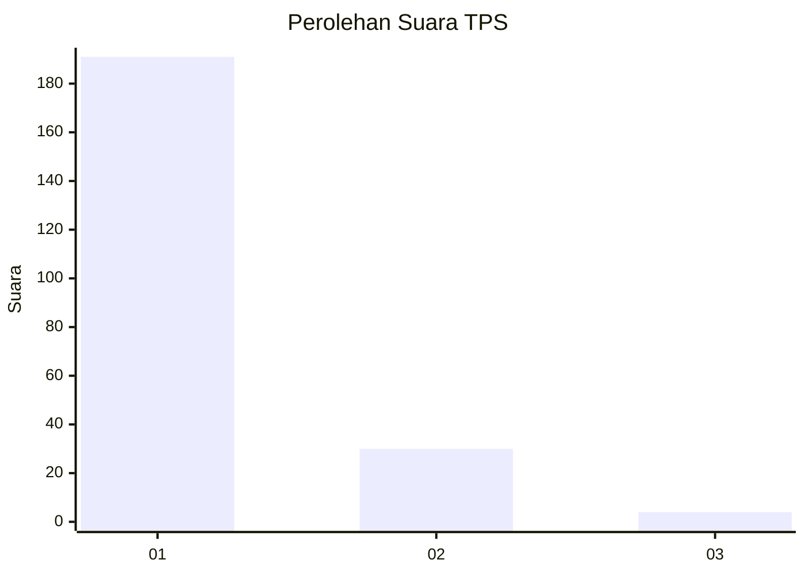
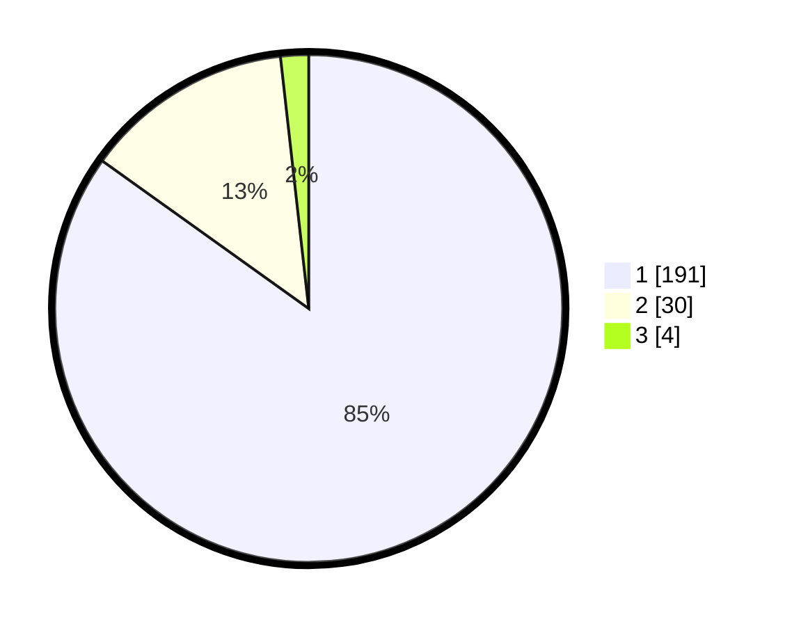

# Hasil

## Grafik

## Tabel

| No. | Nama Paslon    | Suara | Suara (raw) | Persentase |
|:--- |:-------------- | -----:| -----------:| ----------:|
| 1   | ANIES MUHAIMIN | 191   | [191][p-1]  | 84,89      |
| 2   | PRABOWO GIBRAN | 30    | [30][p-2]   | 13,33      |
| 3   | GANJAR MAHFUD  | 4     | [4][p-3]    | 1,78       |

[p-1]: https://github.com/gigit-pemilu/pemilu-2024-11-aceh/blob/main/pilpres/hitung-suara/sub/11-aceh/sub/07-pidie/sub/31-titeue/sub/2002-pante-kulu/sub/001-tps/sub/paslon-1.txt
[p-2]: https://github.com/gigit-pemilu/pemilu-2024-11-aceh/blob/main/pilpres/hitung-suara/sub/11-aceh/sub/07-pidie/sub/31-titeue/sub/2002-pante-kulu/sub/001-tps/sub/paslon-2.txt
[p-3]: https://github.com/gigit-pemilu/pemilu-2024-11-aceh/blob/main/pilpres/hitung-suara/sub/11-aceh/sub/07-pidie/sub/31-titeue/sub/2002-pante-kulu/sub/001-tps/sub/paslon-3.txt

## Foto C Plano

https://sirekap-obj-formc.kpu.go.id/856f/pemilu/ppwp/11/07/31/20/02/1107312002001-20240221-123114--7189f621-682f-4593-82d2-d79f5ad7a647.jpg

https://sirekap-obj-formc.kpu.go.id/856f/pemilu/ppwp/11/07/31/20/02/1107312002001-20240221-123202--e57ecdbb-e3bc-4f18-b1d9-c5b5743c64d8.jpg

https://sirekap-obj-formc.kpu.go.id/856f/pemilu/ppwp/11/07/31/20/02/1107312002001-20240221-123308--1b0029a0-61e4-4b65-875a-f878509a7b64.jpg

## Metadata

| Key        | Value               |
| ---------- | ------------------- |
| Time Stamp | 2024-02-24 22:31:28 |

