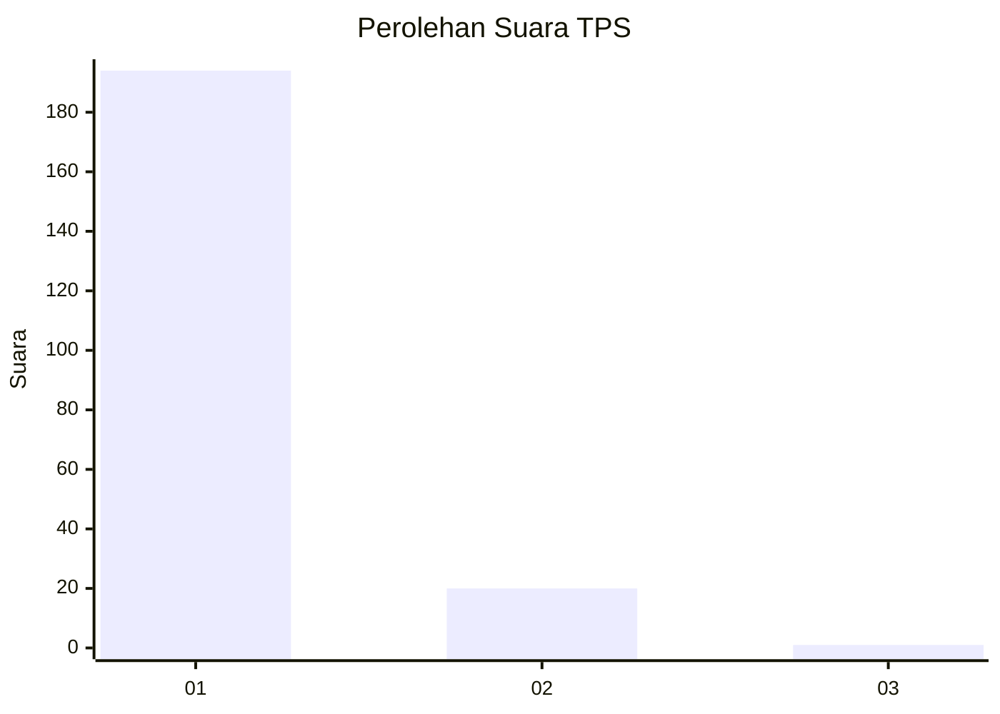
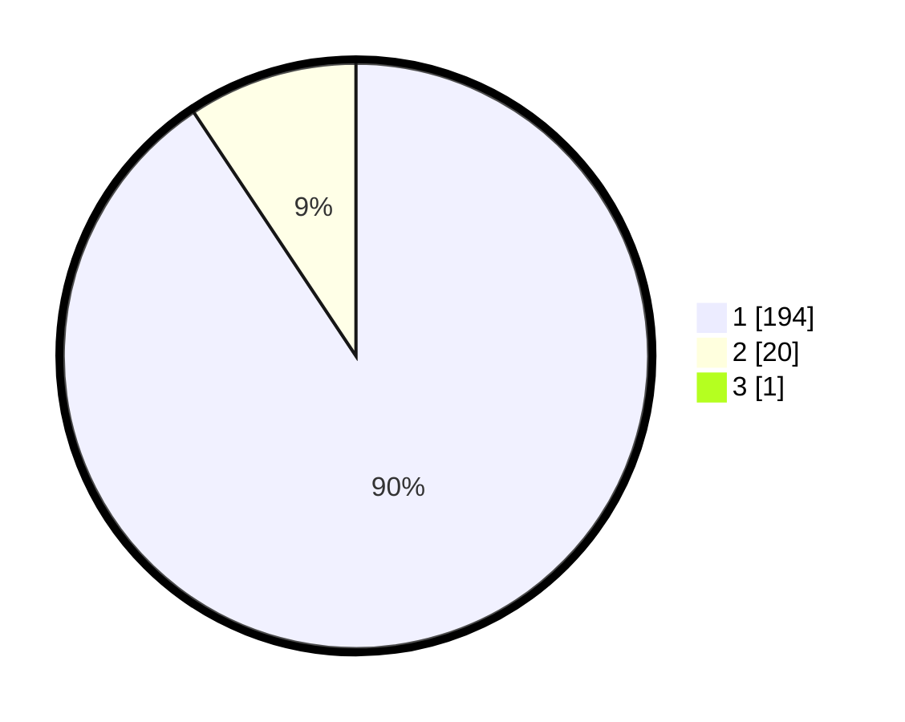

# Hasil

## Grafik

## Tabel

| No. | Nama Paslon    | Suara | Suara (raw) | Persentase |
|:--- |:-------------- | -----:| -----------:| ----------:|
| 1   | ANIES MUHAIMIN | 194   | [194][p-1]  | 90,23      |
| 2   | PRABOWO GIBRAN | 20    | [20][p-2]   | 9,30       |
| 3   | GANJAR MAHFUD  | 1     | [1][p-3]    | 0,47       |

[p-1]: https://github.com/gigit-pemilu/pemilu-2024-11-aceh/blob/main/pilpres/hitung-suara/sub/11-aceh/sub/07-pidie/sub/31-titeue/sub/2002-pante-kulu/sub/002-tps/sub/paslon-1.txt
[p-2]: https://github.com/gigit-pemilu/pemilu-2024-11-aceh/blob/main/pilpres/hitung-suara/sub/11-aceh/sub/07-pidie/sub/31-titeue/sub/2002-pante-kulu/sub/002-tps/sub/paslon-2.txt
[p-3]: https://github.com/gigit-pemilu/pemilu-2024-11-aceh/blob/main/pilpres/hitung-suara/sub/11-aceh/sub/07-pidie/sub/31-titeue/sub/2002-pante-kulu/sub/002-tps/sub/paslon-3.txt

## Foto C Plano

https://sirekap-obj-formc.kpu.go.id/6186/pemilu/ppwp/11/07/31/20/02/1107312002002-20240221-123420--423567ee-3620-4f88-808c-834ac15759f0.jpg

https://sirekap-obj-formc.kpu.go.id/6186/pemilu/ppwp/11/07/31/20/02/1107312002002-20240221-123503--3fa3c8fb-5322-4bf1-b7ec-7d65f10659de.jpg

https://sirekap-obj-formc.kpu.go.id/6186/pemilu/ppwp/11/07/31/20/02/1107312002002-20240221-123602--935ad881-5c90-485c-bf7f-e2a69b3447fa.jpg

## Metadata

| Key        | Value               |
| ---------- | ------------------- |
| Time Stamp | 2024-02-24 22:31:28 |

