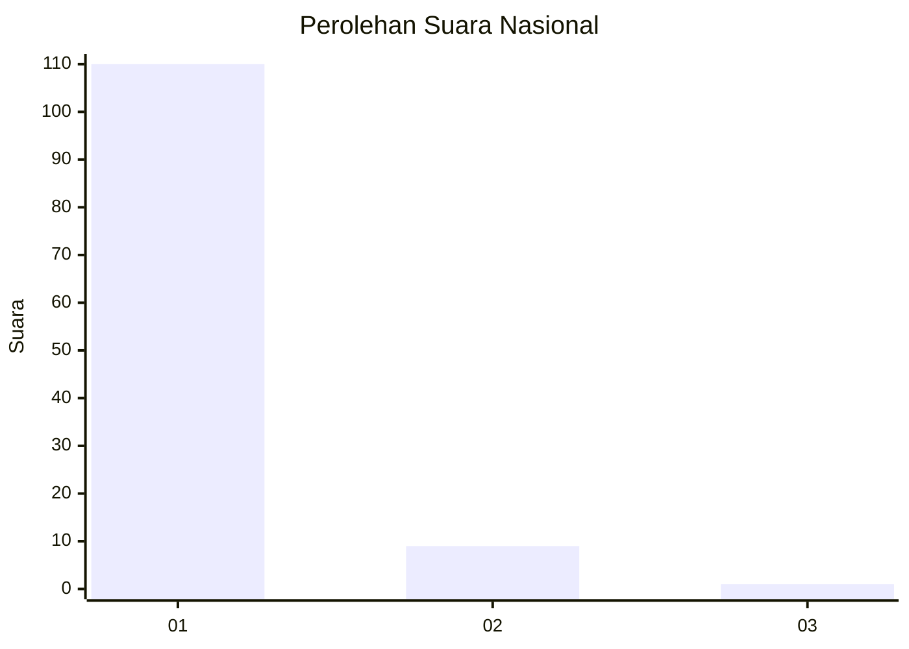
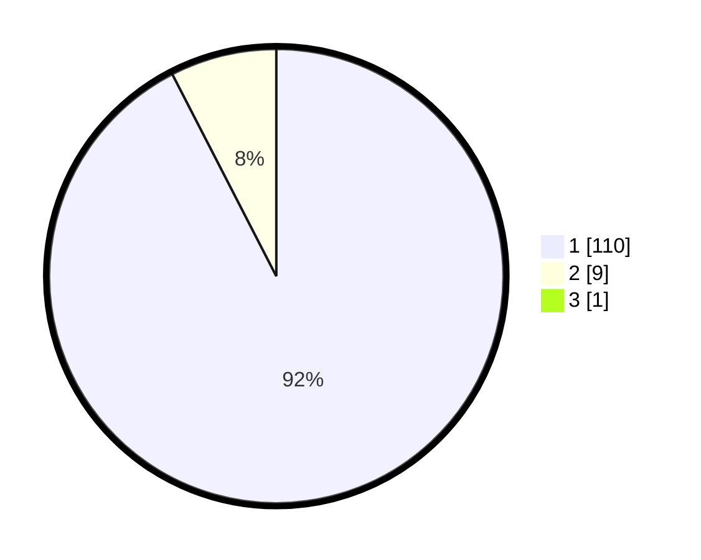

# Hasil

## Grafik

## Tabel

| No. | Nama Paslon    | Suara | Suara (raw) | Persentase |
|:--- |:-------------- | -----:| -----------:| ----------:|
| 1   | ANIES MUHAIMIN | 110   | [110][p-1]  | 91,67      |
| 2   | PRABOWO GIBRAN | 9     | [9][p-2]    | 7,50       |
| 3   | GANJAR MAHFUD  | 1     | [1][p-3]    | 0,83       |

[p-1]: https://github.com/gigit-pemilu/pemilu-2024/blob/main/pilpres/hitung-suara/sub/11-aceh/sub/07-pidie/sub/31-titeue/sub/2005-pulo-raya/sub/001-tps/sub/paslon-1.txt
[p-2]: https://github.com/gigit-pemilu/pemilu-2024/blob/main/pilpres/hitung-suara/sub/11-aceh/sub/07-pidie/sub/31-titeue/sub/2005-pulo-raya/sub/001-tps/sub/paslon-2.txt
[p-3]: https://github.com/gigit-pemilu/pemilu-2024/blob/main/pilpres/hitung-suara/sub/11-aceh/sub/07-pidie/sub/31-titeue/sub/2005-pulo-raya/sub/001-tps/sub/paslon-3.txt

## Foto C Plano

https://sirekap-obj-formc.kpu.go.id/682e/pemilu/ppwp/11/07/31/20/05/1107312005001-20240221-121349--7632ecfe-4448-4630-8847-8eceb08f292d.jpg

https://sirekap-obj-formc.kpu.go.id/682e/pemilu/ppwp/11/07/31/20/05/1107312005001-20240221-121458--d7668f41-12b4-4bcc-a81c-2f92b6cdf2f7.jpg

https://sirekap-obj-formc.kpu.go.id/682e/pemilu/ppwp/11/07/31/20/05/1107312005001-20240221-121541--b6fae5f9-3805-4fca-8aa6-786318959ff6.jpg

## Metadata

| Key        | Value               |
| ---------- | ------------------- |
| Time Stamp | 2024-02-24 22:31:28 |

