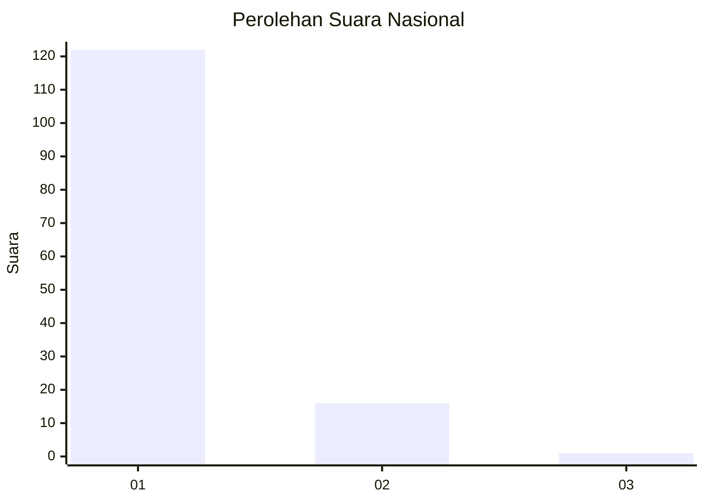
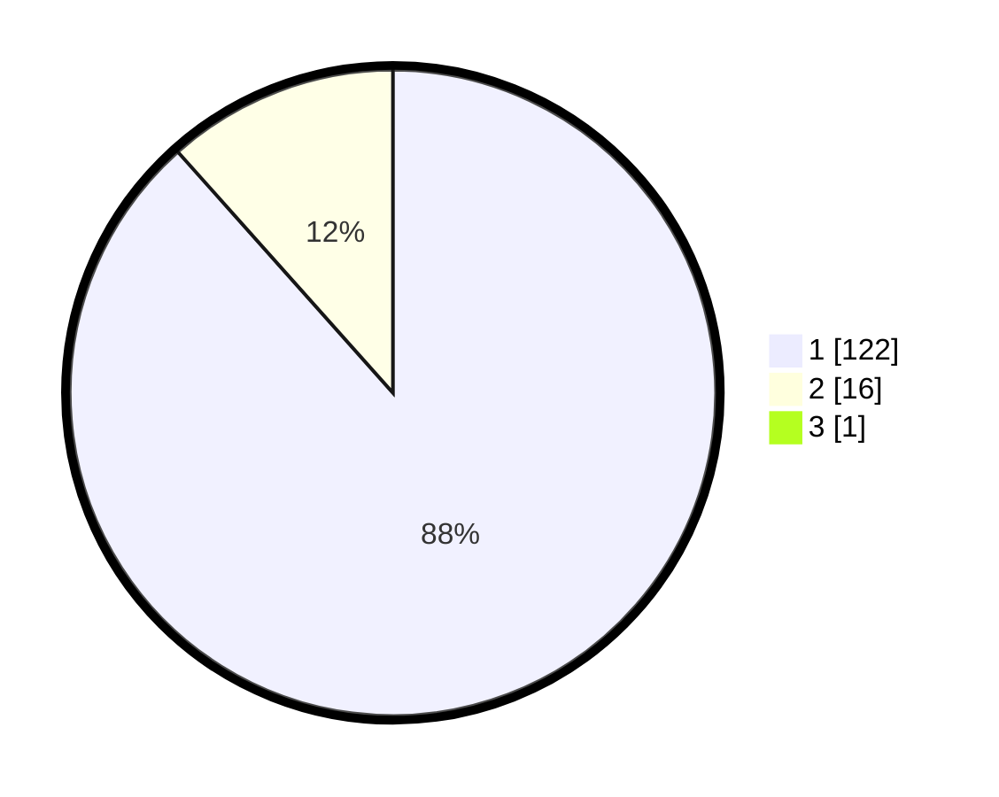

# Hasil

## Grafik

## Tabel

| No. | Nama Paslon    | Suara | Suara (raw) | Persentase |
|:--- |:-------------- | -----:| -----------:| ----------:|
| 1   | ANIES MUHAIMIN | 122   | [122][p-1]  | 87,77      |
| 2   | PRABOWO GIBRAN | 16    | [16][p-2]   | 11,51      |
| 3   | GANJAR MAHFUD  | 1     | [1][p-3]    | 0,72       |

[p-1]: https://github.com/gigit-pemilu/pemilu-2024/blob/main/pilpres/hitung-suara/sub/11-aceh/sub/07-pidie/sub/31-titeue/sub/2005-pulo-raya/sub/002-tps/sub/paslon-1.txt
[p-2]: https://github.com/gigit-pemilu/pemilu-2024/blob/main/pilpres/hitung-suara/sub/11-aceh/sub/07-pidie/sub/31-titeue/sub/2005-pulo-raya/sub/002-tps/sub/paslon-2.txt
[p-3]: https://github.com/gigit-pemilu/pemilu-2024/blob/main/pilpres/hitung-suara/sub/11-aceh/sub/07-pidie/sub/31-titeue/sub/2005-pulo-raya/sub/002-tps/sub/paslon-3.txt

## Foto C Plano

https://sirekap-obj-formc.kpu.go.id/4594/pemilu/ppwp/11/07/31/20/05/1107312005002-20240221-121728--34788b9f-6ed0-446c-8ed3-7960fae52bb2.jpg

https://sirekap-obj-formc.kpu.go.id/4594/pemilu/ppwp/11/07/31/20/05/1107312005002-20240221-121809--ca519c22-8617-4fd5-86bf-1493a057885d.jpg

https://sirekap-obj-formc.kpu.go.id/4594/pemilu/ppwp/11/07/31/20/05/1107312005002-20240221-121847--b08ef010-19aa-4766-a9aa-2c4ab1e6210e.jpg

## Metadata

| Key        | Value               |
| ---------- | ------------------- |
| Time Stamp | 2024-02-24 22:31:28 |

