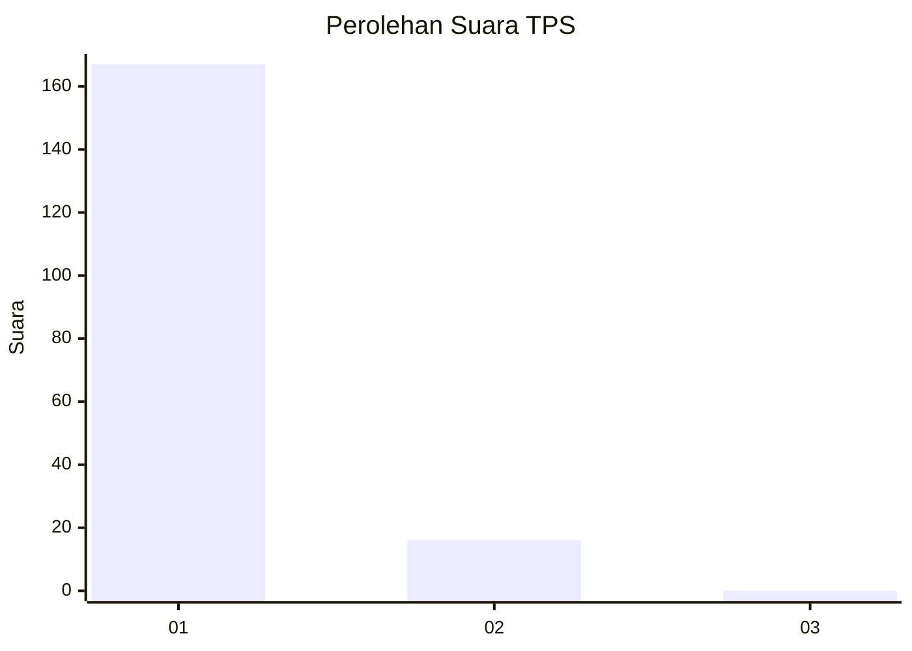
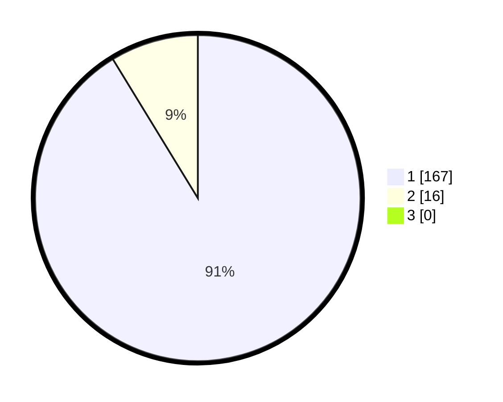

# Hasil

## Grafik

## Tabel

| No. | Nama Paslon    | Suara | Suara (raw) | Persentase |
|:--- |:-------------- | -----:| -----------:| ----------:|
| 1   | ANIES MUHAIMIN | 167   | [167][p-1]  | 91,26      |
| 2   | PRABOWO GIBRAN | 16    | [16][p-2]   | 8,74       |
| 3   | GANJAR MAHFUD  | 0     | [0][p-3]    | 0,00       |

[p-1]: https://github.com/gigit-pemilu/pemilu-2024-11-aceh/blob/main/pilpres/hitung-suara/sub/11-aceh/sub/07-pidie/sub/31-titeue/sub/2006-cut/sub/001-tps/sub/paslon-1.txt
[p-2]: https://github.com/gigit-pemilu/pemilu-2024-11-aceh/blob/main/pilpres/hitung-suara/sub/11-aceh/sub/07-pidie/sub/31-titeue/sub/2006-cut/sub/001-tps/sub/paslon-2.txt
[p-3]: https://github.com/gigit-pemilu/pemilu-2024-11-aceh/blob/main/pilpres/hitung-suara/sub/11-aceh/sub/07-pidie/sub/31-titeue/sub/2006-cut/sub/001-tps/sub/paslon-3.txt

## Foto C Plano

https://sirekap-obj-formc.kpu.go.id/1996/pemilu/ppwp/11/07/31/20/06/1107312006001-20240221-124210--36df9f87-de91-45fa-92d0-2e488e5d4ca8.jpg

https://sirekap-obj-formc.kpu.go.id/1996/pemilu/ppwp/11/07/31/20/06/1107312006001-20240221-124251--71da886c-3616-430a-ab73-3464503ac7b8.jpg

https://sirekap-obj-formc.kpu.go.id/1996/pemilu/ppwp/11/07/31/20/06/1107312006001-20240221-124337--68623c49-3a1c-4ef1-82b8-cbd5e2099af2.jpg

## Metadata

| Key        | Value               |
| ---------- | ------------------- |
| Time Stamp | 2024-02-24 22:31:28 |

