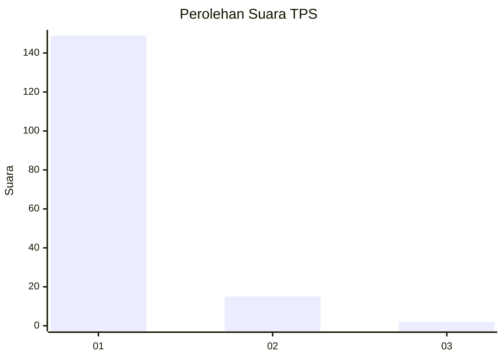
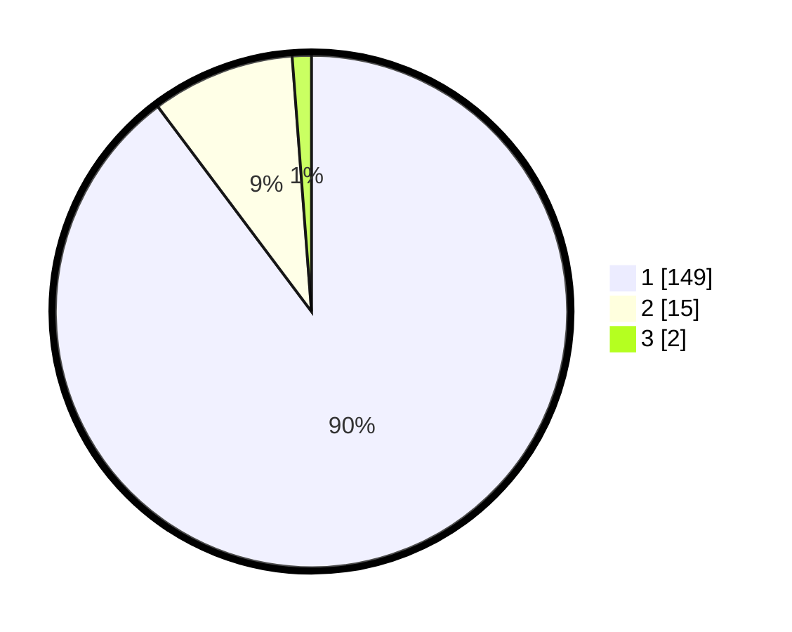

# Hasil

## Grafik

## Tabel

| No. | Nama Paslon    | Suara | Suara (raw) | Persentase |
|:--- |:-------------- | -----:| -----------:| ----------:|
| 1   | ANIES MUHAIMIN | 149   | [149][p-1]  | 89,76      |
| 2   | PRABOWO GIBRAN | 15    | [15][p-2]   | 9,04       |
| 3   | GANJAR MAHFUD  | 2     | [2][p-3]    | 1,20       |

[p-1]: https://github.com/gigit-pemilu/pemilu-2024-11-aceh/blob/main/pilpres/hitung-suara/sub/11-aceh/sub/07-pidie/sub/31-titeue/sub/2006-cut/sub/002-tps/sub/paslon-1.txt
[p-2]: https://github.com/gigit-pemilu/pemilu-2024-11-aceh/blob/main/pilpres/hitung-suara/sub/11-aceh/sub/07-pidie/sub/31-titeue/sub/2006-cut/sub/002-tps/sub/paslon-2.txt
[p-3]: https://github.com/gigit-pemilu/pemilu-2024-11-aceh/blob/main/pilpres/hitung-suara/sub/11-aceh/sub/07-pidie/sub/31-titeue/sub/2006-cut/sub/002-tps/sub/paslon-3.txt

## Foto C Plano

https://sirekap-obj-formc.kpu.go.id/ebb0/pemilu/ppwp/11/07/31/20/06/1107312006002-20240221-124927--7ca582d5-8f60-4a9b-b67d-462a15e104f2.jpg

https://sirekap-obj-formc.kpu.go.id/ebb0/pemilu/ppwp/11/07/31/20/06/1107312006002-20240221-125342--6415ac6e-6bda-4e4c-87ca-b0e65a1f8e68.jpg

https://sirekap-obj-formc.kpu.go.id/ebb0/pemilu/ppwp/11/07/31/20/06/1107312006002-20240221-125428--cbb95c0d-ec97-497c-bd30-9ea2fa596137.jpg

## Metadata

| Key        | Value               |
| ---------- | ------------------- |
| Time Stamp | 2024-02-24 22:31:28 |

