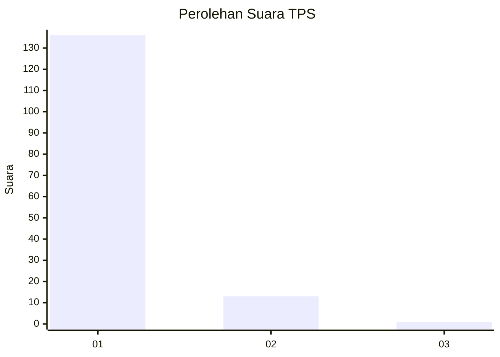
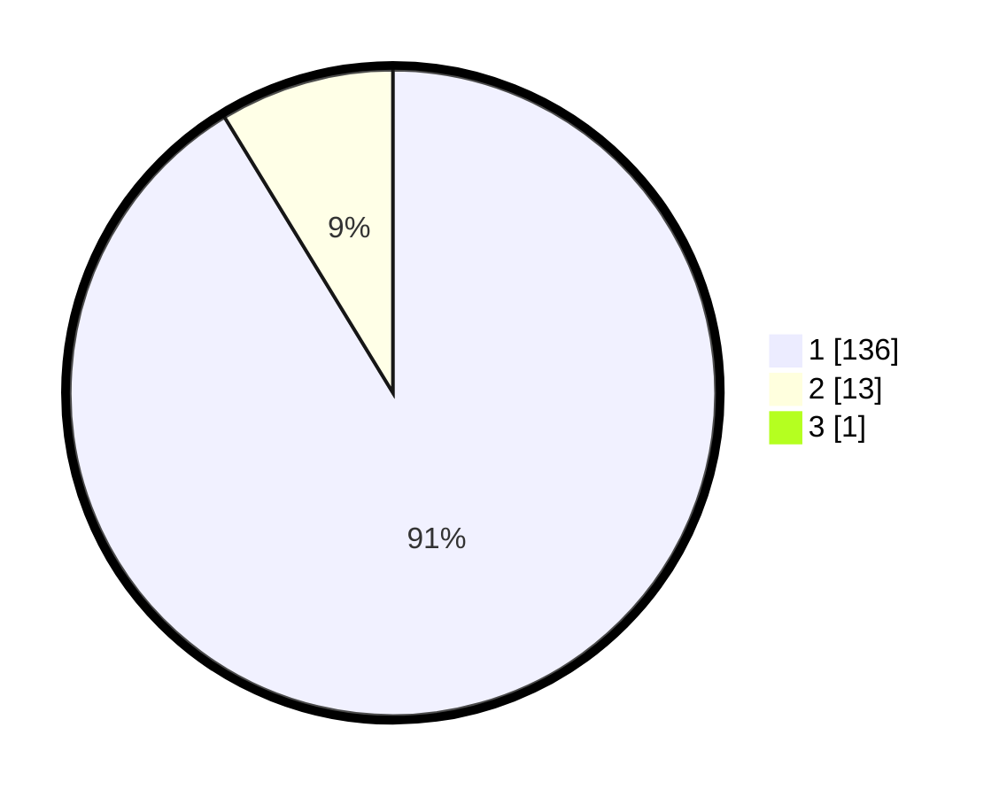

# Hasil

## Grafik

## Tabel

| No. | Nama Paslon    | Suara | Suara (raw) | Persentase |
|:--- |:-------------- | -----:| -----------:| ----------:|
| 1   | ANIES MUHAIMIN | 136   | [136][p-1]  | 90,67      |
| 2   | PRABOWO GIBRAN | 13    | [13][p-2]   | 8,67       |
| 3   | GANJAR MAHFUD  | 1     | [1][p-3]    | 0,67       |

[p-1]: https://github.com/gigit-pemilu/pemilu-2024-11-aceh/blob/main/pilpres/hitung-suara/sub/11-aceh/sub/07-pidie/sub/31-titeue/sub/2008-paloh-naleueng/sub/001-tps/sub/paslon-1.txt
[p-2]: https://github.com/gigit-pemilu/pemilu-2024-11-aceh/blob/main/pilpres/hitung-suara/sub/11-aceh/sub/07-pidie/sub/31-titeue/sub/2008-paloh-naleueng/sub/001-tps/sub/paslon-2.txt
[p-3]: https://github.com/gigit-pemilu/pemilu-2024-11-aceh/blob/main/pilpres/hitung-suara/sub/11-aceh/sub/07-pidie/sub/31-titeue/sub/2008-paloh-naleueng/sub/001-tps/sub/paslon-3.txt

## Foto C Plano

https://sirekap-obj-formc.kpu.go.id/ec6d/pemilu/ppwp/11/07/31/20/08/1107312008001-20240214-195207--d813e44f-e761-48ca-be69-a884ac2d7f9d.jpg

https://sirekap-obj-formc.kpu.go.id/ec6d/pemilu/ppwp/11/07/31/20/08/1107312008001-20240214-195250--e2c8d615-ac36-49d2-bd2c-433d58033194.jpg

https://sirekap-obj-formc.kpu.go.id/ec6d/pemilu/ppwp/11/07/31/20/08/1107312008001-20240214-195302--d49ad4b3-7a7b-47ff-9032-2013cf520744.jpg

## Metadata

| Key        | Value               |
| ---------- | ------------------- |
| Time Stamp | 2024-02-16 02:30:27 |

