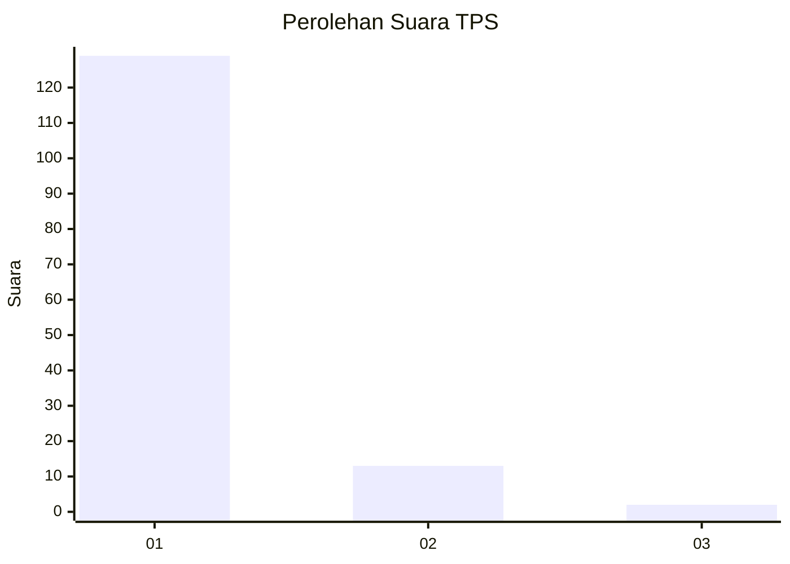
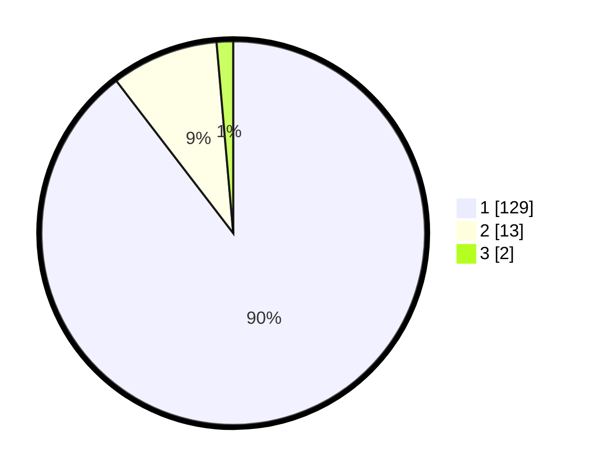

# Hasil

## Grafik

## Tabel

| No. | Nama Paslon    | Suara | Suara (raw) | Persentase |
|:--- |:-------------- | -----:| -----------:| ----------:|
| 1   | ANIES MUHAIMIN | 129   | [129][p-1]  | 89,58      |
| 2   | PRABOWO GIBRAN | 13    | [13][p-2]   | 9,03       |
| 3   | GANJAR MAHFUD  | 2     | [2][p-3]    | 1,39       |

[p-1]: https://github.com/gigit-pemilu/pemilu-2024-11-aceh/blob/main/pilpres/hitung-suara/sub/11-aceh/sub/07-pidie/sub/31-titeue/sub/2009-pulo-lhoih/sub/001-tps/sub/paslon-1.txt
[p-2]: https://github.com/gigit-pemilu/pemilu-2024-11-aceh/blob/main/pilpres/hitung-suara/sub/11-aceh/sub/07-pidie/sub/31-titeue/sub/2009-pulo-lhoih/sub/001-tps/sub/paslon-2.txt
[p-3]: https://github.com/gigit-pemilu/pemilu-2024-11-aceh/blob/main/pilpres/hitung-suara/sub/11-aceh/sub/07-pidie/sub/31-titeue/sub/2009-pulo-lhoih/sub/001-tps/sub/paslon-3.txt

## Foto C Plano

https://sirekap-obj-formc.kpu.go.id/691a/pemilu/ppwp/11/07/31/20/09/1107312009001-20240221-120002--20c3c8df-1102-4b3b-b41a-d21f06736de1.jpg

https://sirekap-obj-formc.kpu.go.id/691a/pemilu/ppwp/11/07/31/20/09/1107312009001-20240221-120056--1712b512-62c8-4e13-8dc7-91ede102cca5.jpg

https://sirekap-obj-formc.kpu.go.id/691a/pemilu/ppwp/11/07/31/20/09/1107312009001-20240221-120144--9e26e07c-a939-4b7d-80ef-27e64b311ba3.jpg

## Metadata

| Key        | Value               |
| ---------- | ------------------- |
| Time Stamp | 2024-02-24 22:31:28 |

