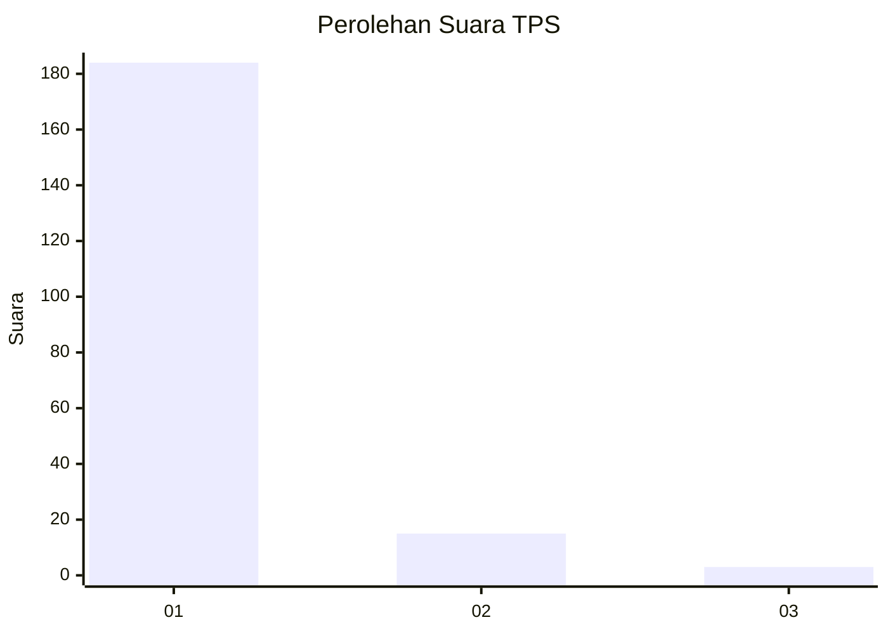
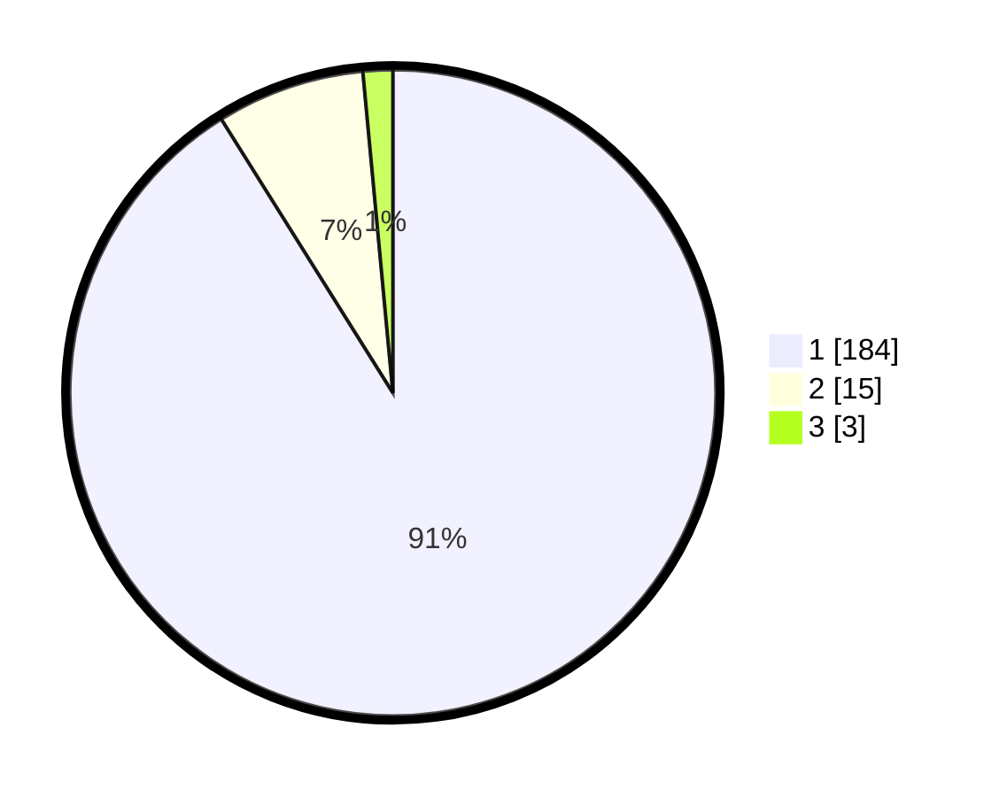

# Hasil

## Grafik

## Tabel

| No. | Nama Paslon    | Suara | Suara (raw) | Persentase |
|:--- |:-------------- | -----:| -----------:| ----------:|
| 1   | ANIES MUHAIMIN | 184   | [184][p-1]  | 91,09      |
| 2   | PRABOWO GIBRAN | 15    | [15][p-2]   | 7,43       |
| 3   | GANJAR MAHFUD  | 3     | [3][p-3]    | 1,49       |

[p-1]: https://github.com/gigit-pemilu/pemilu-2024-11-aceh/blob/main/pilpres/hitung-suara/sub/11-aceh/sub/07-pidie/sub/31-titeue/sub/2010-mesjid-tongpudeng/sub/001-tps/sub/paslon-1.txt
[p-2]: https://github.com/gigit-pemilu/pemilu-2024-11-aceh/blob/main/pilpres/hitung-suara/sub/11-aceh/sub/07-pidie/sub/31-titeue/sub/2010-mesjid-tongpudeng/sub/001-tps/sub/paslon-2.txt
[p-3]: https://github.com/gigit-pemilu/pemilu-2024-11-aceh/blob/main/pilpres/hitung-suara/sub/11-aceh/sub/07-pidie/sub/31-titeue/sub/2010-mesjid-tongpudeng/sub/001-tps/sub/paslon-3.txt

## Foto C Plano

https://sirekap-obj-formc.kpu.go.id/72f1/pemilu/ppwp/11/07/31/20/10/1107312010001-20240221-114242--40c03a42-123e-4543-b08b-f4952760387e.jpg

https://sirekap-obj-formc.kpu.go.id/72f1/pemilu/ppwp/11/07/31/20/10/1107312010001-20240221-114329--314e7e97-0950-4b8b-90b3-ba9dd323f006.jpg

https://sirekap-obj-formc.kpu.go.id/72f1/pemilu/ppwp/11/07/31/20/10/1107312010001-20240221-114417--d010ef28-a311-4cb9-a9af-054ba36bf2c8.jpg

## Metadata

| Key        | Value               |
| ---------- | ------------------- |
| Time Stamp | 2024-02-25 22:00:00 |

