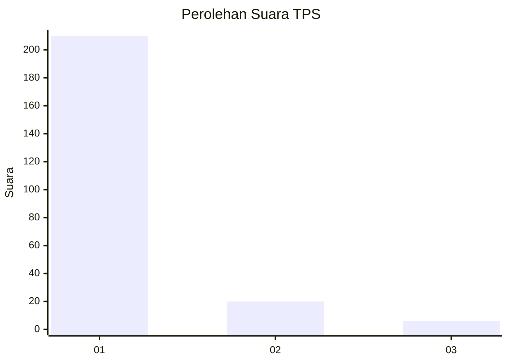
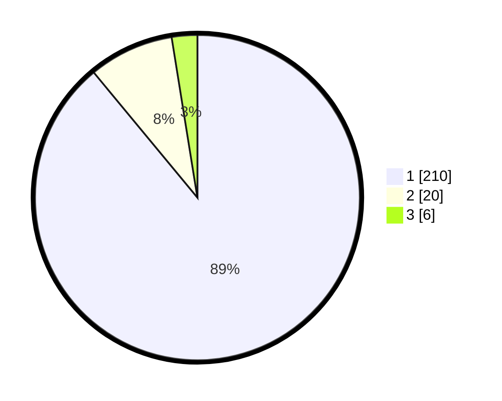

# Hasil

## Grafik

## Tabel

| No. | Nama Paslon    | Suara | Suara (raw) | Persentase |
|:--- |:-------------- | -----:| -----------:| ----------:|
| 1   | ANIES MUHAIMIN | 210   | [210][p-1]  | 88,98      |
| 2   | PRABOWO GIBRAN | 20    | [20][p-2]   | 8,47       |
| 3   | GANJAR MAHFUD  | 6     | [6][p-3]    | 2,54       |

[p-1]: https://github.com/gigit-pemilu/pemilu-2024-11-aceh/blob/main/pilpres/hitung-suara/sub/11-aceh/sub/07-pidie/sub/31-titeue/sub/2010-mesjid-tongpudeng/sub/002-tps/sub/paslon-1.txt
[p-2]: https://github.com/gigit-pemilu/pemilu-2024-11-aceh/blob/main/pilpres/hitung-suara/sub/11-aceh/sub/07-pidie/sub/31-titeue/sub/2010-mesjid-tongpudeng/sub/002-tps/sub/paslon-2.txt
[p-3]: https://github.com/gigit-pemilu/pemilu-2024-11-aceh/blob/main/pilpres/hitung-suara/sub/11-aceh/sub/07-pidie/sub/31-titeue/sub/2010-mesjid-tongpudeng/sub/002-tps/sub/paslon-3.txt

## Foto C Plano

https://sirekap-obj-formc.kpu.go.id/c29e/pemilu/ppwp/11/07/31/20/10/1107312010002-20240221-114941--6593565a-736e-4910-a0f4-b59214a14dfe.jpg

https://sirekap-obj-formc.kpu.go.id/c29e/pemilu/ppwp/11/07/31/20/10/1107312010002-20240221-115049--9a3dc857-6c06-43c1-be2c-31ac404a9484.jpg

https://sirekap-obj-formc.kpu.go.id/c29e/pemilu/ppwp/11/07/31/20/10/1107312010002-20240221-115154--0745e789-a86b-46c1-bcb4-6d9bd9d6a0ef.jpg

## Metadata

| Key        | Value               |
| ---------- | ------------------- |
| Time Stamp | 2024-02-24 22:31:28 |

