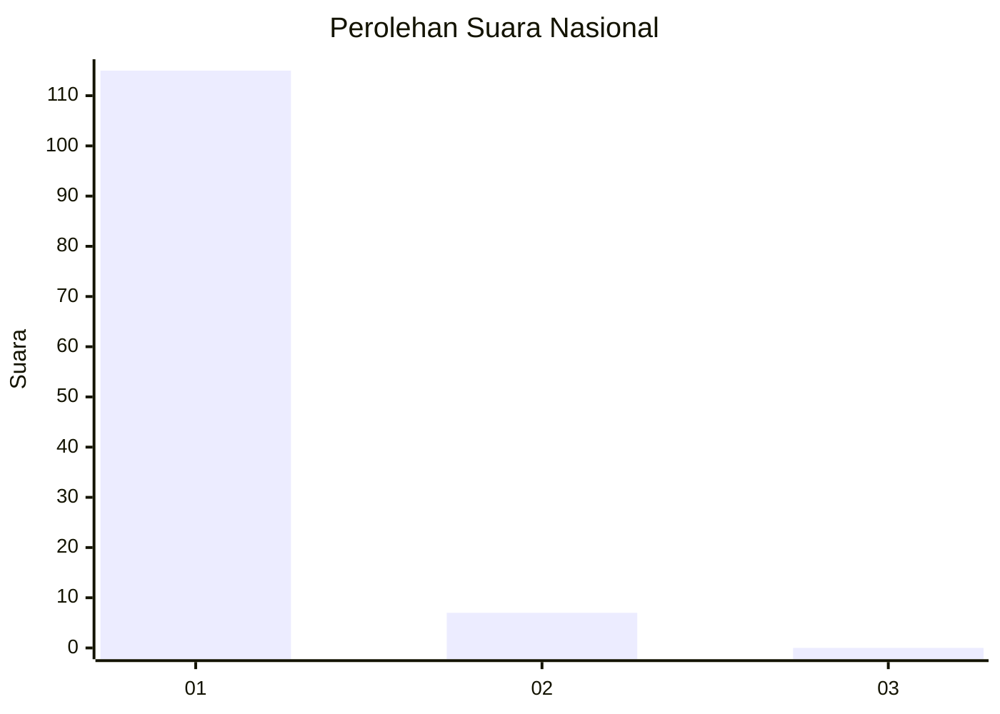
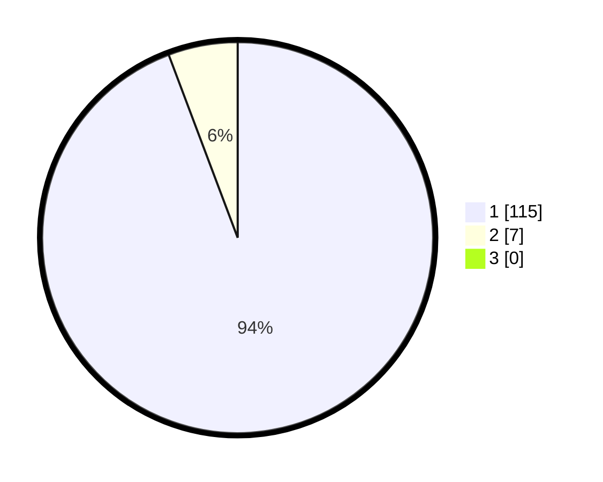

# Hasil

## Grafik

## Tabel

| No. | Nama Paslon    | Suara | Suara (raw) | Persentase |
|:--- |:-------------- | -----:| -----------:| ----------:|
| 1   | ANIES MUHAIMIN | 115   | [115][p-1]  | 94,26      |
| 2   | PRABOWO GIBRAN | 7     | [7][p-2]    | 5,74       |
| 3   | GANJAR MAHFUD  | 0     | [0][p-3]    | 0,00       |

[p-1]: https://github.com/gigit-pemilu/pemilu-2024/blob/main/pilpres/hitung-suara/sub/11-aceh/sub/07-pidie/sub/31-titeue/sub/2011-blang-tho/sub/001-tps/sub/paslon-1.txt
[p-2]: https://github.com/gigit-pemilu/pemilu-2024/blob/main/pilpres/hitung-suara/sub/11-aceh/sub/07-pidie/sub/31-titeue/sub/2011-blang-tho/sub/001-tps/sub/paslon-2.txt
[p-3]: https://github.com/gigit-pemilu/pemilu-2024/blob/main/pilpres/hitung-suara/sub/11-aceh/sub/07-pidie/sub/31-titeue/sub/2011-blang-tho/sub/001-tps/sub/paslon-3.txt

## Foto C Plano

https://sirekap-obj-formc.kpu.go.id/2819/pemilu/ppwp/11/07/31/20/11/1107312011001-20240221-122351--d3c85a3d-7fb6-495e-98fc-7a5726ea4f44.jpg

https://sirekap-obj-formc.kpu.go.id/2819/pemilu/ppwp/11/07/31/20/11/1107312011001-20240221-122436--52061612-d668-4fdd-aabb-8d64461a50ef.jpg

https://sirekap-obj-formc.kpu.go.id/2819/pemilu/ppwp/11/07/31/20/11/1107312011001-20240221-122621--770216b7-ed82-413b-b7d2-0a00c5162984.jpg

## Metadata

| Key        | Value               |
| ---------- | ------------------- |
| Time Stamp | 2024-02-24 22:31:28 |

