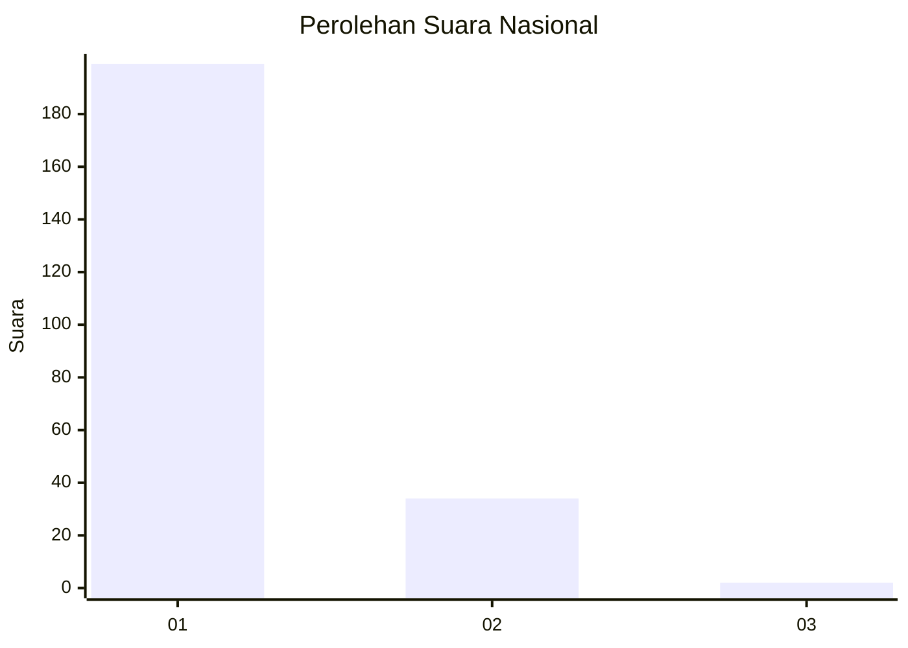
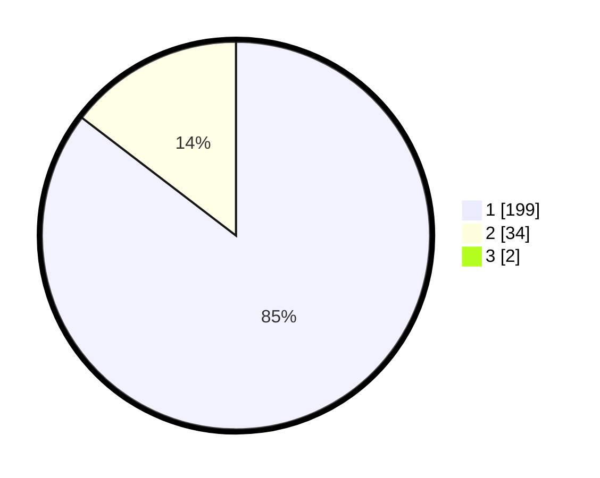

# Hasil

## Grafik

## Tabel

| No. | Nama Paslon    | Suara | Suara (raw) | Persentase |
|:--- |:-------------- | -----:| -----------:| ----------:|
| 1   | ANIES MUHAIMIN | 199   | [199][p-1]  | 84,68      |
| 2   | PRABOWO GIBRAN | 34    | [34][p-2]   | 14,47      |
| 3   | GANJAR MAHFUD  | 2     | [2][p-3]    | 0,85       |

[p-1]: https://github.com/gigit-pemilu/pemilu-2024/blob/main/pilpres/hitung-suara/sub/11-aceh/sub/07-pidie/sub/31-titeue/sub/2013-alue/sub/001-tps/sub/paslon-1.txt
[p-2]: https://github.com/gigit-pemilu/pemilu-2024/blob/main/pilpres/hitung-suara/sub/11-aceh/sub/07-pidie/sub/31-titeue/sub/2013-alue/sub/001-tps/sub/paslon-2.txt
[p-3]: https://github.com/gigit-pemilu/pemilu-2024/blob/main/pilpres/hitung-suara/sub/11-aceh/sub/07-pidie/sub/31-titeue/sub/2013-alue/sub/001-tps/sub/paslon-3.txt

## Foto C Plano

https://sirekap-obj-formc.kpu.go.id/10d2/pemilu/ppwp/11/07/31/20/13/1107312013001-20240221-105739--f7987db2-4213-496d-807b-01893b80fcdb.jpg

https://sirekap-obj-formc.kpu.go.id/10d2/pemilu/ppwp/11/07/31/20/13/1107312013001-20240221-105920--22283ea2-71fc-4307-abfa-0357e00e1cee.jpg

https://sirekap-obj-formc.kpu.go.id/10d2/pemilu/ppwp/11/07/31/20/13/1107312013001-20240221-110032--6e3848db-553d-4a0e-8a34-91224ec29557.jpg

## Metadata

| Key        | Value               |
| ---------- | ------------------- |
| Time Stamp | 2024-02-24 22:31:28 |

