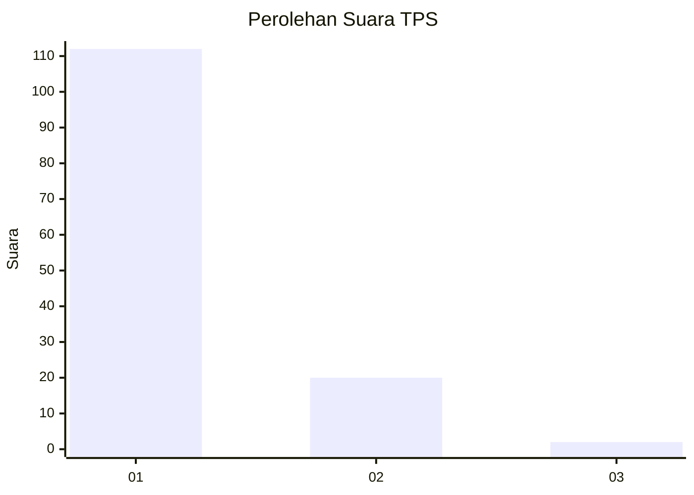
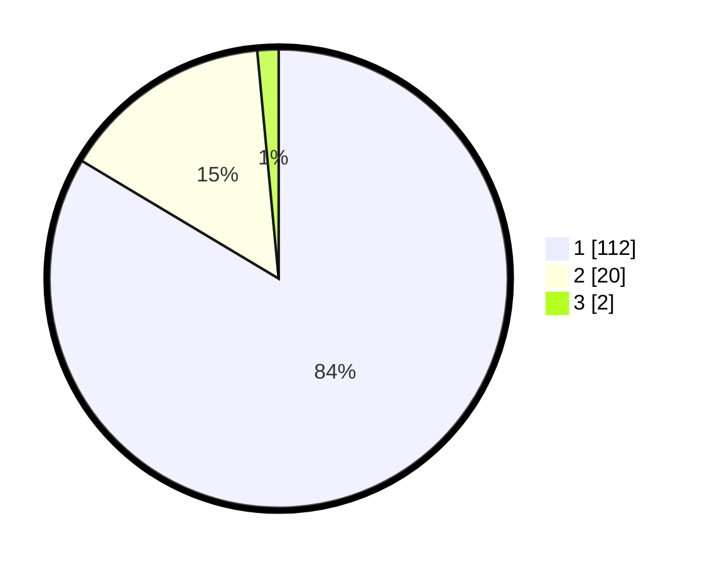

# Hasil

## Grafik

## Tabel

| No. | Nama Paslon    | Suara | Suara (raw) | Persentase |
|:--- |:-------------- | -----:| -----------:| ----------:|
| 1   | ANIES MUHAIMIN | 112   | [112][p-1]  | 83,58      |
| 2   | PRABOWO GIBRAN | 20    | [20][p-2]   | 14,93      |
| 3   | GANJAR MAHFUD  | 2     | [2][p-3]    | 1,49       |

[p-1]: https://github.com/gigit-pemilu/pemilu-2024-11-aceh/blob/main/pilpres/hitung-suara/sub/11-aceh/sub/08-aceh-utara/sub/01-baktiya/sub/2001-keude-alue-ie-puteh/sub/002-tps/sub/paslon-1.txt
[p-2]: https://github.com/gigit-pemilu/pemilu-2024-11-aceh/blob/main/pilpres/hitung-suara/sub/11-aceh/sub/08-aceh-utara/sub/01-baktiya/sub/2001-keude-alue-ie-puteh/sub/002-tps/sub/paslon-2.txt
[p-3]: https://github.com/gigit-pemilu/pemilu-2024-11-aceh/blob/main/pilpres/hitung-suara/sub/11-aceh/sub/08-aceh-utara/sub/01-baktiya/sub/2001-keude-alue-ie-puteh/sub/002-tps/sub/paslon-3.txt

## Foto C Plano

https://sirekap-obj-formc.kpu.go.id/a31d/pemilu/ppwp/11/08/01/20/01/1108012001002-20240222-214639--23619999-ca9f-40f5-9339-ea011f25a833.jpg

https://sirekap-obj-formc.kpu.go.id/a31d/pemilu/ppwp/11/08/01/20/01/1108012001002-20240222-214654--fdc8f22c-ff52-4ce3-82ce-f9413c88f6ac.jpg

https://sirekap-obj-formc.kpu.go.id/a31d/pemilu/ppwp/11/08/01/20/01/1108012001002-20240222-214709--940f8748-939a-4cbd-8d6d-81f09401572d.jpg

## Metadata

| Key        | Value               |
| ---------- | ------------------- |
| Time Stamp | 2024-02-24 22:31:28 |

