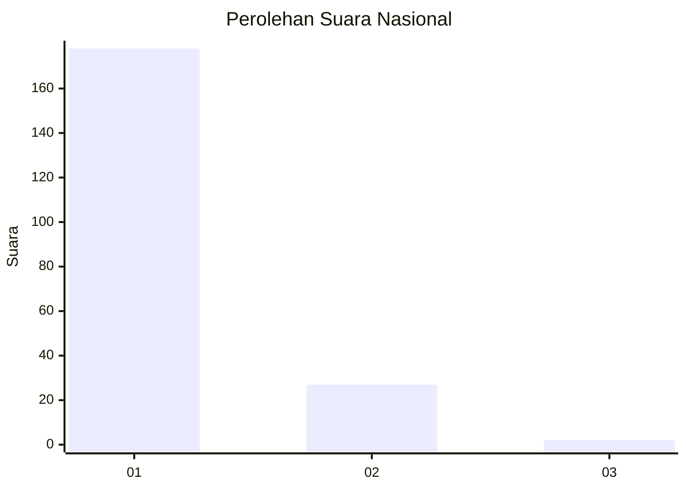
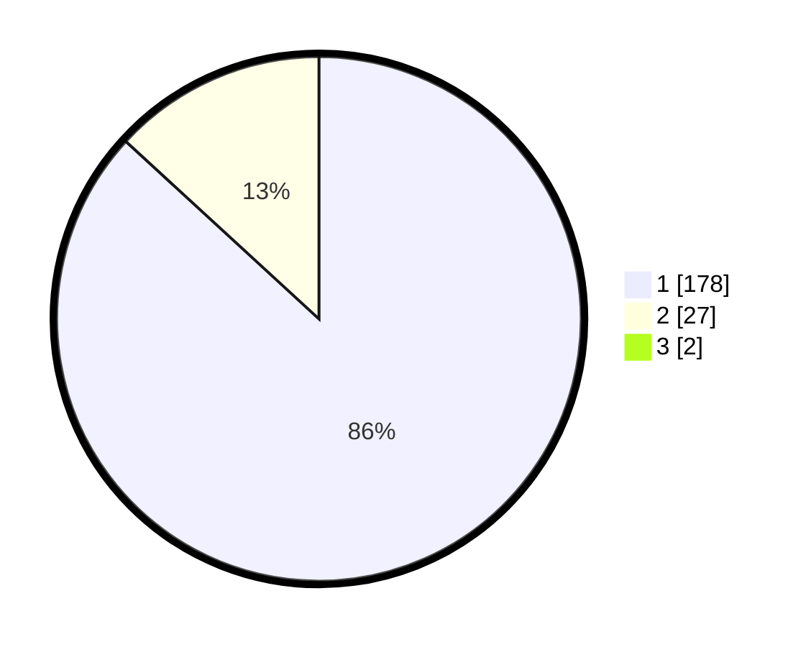

# Hasil

## Grafik

## Tabel

| No. | Nama Paslon    | Suara | Suara (raw) | Persentase |
|:--- |:-------------- | -----:| -----------:| ----------:|
| 1   | ANIES MUHAIMIN | 178   | [178][p-1]  | 85,99      |
| 2   | PRABOWO GIBRAN | 27    | [27][p-2]   | 13,04      |
| 3   | GANJAR MAHFUD  | 2     | [2][p-3]    | 0,97       |

[p-1]: https://github.com/gigit-pemilu/pemilu-2024/blob/main/pilpres/hitung-suara/sub/11-aceh/sub/08-aceh-utara/sub/01-baktiya/sub/2002-meunasah-alue-ie-puteh/sub/001-tps/sub/paslon-1.txt
[p-2]: https://github.com/gigit-pemilu/pemilu-2024/blob/main/pilpres/hitung-suara/sub/11-aceh/sub/08-aceh-utara/sub/01-baktiya/sub/2002-meunasah-alue-ie-puteh/sub/001-tps/sub/paslon-2.txt
[p-3]: https://github.com/gigit-pemilu/pemilu-2024/blob/main/pilpres/hitung-suara/sub/11-aceh/sub/08-aceh-utara/sub/01-baktiya/sub/2002-meunasah-alue-ie-puteh/sub/001-tps/sub/paslon-3.txt

## Foto C Plano

https://sirekap-obj-formc.kpu.go.id/522c/pemilu/ppwp/11/08/01/20/02/1108012002001-20240215-053326--f104676e-d226-4ca4-8f68-ba8f8e1f436d.jpg

https://sirekap-obj-formc.kpu.go.id/522c/pemilu/ppwp/11/08/01/20/02/1108012002001-20240215-053607--6bf4ffa2-0da6-47ff-8cc4-52f906f0b605.jpg

https://sirekap-obj-formc.kpu.go.id/522c/pemilu/ppwp/11/08/01/20/02/1108012002001-20240215-053910--ef0d9188-28a8-4aea-82ec-a206848141a2.jpg

## Metadata

| Key        | Value               |
| ---------- | ------------------- |
| Time Stamp | 2024-02-17 16:36:25 |

## DATA PEMILIH TETAP

Jumlah pemilih dalam DPT: **275**.
 * L: **130**.
 * P: **145**.

## DATA PENGGUNA HAK PILIH

Jumlah pengguna hak pilih dalam DPT: **210**.
 * L: **95**.
 * P: **115**.

Jumlah pengguna hak pilih dalam DPTb: **0**.
 * L: **0**.
 * P: **0**.

Jumlah pengguna hak pilih dalam DPK: **0**.
 * L: **0**.
 * P: **0**.

Jumlah pengguna hak pilih: **210**.
 * L: **95**.
 * P: **115**.

## JUMLAH SUARA SAH DAN TIDAK SAH

JUMLAH SELURUH SUARA SAH: **207**.

JUMLAH SUARA TIDAK SAH: **3**.

JUMLAH SELURUH SUARA SAH DAN SUARA TIDAK SAH: **210**.

