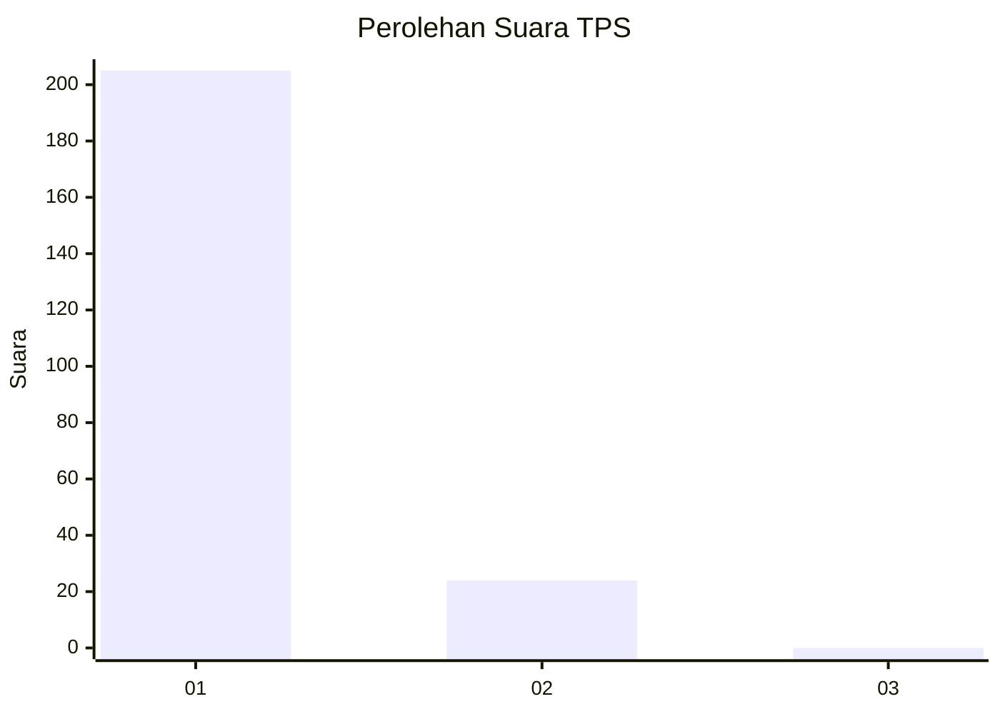
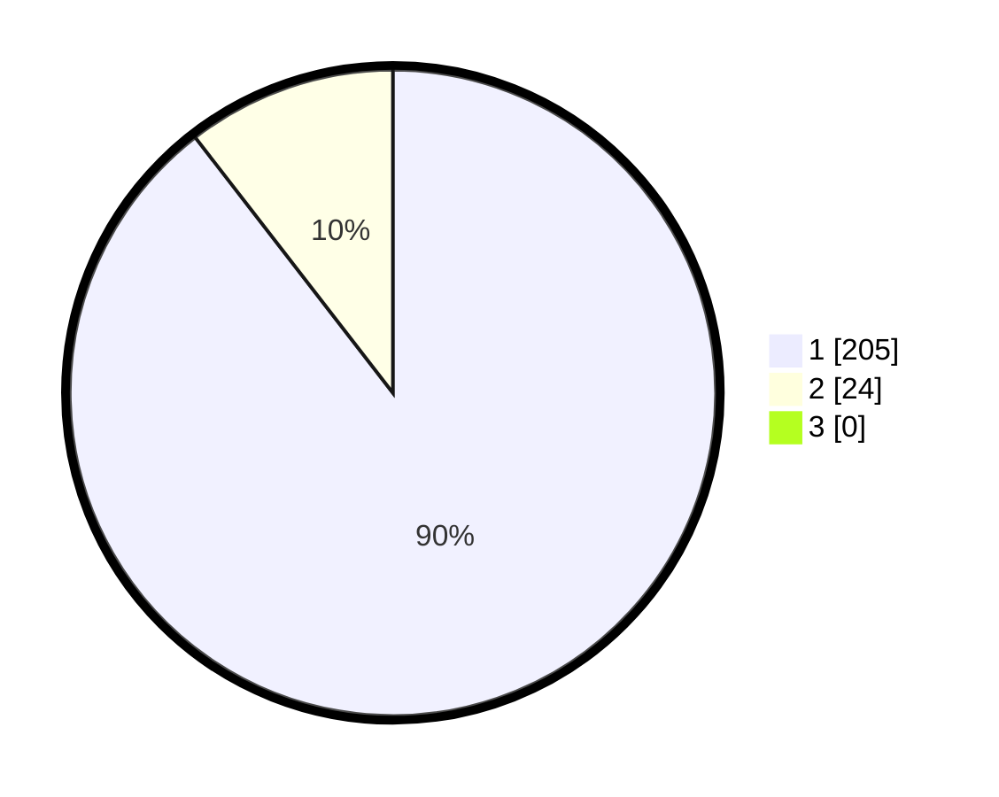

# Hasil

## Grafik

## Tabel

| No. | Nama Paslon    | Suara | Suara (raw) | Persentase |
|:--- |:-------------- | -----:| -----------:| ----------:|
| 1   | ANIES MUHAIMIN | 205   | [205][p-1]  | 89,52      |
| 2   | PRABOWO GIBRAN | 24    | [24][p-2]   | 10,48      |
| 3   | GANJAR MAHFUD  | 0     | [0][p-3]    | 0,00       |

[p-1]: https://github.com/gigit-pemilu/pemilu-2024-11-aceh/blob/main/pilpres/hitung-suara/sub/11-aceh/sub/08-aceh-utara/sub/01-baktiya/sub/2002-meunasah-alue-ie-puteh/sub/002-tps/sub/paslon-1.txt
[p-2]: https://github.com/gigit-pemilu/pemilu-2024-11-aceh/blob/main/pilpres/hitung-suara/sub/11-aceh/sub/08-aceh-utara/sub/01-baktiya/sub/2002-meunasah-alue-ie-puteh/sub/002-tps/sub/paslon-2.txt
[p-3]: https://github.com/gigit-pemilu/pemilu-2024-11-aceh/blob/main/pilpres/hitung-suara/sub/11-aceh/sub/08-aceh-utara/sub/01-baktiya/sub/2002-meunasah-alue-ie-puteh/sub/002-tps/sub/paslon-3.txt

## Foto C Plano

https://sirekap-obj-formc.kpu.go.id/a69c/pemilu/ppwp/11/08/01/20/02/1108012002002-20240215-111032--d1168e33-ec54-4080-bb67-0e97fd14d9cb.jpg

https://sirekap-obj-formc.kpu.go.id/a69c/pemilu/ppwp/11/08/01/20/02/1108012002002-20240215-111330--f3f50eea-768c-40f2-ad31-4f9178b12500.jpg

https://sirekap-obj-formc.kpu.go.id/a69c/pemilu/ppwp/11/08/01/20/02/1108012002002-20240215-111510--0687aa60-ecbb-4596-9b8b-9e9cb533eda4.jpg

## Metadata

| Key        | Value               |
| ---------- | ------------------- |
| Time Stamp | 2024-02-17 16:36:25 |

## DATA PEMILIH TETAP

Jumlah pemilih dalam DPT: **267**.
 * L: **134**.
 * P: **133**.

## DATA PENGGUNA HAK PILIH

Jumlah pengguna hak pilih dalam DPT: **227**.
 * L: **111**.
 * P: **116**.

Jumlah pengguna hak pilih dalam DPTb: **0**.
 * L: **0**.
 * P: **0**.

Jumlah pengguna hak pilih dalam DPK: **3**.
 * L: **3**.
 * P: **0**.

Jumlah pengguna hak pilih: **230**.
 * L: **114**.
 * P: **116**.

## JUMLAH SUARA SAH DAN TIDAK SAH

JUMLAH SELURUH SUARA SAH: **229**.

JUMLAH SUARA TIDAK SAH: **1**.

JUMLAH SELURUH SUARA SAH DAN SUARA TIDAK SAH: **230**.

