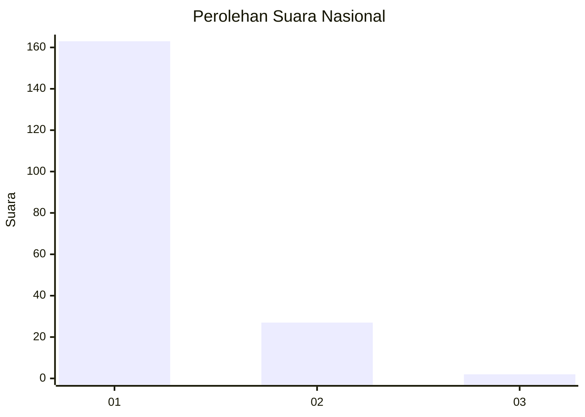
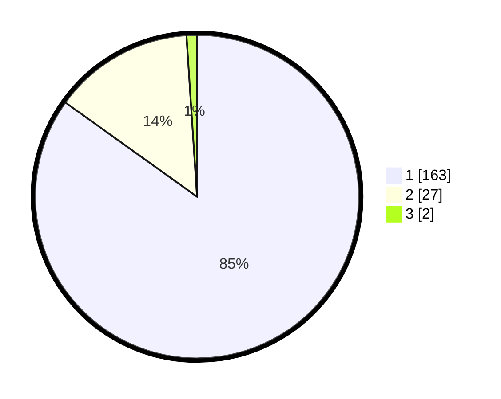

# Hasil

## Grafik

## Tabel

| No. | Nama Paslon    | Suara | Suara (raw) | Persentase |
|:--- |:-------------- | -----:| -----------:| ----------:|
| 1   | ANIES MUHAIMIN | 163   | [163][p-1]  | 84,90      |
| 2   | PRABOWO GIBRAN | 27    | [27][p-2]   | 14,06      |
| 3   | GANJAR MAHFUD  | 2     | [2][p-3]    | 1,04       |

[p-1]: https://github.com/gigit-pemilu/pemilu-2024/blob/main/pilpres/hitung-suara/sub/11-aceh/sub/08-aceh-utara/sub/01-baktiya/sub/2002-meunasah-alue-ie-puteh/sub/003-tps/sub/paslon-1.txt
[p-2]: https://github.com/gigit-pemilu/pemilu-2024/blob/main/pilpres/hitung-suara/sub/11-aceh/sub/08-aceh-utara/sub/01-baktiya/sub/2002-meunasah-alue-ie-puteh/sub/003-tps/sub/paslon-2.txt
[p-3]: https://github.com/gigit-pemilu/pemilu-2024/blob/main/pilpres/hitung-suara/sub/11-aceh/sub/08-aceh-utara/sub/01-baktiya/sub/2002-meunasah-alue-ie-puteh/sub/003-tps/sub/paslon-3.txt

## Foto C Plano

https://sirekap-obj-formc.kpu.go.id/6ace/pemilu/ppwp/11/08/01/20/02/1108012002003-20240215-010434--7034cc5c-cd54-4e16-a9ac-ee52b8479897.jpg

https://sirekap-obj-formc.kpu.go.id/6ace/pemilu/ppwp/11/08/01/20/02/1108012002003-20240215-010611--29999ef5-9309-43fa-b280-569de86aaec0.jpg

https://sirekap-obj-formc.kpu.go.id/6ace/pemilu/ppwp/11/08/01/20/02/1108012002003-20240215-010732--437464c8-c7dd-4d1c-a4e5-2ccf2170111e.jpg

## Metadata

| Key        | Value               |
| ---------- | ------------------- |
| Time Stamp | 2024-02-15 15:00:29 |

