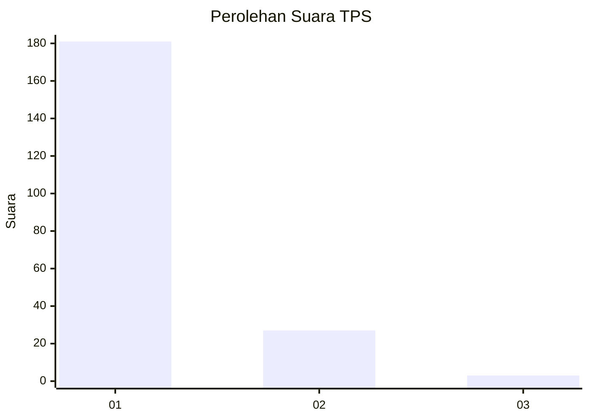
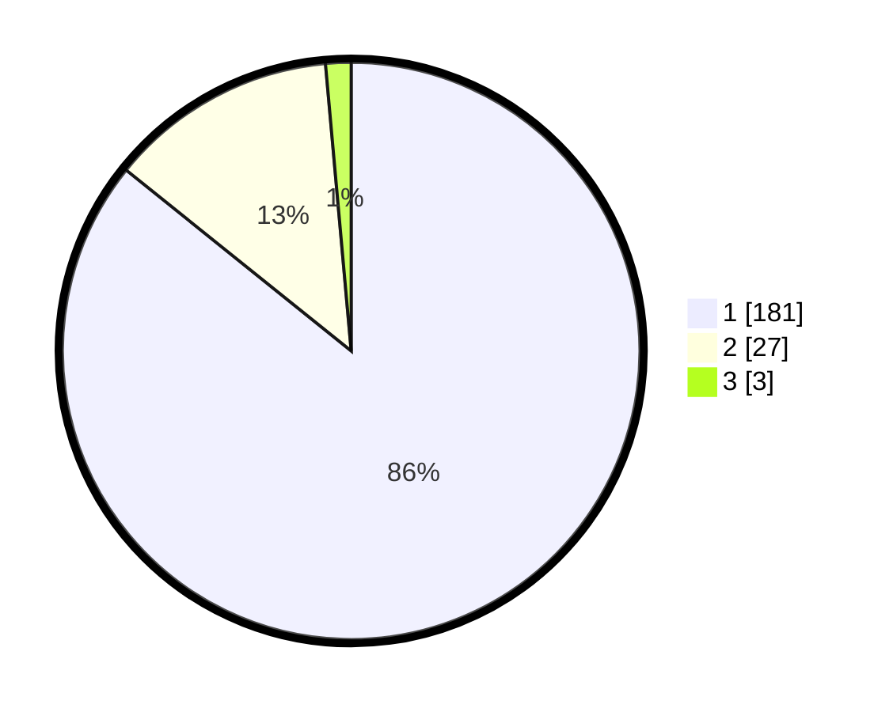

# Hasil

## Grafik

## Tabel

| No. | Nama Paslon    | Suara | Suara (raw) | Persentase |
|:--- |:-------------- | -----:| -----------:| ----------:|
| 1   | ANIES MUHAIMIN | 181   | [181][p-1]  | 85,78      |
| 2   | PRABOWO GIBRAN | 27    | [27][p-2]   | 12,80      |
| 3   | GANJAR MAHFUD  | 3     | [3][p-3]    | 1,42       |

[p-1]: https://github.com/gigit-pemilu/pemilu-2024-11-aceh/blob/main/pilpres/hitung-suara/sub/11-aceh/sub/08-aceh-utara/sub/01-baktiya/sub/2002-meunasah-alue-ie-puteh/sub/004-tps/sub/paslon-1.txt
[p-2]: https://github.com/gigit-pemilu/pemilu-2024-11-aceh/blob/main/pilpres/hitung-suara/sub/11-aceh/sub/08-aceh-utara/sub/01-baktiya/sub/2002-meunasah-alue-ie-puteh/sub/004-tps/sub/paslon-2.txt
[p-3]: https://github.com/gigit-pemilu/pemilu-2024-11-aceh/blob/main/pilpres/hitung-suara/sub/11-aceh/sub/08-aceh-utara/sub/01-baktiya/sub/2002-meunasah-alue-ie-puteh/sub/004-tps/sub/paslon-3.txt

## Foto C Plano

https://sirekap-obj-formc.kpu.go.id/93af/pemilu/ppwp/11/08/01/20/02/1108012002004-20240215-042543--dd1bd0be-6691-45f2-a808-57b50c779626.jpg

https://sirekap-obj-formc.kpu.go.id/93af/pemilu/ppwp/11/08/01/20/02/1108012002004-20240215-042733--e1cb29b3-a339-4114-b79c-b93bd2c57397.jpg

https://sirekap-obj-formc.kpu.go.id/93af/pemilu/ppwp/11/08/01/20/02/1108012002004-20240215-042951--45ceef28-6d42-4029-bb80-9ed4c6f7a9bb.jpg

## Metadata

| Key        | Value               |
| ---------- | ------------------- |
| Time Stamp | 2024-02-16 23:00:00 |

