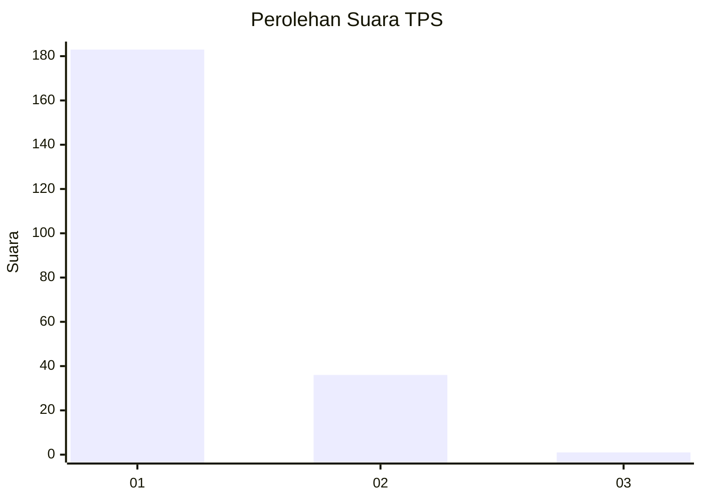
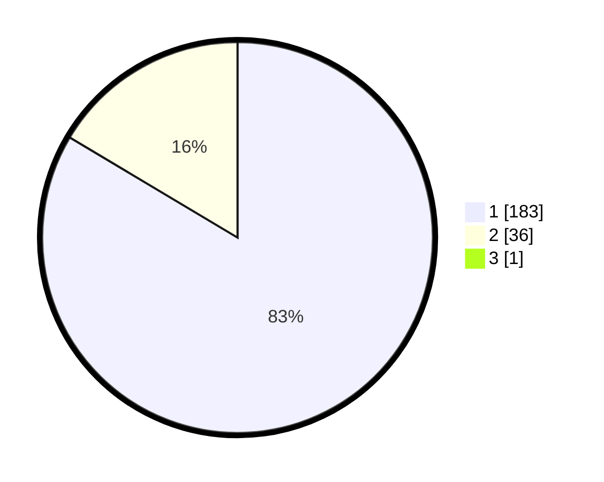

# Hasil

## Grafik

## Tabel

| No. | Nama Paslon    | Suara | Suara (raw) | Persentase |
|:--- |:-------------- | -----:| -----------:| ----------:|
| 1   | ANIES MUHAIMIN | 183   | [183][p-1]  | 83,18      |
| 2   | PRABOWO GIBRAN | 36    | [36][p-2]   | 16,36      |
| 3   | GANJAR MAHFUD  | 1     | [1][p-3]    | 0,45       |

[p-1]: https://github.com/gigit-pemilu/pemilu-2024-11-aceh/blob/main/pilpres/hitung-suara/sub/11-aceh/sub/08-aceh-utara/sub/01-baktiya/sub/2002-meunasah-alue-ie-puteh/sub/005-tps/sub/paslon-1.txt
[p-2]: https://github.com/gigit-pemilu/pemilu-2024-11-aceh/blob/main/pilpres/hitung-suara/sub/11-aceh/sub/08-aceh-utara/sub/01-baktiya/sub/2002-meunasah-alue-ie-puteh/sub/005-tps/sub/paslon-2.txt
[p-3]: https://github.com/gigit-pemilu/pemilu-2024-11-aceh/blob/main/pilpres/hitung-suara/sub/11-aceh/sub/08-aceh-utara/sub/01-baktiya/sub/2002-meunasah-alue-ie-puteh/sub/005-tps/sub/paslon-3.txt

## Foto C Plano

https://sirekap-obj-formc.kpu.go.id/a673/pemilu/ppwp/11/08/01/20/02/1108012002005-20240215-061056--2ea20a6f-867a-41d8-b5d2-bd5a01ea249f.jpg

https://sirekap-obj-formc.kpu.go.id/a673/pemilu/ppwp/11/08/01/20/02/1108012002005-20240215-061322--58f483c9-c713-464a-a45f-d84ff291406b.jpg

https://sirekap-obj-formc.kpu.go.id/a673/pemilu/ppwp/11/08/01/20/02/1108012002005-20240215-061433--534ac6ed-b221-4732-9399-7bf12d6efc73.jpg

## Metadata

| Key        | Value               |
| ---------- | ------------------- |
| Time Stamp | 2024-02-17 16:36:25 |

