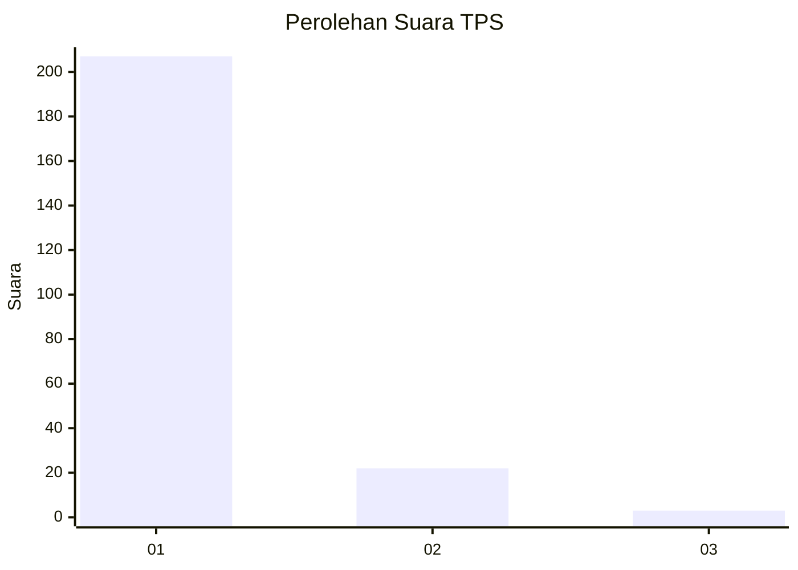
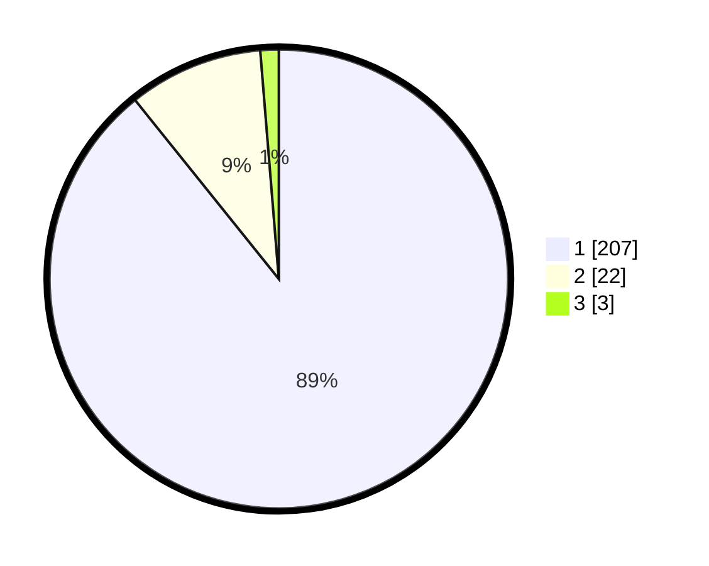

# Hasil

## Grafik

## Tabel

| No. | Nama Paslon    | Suara | Suara (raw) | Persentase |
|:--- |:-------------- | -----:| -----------:| ----------:|
| 1   | ANIES MUHAIMIN | 207   | [207][p-1]  | 89,22      |
| 2   | PRABOWO GIBRAN | 22    | [22][p-2]   | 9,48       |
| 3   | GANJAR MAHFUD  | 3     | [3][p-3]    | 1,29       |

[p-1]: https://github.com/gigit-pemilu/pemilu-2024-11-aceh/blob/main/pilpres/hitung-suara/sub/11-aceh/sub/08-aceh-utara/sub/01-baktiya/sub/2004-alue-anoe-timu/sub/001-tps/sub/paslon-1.txt
[p-2]: https://github.com/gigit-pemilu/pemilu-2024-11-aceh/blob/main/pilpres/hitung-suara/sub/11-aceh/sub/08-aceh-utara/sub/01-baktiya/sub/2004-alue-anoe-timu/sub/001-tps/sub/paslon-2.txt
[p-3]: https://github.com/gigit-pemilu/pemilu-2024-11-aceh/blob/main/pilpres/hitung-suara/sub/11-aceh/sub/08-aceh-utara/sub/01-baktiya/sub/2004-alue-anoe-timu/sub/001-tps/sub/paslon-3.txt

## Foto C Plano

https://sirekap-obj-formc.kpu.go.id/2521/pemilu/ppwp/11/08/01/20/04/1108012004001-20240223-093306--34222c5d-9bcd-44bd-81cb-9d1da286127b.jpg

https://sirekap-obj-formc.kpu.go.id/2521/pemilu/ppwp/11/08/01/20/04/1108012004001-20240223-093428--07167a6d-38a1-4116-b608-08e74809595c.jpg

https://sirekap-obj-formc.kpu.go.id/2521/pemilu/ppwp/11/08/01/20/04/1108012004001-20240223-093542--d9f841e7-e30a-4191-940d-423b39aecda1.jpg

## Metadata

| Key        | Value               |
| ---------- | ------------------- |
| Time Stamp | 2024-02-24 22:31:28 |

