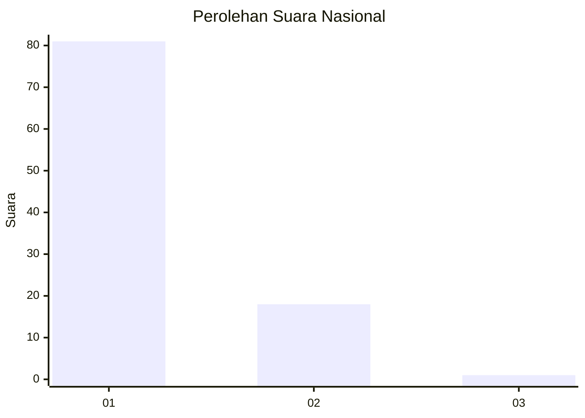
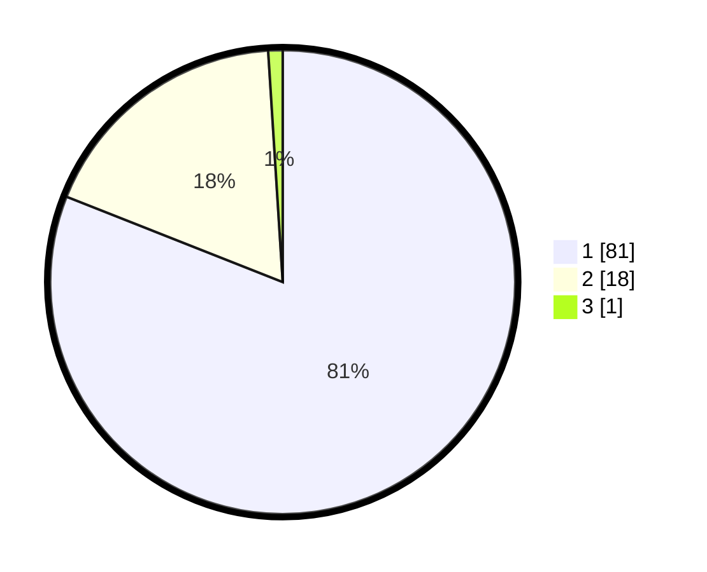

# Hasil

## Grafik

## Tabel

| No. | Nama Paslon    | Suara | Suara (raw) | Persentase |
|:--- |:-------------- | -----:| -----------:| ----------:|
| 1   | ANIES MUHAIMIN | 81    | [81][p-1]   | 81,00      |
| 2   | PRABOWO GIBRAN | 18    | [18][p-2]   | 18,00      |
| 3   | GANJAR MAHFUD  | 1     | [1][p-3]    | 1,00       |

[p-1]: https://github.com/gigit-pemilu/pemilu-2024/blob/main/pilpres/hitung-suara/sub/11-aceh/sub/08-aceh-utara/sub/01-baktiya/sub/2006-pulo-seukee/sub/001-tps/sub/paslon-1.txt
[p-2]: https://github.com/gigit-pemilu/pemilu-2024/blob/main/pilpres/hitung-suara/sub/11-aceh/sub/08-aceh-utara/sub/01-baktiya/sub/2006-pulo-seukee/sub/001-tps/sub/paslon-2.txt
[p-3]: https://github.com/gigit-pemilu/pemilu-2024/blob/main/pilpres/hitung-suara/sub/11-aceh/sub/08-aceh-utara/sub/01-baktiya/sub/2006-pulo-seukee/sub/001-tps/sub/paslon-3.txt

## Foto C Plano

https://sirekap-obj-formc.kpu.go.id/f974/pemilu/ppwp/11/08/01/20/06/1108012006001-20240215-133403--aca9421e-65b0-456e-b18b-d103435793b5.jpg

https://sirekap-obj-formc.kpu.go.id/f974/pemilu/ppwp/11/08/01/20/06/1108012006001-20240215-133500--27ac4e00-e039-4a20-919d-c0f4876fc76f.jpg

https://sirekap-obj-formc.kpu.go.id/f974/pemilu/ppwp/11/08/01/20/06/1108012006001-20240215-133559--48908d78-9f7f-4587-a2f6-2cd472dc5112.jpg

## Metadata

| Key        | Value               |
| ---------- | ------------------- |
| Time Stamp | 2024-02-16 22:30:00 |

