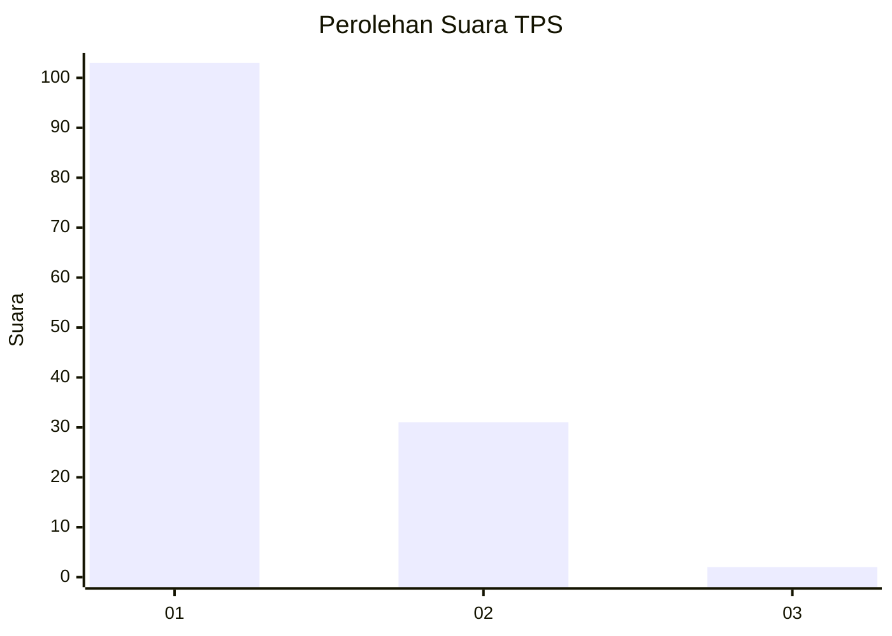
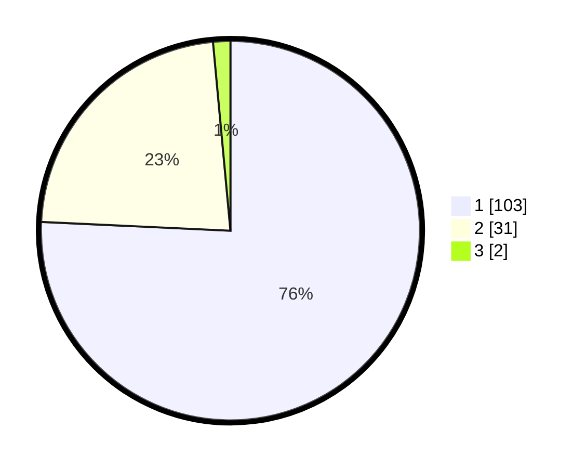

# Hasil

## Grafik

## Tabel

| No. | Nama Paslon    | Suara | Suara (raw) | Persentase |
|:--- |:-------------- | -----:| -----------:| ----------:|
| 1   | ANIES MUHAIMIN | 103   | [103][p-1]  | 75,74      |
| 2   | PRABOWO GIBRAN | 31    | [31][p-2]   | 22,79      |
| 3   | GANJAR MAHFUD  | 2     | [2][p-3]    | 1,47       |

[p-1]: https://github.com/gigit-pemilu/pemilu-2024-11-aceh/blob/main/pilpres/hitung-suara/sub/11-aceh/sub/08-aceh-utara/sub/01-baktiya/sub/2007-alue-serdang/sub/001-tps/sub/paslon-1.txt
[p-2]: https://github.com/gigit-pemilu/pemilu-2024-11-aceh/blob/main/pilpres/hitung-suara/sub/11-aceh/sub/08-aceh-utara/sub/01-baktiya/sub/2007-alue-serdang/sub/001-tps/sub/paslon-2.txt
[p-3]: https://github.com/gigit-pemilu/pemilu-2024-11-aceh/blob/main/pilpres/hitung-suara/sub/11-aceh/sub/08-aceh-utara/sub/01-baktiya/sub/2007-alue-serdang/sub/001-tps/sub/paslon-3.txt

## Foto C Plano

https://sirekap-obj-formc.kpu.go.id/6516/pemilu/ppwp/11/08/01/20/07/1108012007001-20240215-073302--9c6dc12a-4c31-47de-85be-e768e7edaf68.jpg

https://sirekap-obj-formc.kpu.go.id/6516/pemilu/ppwp/11/08/01/20/07/1108012007001-20240215-073613--108df70f-3532-46a3-a571-464558bb8394.jpg

## Metadata

| Key        | Value               |
| ---------- | ------------------- |
| Time Stamp | 2024-02-16 23:00:00 |

