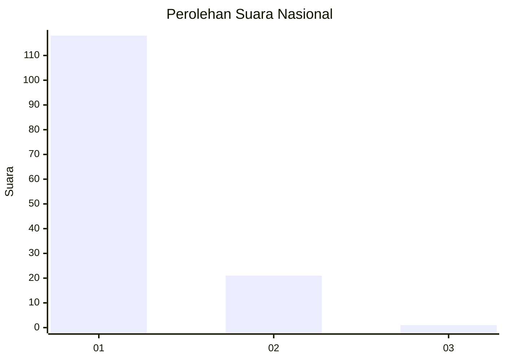
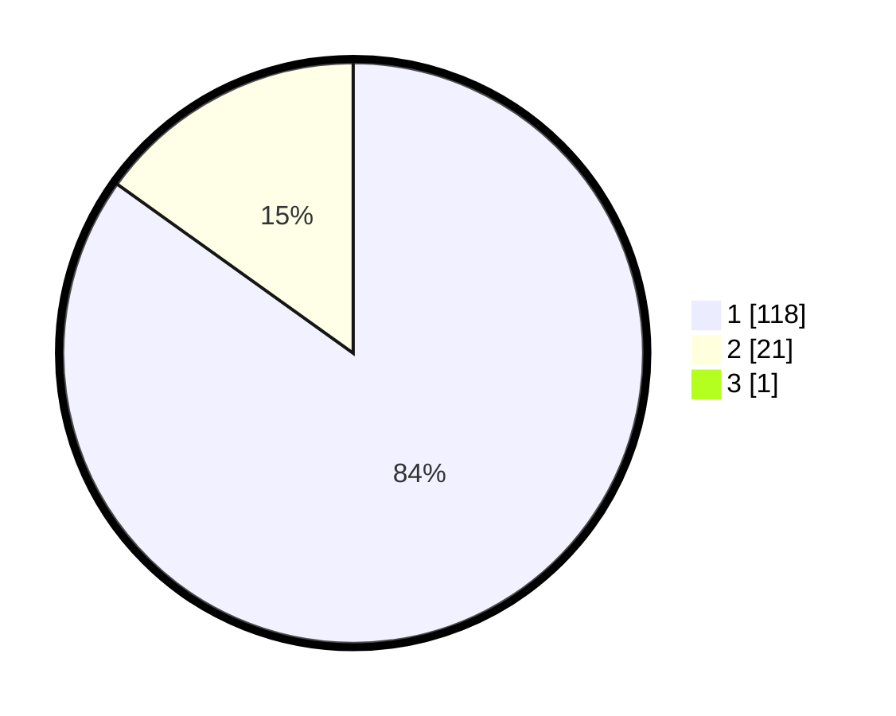

# Hasil

## Grafik

## Tabel

| No. | Nama Paslon    | Suara | Suara (raw) | Persentase |
|:--- |:-------------- | -----:| -----------:| ----------:|
| 1   | ANIES MUHAIMIN | 118   | [118][p-1]  | 84,29      |
| 2   | PRABOWO GIBRAN | 21    | [21][p-2]   | 15,00      |
| 3   | GANJAR MAHFUD  | 1     | [1][p-3]    | 0,71       |

[p-1]: https://github.com/gigit-pemilu/pemilu-2024/blob/main/pilpres/hitung-suara/sub/11-aceh/sub/08-aceh-utara/sub/01-baktiya/sub/2008-cot-mane/sub/001-tps/sub/paslon-1.txt
[p-2]: https://github.com/gigit-pemilu/pemilu-2024/blob/main/pilpres/hitung-suara/sub/11-aceh/sub/08-aceh-utara/sub/01-baktiya/sub/2008-cot-mane/sub/001-tps/sub/paslon-2.txt
[p-3]: https://github.com/gigit-pemilu/pemilu-2024/blob/main/pilpres/hitung-suara/sub/11-aceh/sub/08-aceh-utara/sub/01-baktiya/sub/2008-cot-mane/sub/001-tps/sub/paslon-3.txt

## Foto C Plano

https://sirekap-obj-formc.kpu.go.id/da63/pemilu/ppwp/11/08/01/20/08/1108012008001-20240220-204306--a8a0288f-56e9-4b07-82ad-1671bfb96dd6.jpg

https://sirekap-obj-formc.kpu.go.id/da63/pemilu/ppwp/11/08/01/20/08/1108012008001-20240220-203237--181fba7c-8039-4ce3-81d7-d36f1b0ac413.jpg

https://sirekap-obj-formc.kpu.go.id/da63/pemilu/ppwp/11/08/01/20/08/1108012008001-20240220-203540--d5c8340c-9f91-4ffe-be93-9f7b1797b1e8.jpg

## Metadata

| Key        | Value               |
| ---------- | ------------------- |
| Time Stamp | 2024-02-24 22:31:28 |

