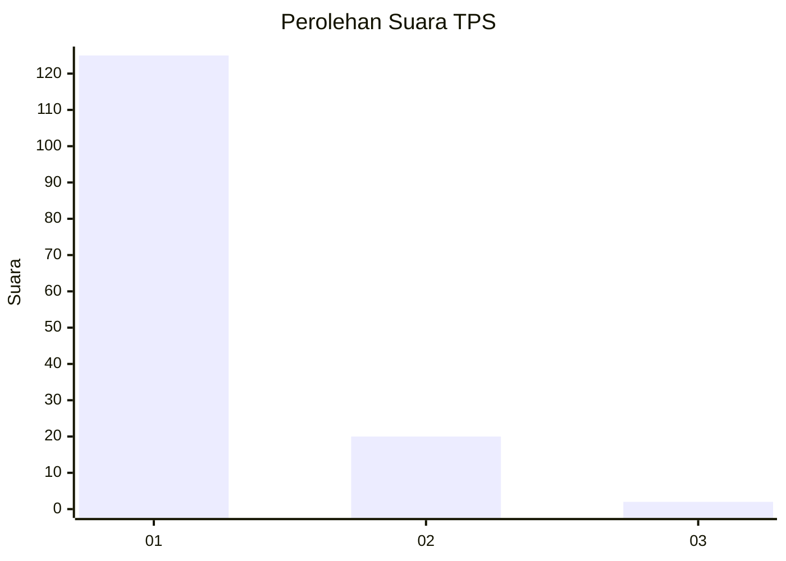
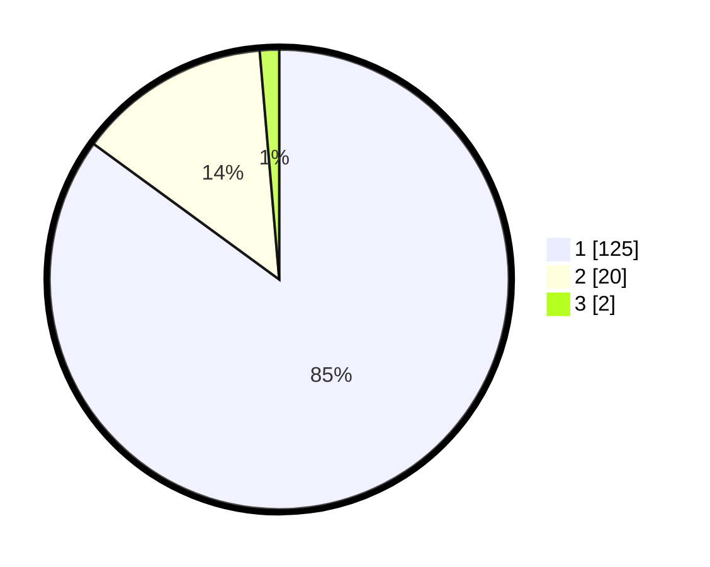

# Hasil

## Grafik

## Tabel

| No. | Nama Paslon    | Suara | Suara (raw) | Persentase |
|:--- |:-------------- | -----:| -----------:| ----------:|
| 1   | ANIES MUHAIMIN | 125   | [125][p-1]  | 85,03      |
| 2   | PRABOWO GIBRAN | 20    | [20][p-2]   | 13,61      |
| 3   | GANJAR MAHFUD  | 2     | [2][p-3]    | 1,36       |

[p-1]: https://github.com/gigit-pemilu/pemilu-2024-11-aceh/blob/main/pilpres/hitung-suara/sub/11-aceh/sub/08-aceh-utara/sub/01-baktiya/sub/2008-cot-mane/sub/002-tps/sub/paslon-1.txt
[p-2]: https://github.com/gigit-pemilu/pemilu-2024-11-aceh/blob/main/pilpres/hitung-suara/sub/11-aceh/sub/08-aceh-utara/sub/01-baktiya/sub/2008-cot-mane/sub/002-tps/sub/paslon-2.txt
[p-3]: https://github.com/gigit-pemilu/pemilu-2024-11-aceh/blob/main/pilpres/hitung-suara/sub/11-aceh/sub/08-aceh-utara/sub/01-baktiya/sub/2008-cot-mane/sub/002-tps/sub/paslon-3.txt

## Foto C Plano

https://sirekap-obj-formc.kpu.go.id/e050/pemilu/ppwp/11/08/01/20/08/1108012008002-20240220-211328--e9e710e1-8cfd-4287-afc3-d7cceaa7b345.jpg

https://sirekap-obj-formc.kpu.go.id/e050/pemilu/ppwp/11/08/01/20/08/1108012008002-20240220-211545--0c02bda2-c017-4085-9018-3727a0aea2a6.jpg

https://sirekap-obj-formc.kpu.go.id/e050/pemilu/ppwp/11/08/01/20/08/1108012008002-20240220-211743--853f56a7-98b2-4238-a10c-6bc4b7fba6ef.jpg

## Metadata

| Key        | Value               |
| ---------- | ------------------- |
| Time Stamp | 2024-02-24 22:31:28 |

