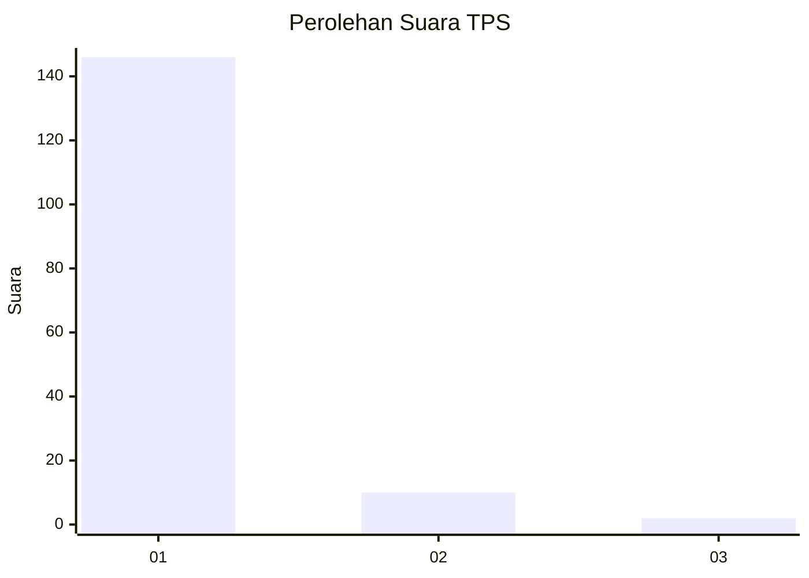
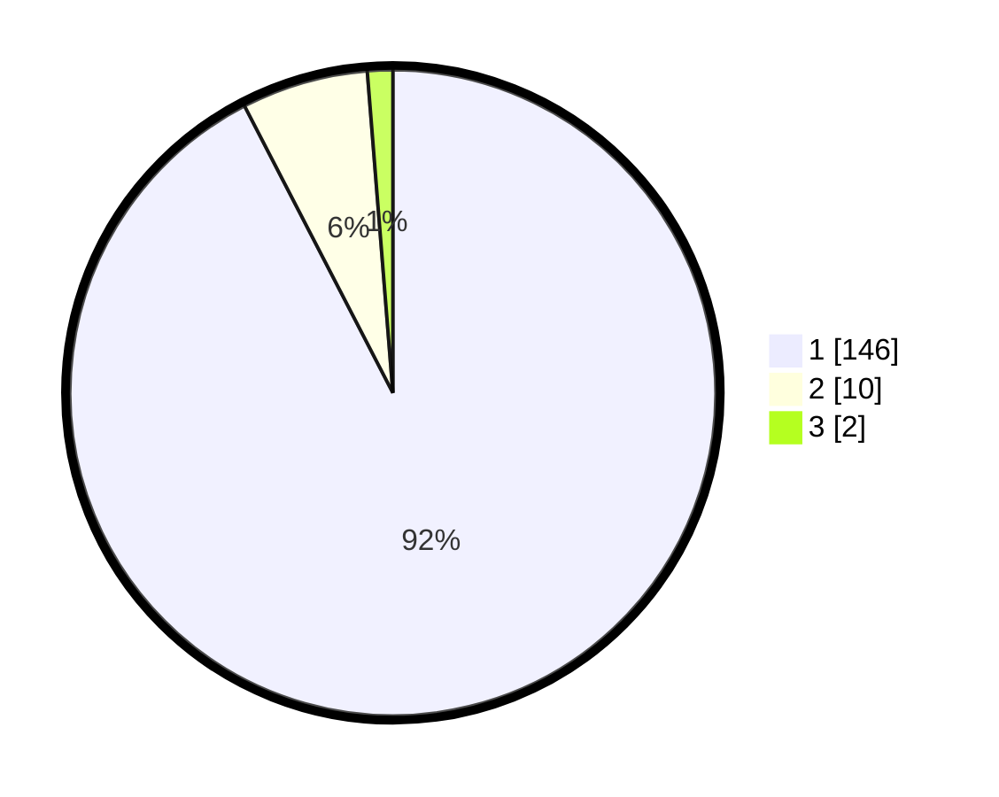

# Hasil

## Grafik

## Tabel

| No. | Nama Paslon    | Suara | Suara (raw) | Persentase |
|:--- |:-------------- | -----:| -----------:| ----------:|
| 1   | ANIES MUHAIMIN | 146   | [146][p-1]  | 92,41      |
| 2   | PRABOWO GIBRAN | 10    | [10][p-2]   | 6,33       |
| 3   | GANJAR MAHFUD  | 2     | [2][p-3]    | 1,27       |

[p-1]: https://github.com/gigit-pemilu/pemilu-2024-11-aceh/blob/main/pilpres/hitung-suara/sub/11-aceh/sub/08-aceh-utara/sub/01-baktiya/sub/2009-cot-kumbang/sub/002-tps/sub/paslon-1.txt
[p-2]: https://github.com/gigit-pemilu/pemilu-2024-11-aceh/blob/main/pilpres/hitung-suara/sub/11-aceh/sub/08-aceh-utara/sub/01-baktiya/sub/2009-cot-kumbang/sub/002-tps/sub/paslon-2.txt
[p-3]: https://github.com/gigit-pemilu/pemilu-2024-11-aceh/blob/main/pilpres/hitung-suara/sub/11-aceh/sub/08-aceh-utara/sub/01-baktiya/sub/2009-cot-kumbang/sub/002-tps/sub/paslon-3.txt

## Foto C Plano

https://sirekap-obj-formc.kpu.go.id/1904/pemilu/ppwp/11/08/01/20/09/1108012009002-20240215-115427--94cdc4ff-2bed-4019-99b2-70c1bae4fc60.jpg

https://sirekap-obj-formc.kpu.go.id/1904/pemilu/ppwp/11/08/01/20/09/1108012009002-20240215-115528--5aa04331-e073-4958-b06f-e9ecc3b59279.jpg

https://sirekap-obj-formc.kpu.go.id/1904/pemilu/ppwp/11/08/01/20/09/1108012009002-20240215-115653--3a30bf8e-f5b9-435b-8dbe-b94bfa62a512.jpg

## Metadata

| Key        | Value               |
| ---------- | ------------------- |
| Time Stamp | 2024-02-16 23:00:00 |

