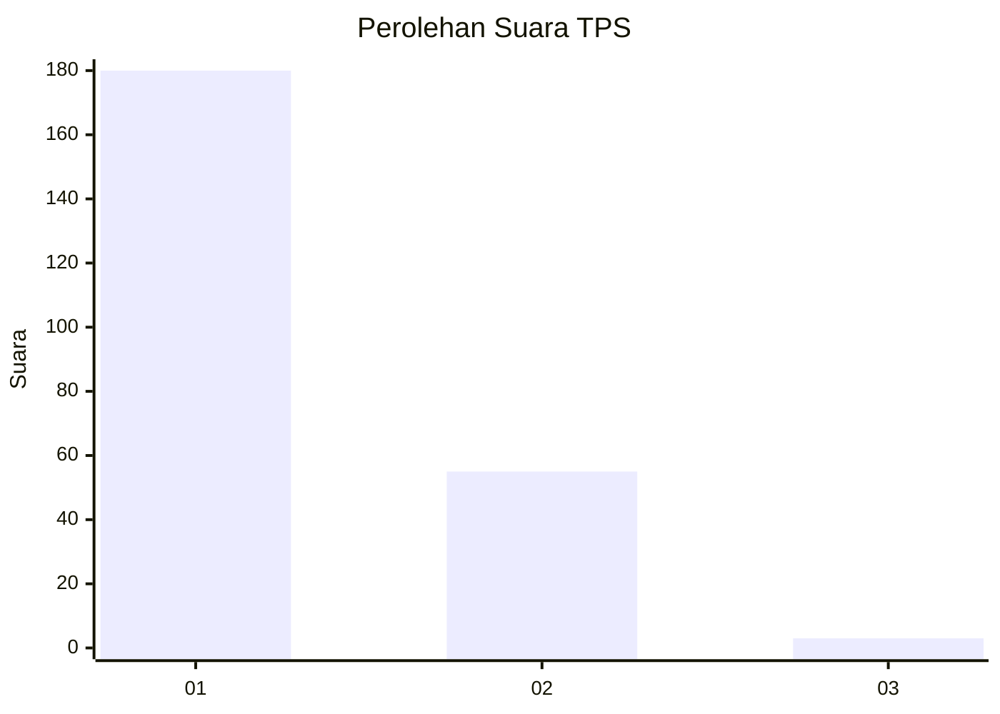
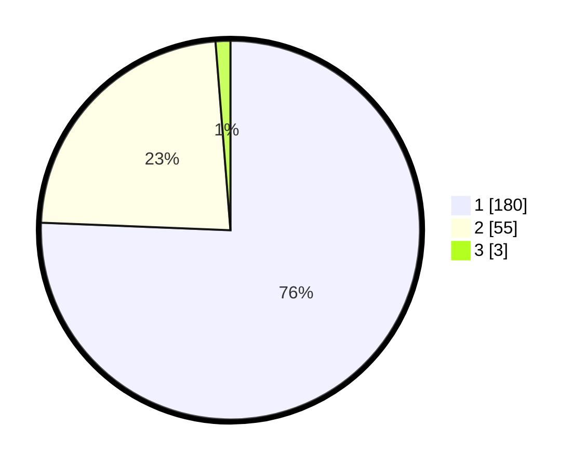

# Hasil

## Grafik

## Tabel

| No. | Nama Paslon    | Suara | Suara (raw) | Persentase |
|:--- |:-------------- | -----:| -----------:| ----------:|
| 1   | ANIES MUHAIMIN | 180   | [180][p-1]  | 75,63      |
| 2   | PRABOWO GIBRAN | 55    | [55][p-2]   | 23,11      |
| 3   | GANJAR MAHFUD  | 3     | [3][p-3]    | 1,26       |

[p-1]: https://github.com/gigit-pemilu/pemilu-2024-11-aceh/blob/main/pilpres/hitung-suara/sub/11-aceh/sub/08-aceh-utara/sub/01-baktiya/sub/2010-matang-kumbang/sub/002-tps/sub/paslon-1.txt
[p-2]: https://github.com/gigit-pemilu/pemilu-2024-11-aceh/blob/main/pilpres/hitung-suara/sub/11-aceh/sub/08-aceh-utara/sub/01-baktiya/sub/2010-matang-kumbang/sub/002-tps/sub/paslon-2.txt
[p-3]: https://github.com/gigit-pemilu/pemilu-2024-11-aceh/blob/main/pilpres/hitung-suara/sub/11-aceh/sub/08-aceh-utara/sub/01-baktiya/sub/2010-matang-kumbang/sub/002-tps/sub/paslon-3.txt

## Foto C Plano

https://sirekap-obj-formc.kpu.go.id/1e1c/pemilu/ppwp/11/08/01/20/10/1108012010002-20240222-102043--a059b32a-ade4-4fc6-ad5f-b0b00d989ae3.jpg

https://sirekap-obj-formc.kpu.go.id/1e1c/pemilu/ppwp/11/08/01/20/10/1108012010002-20240222-102452--d6b3daa4-0800-4b4e-9ee3-4b94d6c1b4f9.jpg

https://sirekap-obj-formc.kpu.go.id/1e1c/pemilu/ppwp/11/08/01/20/10/1108012010002-20240222-102955--6957641e-2c5b-4419-a8bf-ef9e7099c1af.jpg

## Metadata

| Key        | Value               |
| ---------- | ------------------- |
| Time Stamp | 2024-02-24 22:31:28 |

