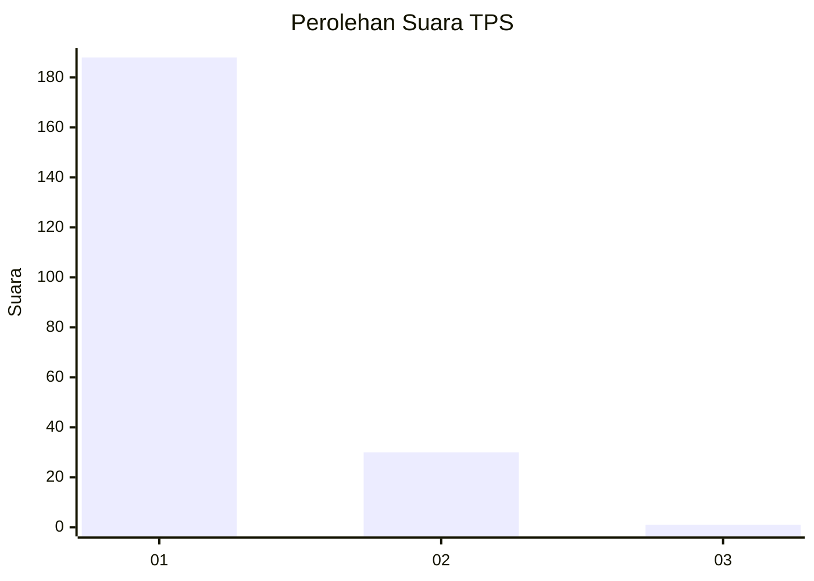
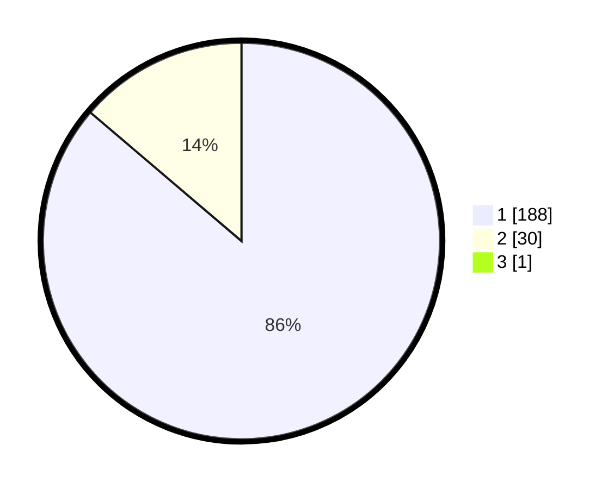

# Hasil

## Grafik

## Tabel

| No. | Nama Paslon    | Suara | Suara (raw) | Persentase |
|:--- |:-------------- | -----:| -----------:| ----------:|
| 1   | ANIES MUHAIMIN | 188   | [188][p-1]  | 85,84      |
| 2   | PRABOWO GIBRAN | 30    | [30][p-2]   | 13,70      |
| 3   | GANJAR MAHFUD  | 1     | [1][p-3]    | 0,46       |

[p-1]: https://github.com/gigit-pemilu/pemilu-2024-11-aceh/blob/main/pilpres/hitung-suara/sub/11-aceh/sub/08-aceh-utara/sub/01-baktiya/sub/2010-matang-kumbang/sub/003-tps/sub/paslon-1.txt
[p-2]: https://github.com/gigit-pemilu/pemilu-2024-11-aceh/blob/main/pilpres/hitung-suara/sub/11-aceh/sub/08-aceh-utara/sub/01-baktiya/sub/2010-matang-kumbang/sub/003-tps/sub/paslon-2.txt
[p-3]: https://github.com/gigit-pemilu/pemilu-2024-11-aceh/blob/main/pilpres/hitung-suara/sub/11-aceh/sub/08-aceh-utara/sub/01-baktiya/sub/2010-matang-kumbang/sub/003-tps/sub/paslon-3.txt

## Foto C Plano

https://sirekap-obj-formc.kpu.go.id/1457/pemilu/ppwp/11/08/01/20/10/1108012010003-20240222-142946--2ea2fda9-d2e7-4653-b89c-d1d4938c30fe.jpg

https://sirekap-obj-formc.kpu.go.id/1457/pemilu/ppwp/11/08/01/20/10/1108012010003-20240222-143046--53903919-0500-4d19-9737-46481c813ce3.jpg

https://sirekap-obj-formc.kpu.go.id/1457/pemilu/ppwp/11/08/01/20/10/1108012010003-20240222-143145--067dcee4-93b7-47c2-948c-c7e481d19666.jpg

## Metadata

| Key        | Value               |
| ---------- | ------------------- |
| Time Stamp | 2024-02-24 22:31:28 |

