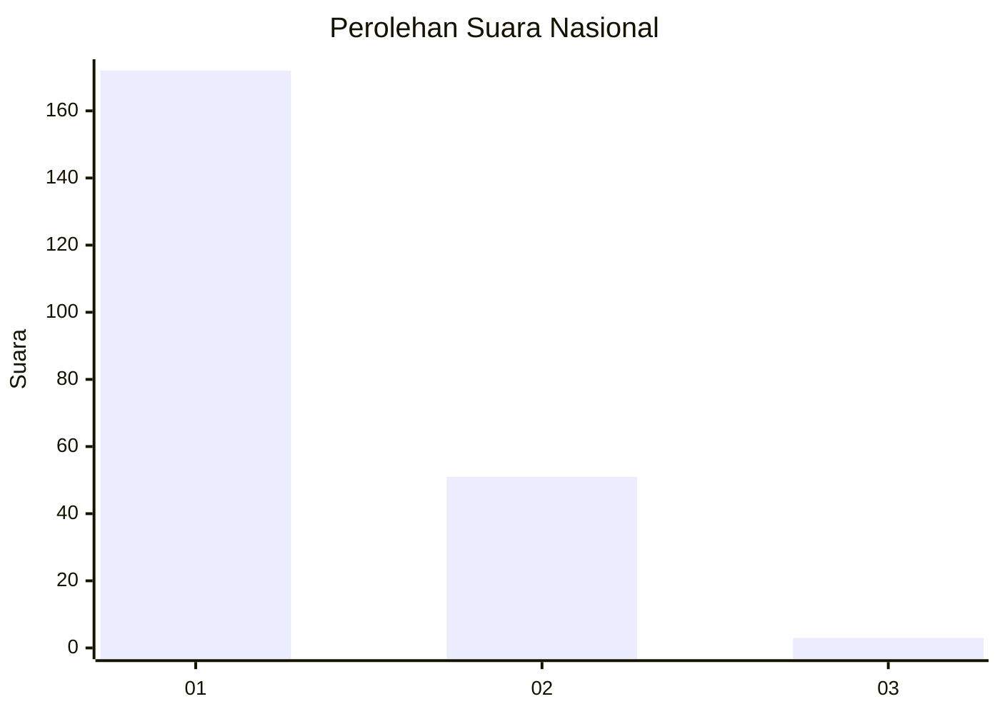
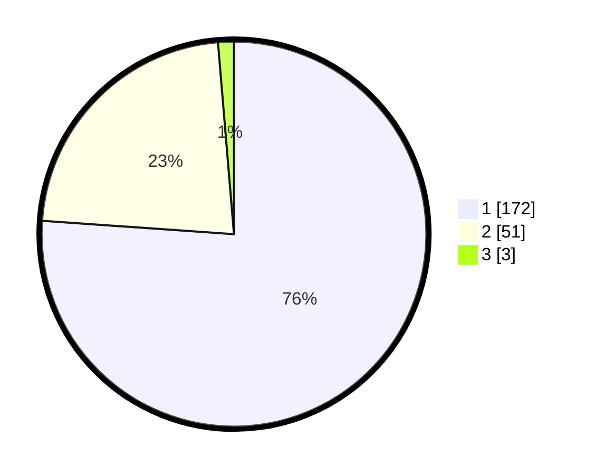

# Hasil

## Grafik

## Tabel

| No. | Nama Paslon    | Suara | Suara (raw) | Persentase |
|:--- |:-------------- | -----:| -----------:| ----------:|
| 1   | ANIES MUHAIMIN | 172   | [172][p-1]  | 76,11      |
| 2   | PRABOWO GIBRAN | 51    | [51][p-2]   | 22,57      |
| 3   | GANJAR MAHFUD  | 3     | [3][p-3]    | 1,33       |

[p-1]: https://github.com/gigit-pemilu/pemilu-2024/blob/main/pilpres/hitung-suara/sub/11-aceh/sub/08-aceh-utara/sub/01-baktiya/sub/2010-matang-kumbang/sub/004-tps/sub/paslon-1.txt
[p-2]: https://github.com/gigit-pemilu/pemilu-2024/blob/main/pilpres/hitung-suara/sub/11-aceh/sub/08-aceh-utara/sub/01-baktiya/sub/2010-matang-kumbang/sub/004-tps/sub/paslon-2.txt
[p-3]: https://github.com/gigit-pemilu/pemilu-2024/blob/main/pilpres/hitung-suara/sub/11-aceh/sub/08-aceh-utara/sub/01-baktiya/sub/2010-matang-kumbang/sub/004-tps/sub/paslon-3.txt

## Foto C Plano

https://sirekap-obj-formc.kpu.go.id/2c09/pemilu/ppwp/11/08/01/20/10/1108012010004-20240222-141134--9be597ff-8658-4ca8-aa1f-618dd2eeab8d.jpg

https://sirekap-obj-formc.kpu.go.id/2c09/pemilu/ppwp/11/08/01/20/10/1108012010004-20240222-141056--a0909ee1-1b46-44a5-9f9d-bc7a684e842a.jpg

https://sirekap-obj-formc.kpu.go.id/2c09/pemilu/ppwp/11/08/01/20/10/1108012010004-20240222-141344--7acd4beb-5b99-4016-8dae-67bb995022a6.jpg

## Metadata

| Key        | Value               |
| ---------- | ------------------- |
| Time Stamp | 2024-02-24 22:31:28 |

