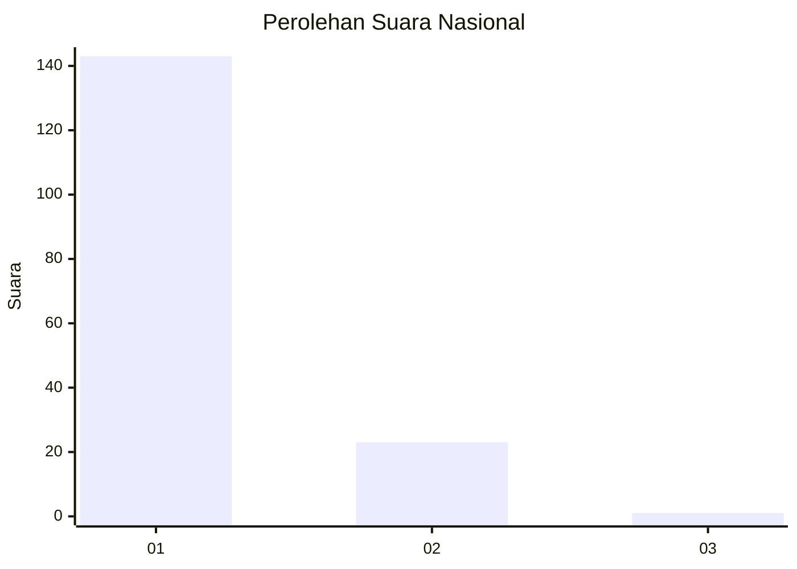
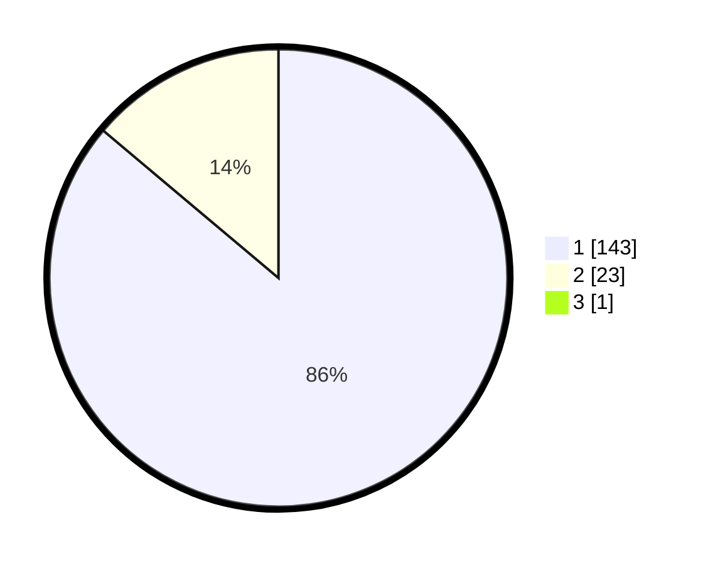

# Hasil

## Grafik

## Tabel

| No. | Nama Paslon    | Suara | Suara (raw) | Persentase |
|:--- |:-------------- | -----:| -----------:| ----------:|
| 1   | ANIES MUHAIMIN | 143   | [143][p-1]  | 85,63      |
| 2   | PRABOWO GIBRAN | 23    | [23][p-2]   | 13,77      |
| 3   | GANJAR MAHFUD  | 1     | [1][p-3]    | 0,60       |

[p-1]: https://github.com/gigit-pemilu/pemilu-2024/blob/main/pilpres/hitung-suara/sub/11-aceh/sub/08-aceh-utara/sub/01-baktiya/sub/2015-matang-raya-timu/sub/001-tps/sub/paslon-1.txt
[p-2]: https://github.com/gigit-pemilu/pemilu-2024/blob/main/pilpres/hitung-suara/sub/11-aceh/sub/08-aceh-utara/sub/01-baktiya/sub/2015-matang-raya-timu/sub/001-tps/sub/paslon-2.txt
[p-3]: https://github.com/gigit-pemilu/pemilu-2024/blob/main/pilpres/hitung-suara/sub/11-aceh/sub/08-aceh-utara/sub/01-baktiya/sub/2015-matang-raya-timu/sub/001-tps/sub/paslon-3.txt

## Foto C Plano

https://sirekap-obj-formc.kpu.go.id/0293/pemilu/ppwp/11/08/01/20/15/1108012015001-20240220-145152--e8ce2ca1-d10e-4ce2-a051-f288b021b677.jpg

https://sirekap-obj-formc.kpu.go.id/0293/pemilu/ppwp/11/08/01/20/15/1108012015001-20240220-144933--df5f3013-7521-4724-a53b-1bcc5ca9760b.jpg

https://sirekap-obj-formc.kpu.go.id/0293/pemilu/ppwp/11/08/01/20/15/1108012015001-20240220-145025--fbab46ba-ff28-42cf-b925-fb63ffaea840.jpg

## Metadata

| Key        | Value               |
| ---------- | ------------------- |
| Time Stamp | 2024-02-25 11:00:00 |

