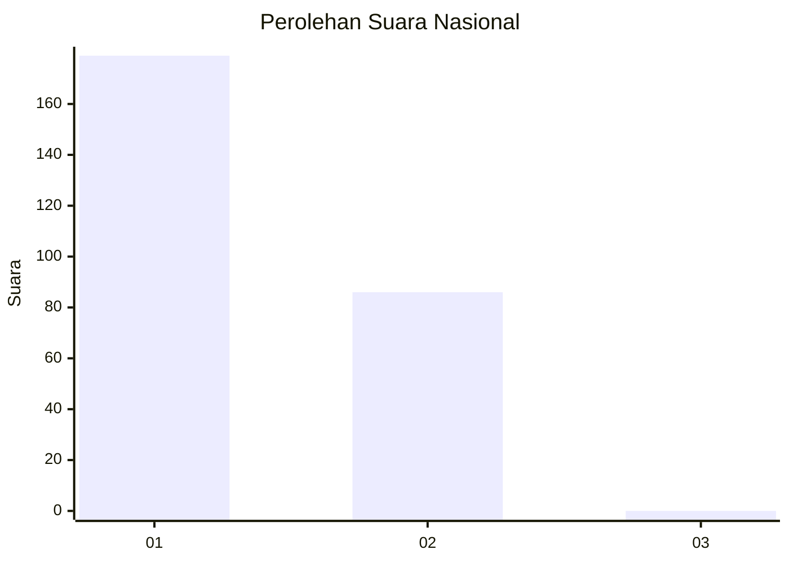
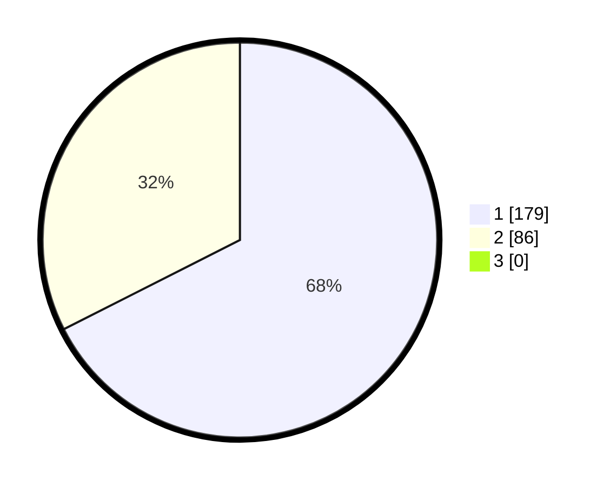

# Hasil

## Grafik

## Tabel

| No. | Nama Paslon    | Suara | Suara (raw) | Persentase |
|:--- |:-------------- | -----:| -----------:| ----------:|
| 1   | ANIES MUHAIMIN | 179   | [179][p-1]  | 67,55      |
| 2   | PRABOWO GIBRAN | 86    | [86][p-2]   | 32,45      |
| 3   | GANJAR MAHFUD  | 0     | [0][p-3]    | 0,00       |

[p-1]: https://github.com/gigit-pemilu/pemilu-2024/blob/main/pilpres/hitung-suara/sub/11-aceh/sub/08-aceh-utara/sub/01-baktiya/sub/2016-matang-raya-barat/sub/002-tps/sub/paslon-1.txt
[p-2]: https://github.com/gigit-pemilu/pemilu-2024/blob/main/pilpres/hitung-suara/sub/11-aceh/sub/08-aceh-utara/sub/01-baktiya/sub/2016-matang-raya-barat/sub/002-tps/sub/paslon-2.txt
[p-3]: https://github.com/gigit-pemilu/pemilu-2024/blob/main/pilpres/hitung-suara/sub/11-aceh/sub/08-aceh-utara/sub/01-baktiya/sub/2016-matang-raya-barat/sub/002-tps/sub/paslon-3.txt

## Foto C Plano

https://sirekap-obj-formc.kpu.go.id/e3bc/pemilu/ppwp/11/08/01/20/16/1108012016002-20240220-140746--00f27a14-6cfc-4358-9889-46312f09863e.jpg

https://sirekap-obj-formc.kpu.go.id/e3bc/pemilu/ppwp/11/08/01/20/16/1108012016002-20240220-141456--d5d8e54c-cbd1-4ec0-b739-c1883faee88d.jpg

https://sirekap-obj-formc.kpu.go.id/e3bc/pemilu/ppwp/11/08/01/20/16/1108012016002-20240220-141628--c711fda5-8dd2-4d07-b0f5-70bbb521e495.jpg

## Metadata

| Key        | Value               |
| ---------- | ------------------- |
| Time Stamp | 2024-02-24 22:31:28 |

