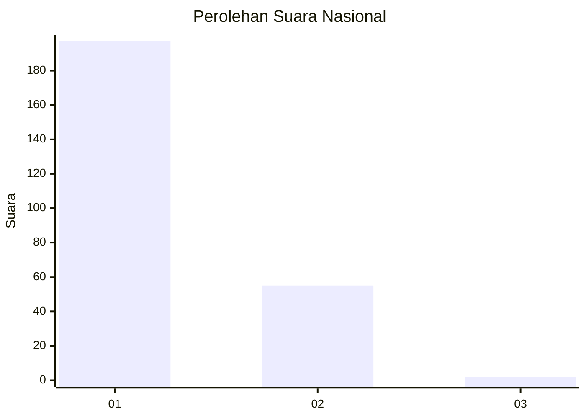
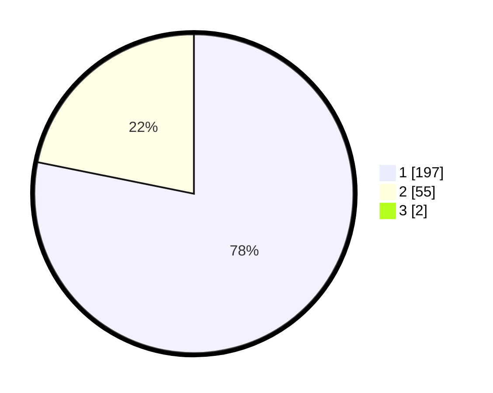

# Hasil

## Grafik

## Tabel

| No. | Nama Paslon    | Suara | Suara (raw) | Persentase |
|:--- |:-------------- | -----:| -----------:| ----------:|
| 1   | ANIES MUHAIMIN | 197   | [197][p-1]  | 77,56      |
| 2   | PRABOWO GIBRAN | 55    | [55][p-2]   | 21,65      |
| 3   | GANJAR MAHFUD  | 2     | [2][p-3]    | 0,79       |

[p-1]: https://github.com/gigit-pemilu/pemilu-2024/blob/main/pilpres/hitung-suara/sub/11-aceh/sub/08-aceh-utara/sub/01-baktiya/sub/2018-alue-buya/sub/002-tps/sub/paslon-1.txt
[p-2]: https://github.com/gigit-pemilu/pemilu-2024/blob/main/pilpres/hitung-suara/sub/11-aceh/sub/08-aceh-utara/sub/01-baktiya/sub/2018-alue-buya/sub/002-tps/sub/paslon-2.txt
[p-3]: https://github.com/gigit-pemilu/pemilu-2024/blob/main/pilpres/hitung-suara/sub/11-aceh/sub/08-aceh-utara/sub/01-baktiya/sub/2018-alue-buya/sub/002-tps/sub/paslon-3.txt

## Foto C Plano

https://sirekap-obj-formc.kpu.go.id/5386/pemilu/ppwp/11/08/01/20/18/1108012018002-20240215-165328--94ea3bd3-9050-48cf-8e67-3a481c37953f.jpg

https://sirekap-obj-formc.kpu.go.id/5386/pemilu/ppwp/11/08/01/20/18/1108012018002-20240215-165457--78be837d-437c-4aee-ab10-949690a5b84c.jpg

https://sirekap-obj-formc.kpu.go.id/5386/pemilu/ppwp/11/08/01/20/18/1108012018002-20240215-165624--06c66fd7-7440-43cd-8721-708dc4da11f9.jpg

## Metadata

| Key        | Value               |
| ---------- | ------------------- |
| Time Stamp | 2024-02-16 23:00:00 |

