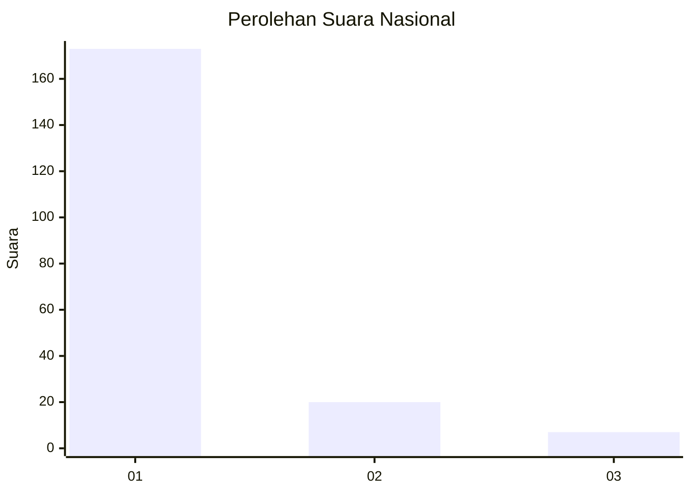
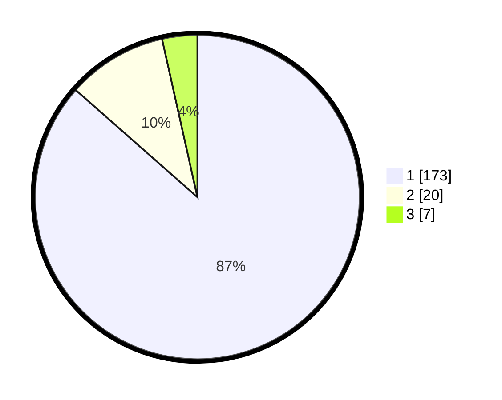

# Hasil

## Grafik

## Tabel

| No. | Nama Paslon    | Suara | Suara (raw) | Persentase |
|:--- |:-------------- | -----:| -----------:| ----------:|
| 1   | ANIES MUHAIMIN | 173   | [173][p-1]  | 86,50      |
| 2   | PRABOWO GIBRAN | 20    | [20][p-2]   | 10,00      |
| 3   | GANJAR MAHFUD  | 7     | [7][p-3]    | 3,50       |

[p-1]: https://github.com/gigit-pemilu/pemilu-2024/blob/main/pilpres/hitung-suara/sub/11-aceh/sub/08-aceh-utara/sub/01-baktiya/sub/2019-matang-cut/sub/001-tps/sub/paslon-1.txt
[p-2]: https://github.com/gigit-pemilu/pemilu-2024/blob/main/pilpres/hitung-suara/sub/11-aceh/sub/08-aceh-utara/sub/01-baktiya/sub/2019-matang-cut/sub/001-tps/sub/paslon-2.txt
[p-3]: https://github.com/gigit-pemilu/pemilu-2024/blob/main/pilpres/hitung-suara/sub/11-aceh/sub/08-aceh-utara/sub/01-baktiya/sub/2019-matang-cut/sub/001-tps/sub/paslon-3.txt

## Foto C Plano

https://sirekap-obj-formc.kpu.go.id/56fe/pemilu/ppwp/11/08/01/20/19/1108012019001-20240215-200312--1a838694-0999-42e7-bf54-d8e0a0f7d2ec.jpg

https://sirekap-obj-formc.kpu.go.id/56fe/pemilu/ppwp/11/08/01/20/19/1108012019001-20240215-200552--ed9d38b1-6460-4173-89f3-547a8cc8322c.jpg

## Metadata

| Key        | Value               |
| ---------- | ------------------- |
| Time Stamp | 2024-02-16 23:00:00 |

