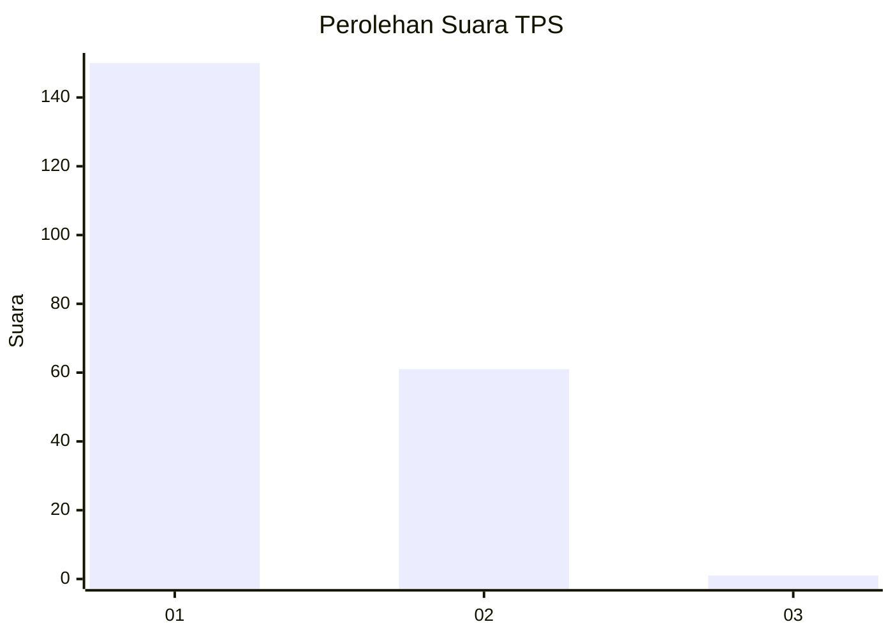
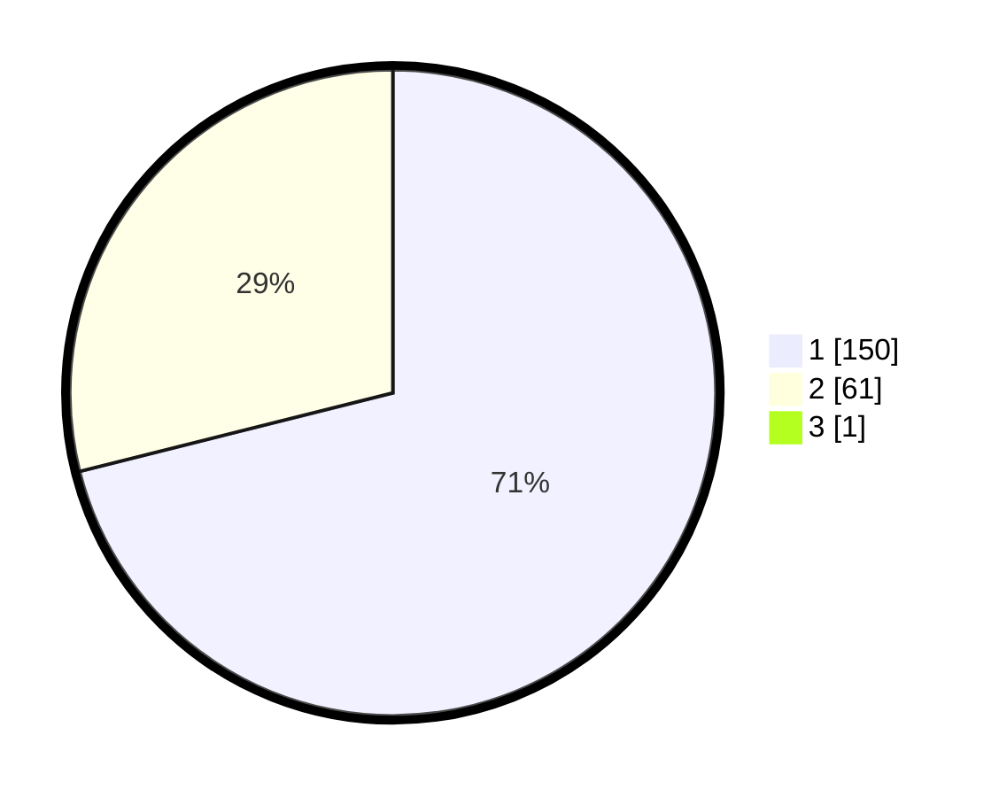

# Hasil

## Grafik

## Tabel

| No. | Nama Paslon    | Suara | Suara (raw) | Persentase |
|:--- |:-------------- | -----:| -----------:| ----------:|
| 1   | ANIES MUHAIMIN | 150   | [150][p-1]  | 70,75      |
| 2   | PRABOWO GIBRAN | 61    | [61][p-2]   | 28,77      |
| 3   | GANJAR MAHFUD  | 1     | [1][p-3]    | 0,47       |

[p-1]: https://github.com/gigit-pemilu/pemilu-2024-11-aceh/blob/main/pilpres/hitung-suara/sub/11-aceh/sub/08-aceh-utara/sub/01-baktiya/sub/2019-matang-cut/sub/002-tps/sub/paslon-1.txt
[p-2]: https://github.com/gigit-pemilu/pemilu-2024-11-aceh/blob/main/pilpres/hitung-suara/sub/11-aceh/sub/08-aceh-utara/sub/01-baktiya/sub/2019-matang-cut/sub/002-tps/sub/paslon-2.txt
[p-3]: https://github.com/gigit-pemilu/pemilu-2024-11-aceh/blob/main/pilpres/hitung-suara/sub/11-aceh/sub/08-aceh-utara/sub/01-baktiya/sub/2019-matang-cut/sub/002-tps/sub/paslon-3.txt

## Foto C Plano

https://sirekap-obj-formc.kpu.go.id/53a8/pemilu/ppwp/11/08/01/20/19/1108012019002-20240216-171239--b822a8a4-7506-40da-b9aa-9255a569e2cb.jpg

https://sirekap-obj-formc.kpu.go.id/53a8/pemilu/ppwp/11/08/01/20/19/1108012019002-20240216-171257--25b47dc5-82f7-426c-a343-ee1fd9505e46.jpg

https://sirekap-obj-formc.kpu.go.id/53a8/pemilu/ppwp/11/08/01/20/19/1108012019002-20240216-171324--dcd715b5-567a-4a4e-a98b-56ef369d3426.jpg

## Metadata

| Key        | Value               |
| ---------- | ------------------- |
| Time Stamp | 2024-02-16 23:00:00 |

