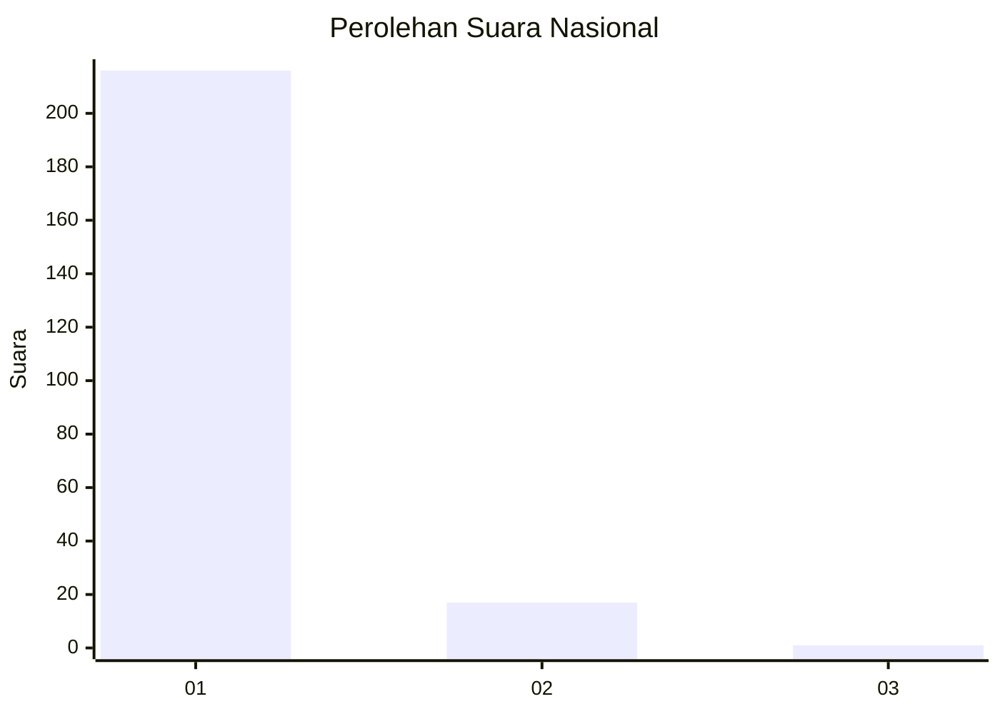
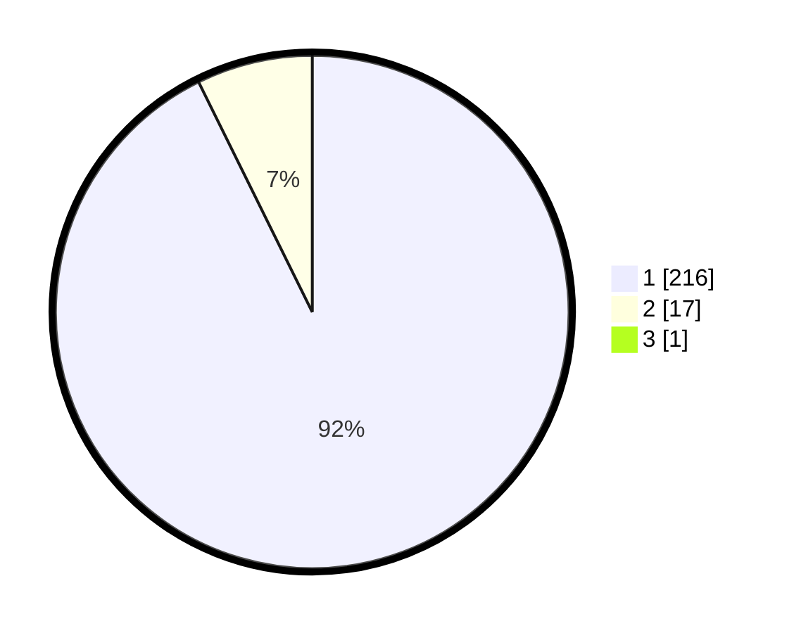

# Hasil

## Grafik

## Tabel

| No. | Nama Paslon    | Suara | Suara (raw) | Persentase |
|:--- |:-------------- | -----:| -----------:| ----------:|
| 1   | ANIES MUHAIMIN | 216   | [216][p-1]  | 92,31      |
| 2   | PRABOWO GIBRAN | 17    | [17][p-2]   | 7,26       |
| 3   | GANJAR MAHFUD  | 1     | [1][p-3]    | 0,43       |

[p-1]: https://github.com/gigit-pemilu/pemilu-2024/blob/main/pilpres/hitung-suara/sub/11-aceh/sub/08-aceh-utara/sub/01-baktiya/sub/2021-meudang-ara/sub/001-tps/sub/paslon-1.txt
[p-2]: https://github.com/gigit-pemilu/pemilu-2024/blob/main/pilpres/hitung-suara/sub/11-aceh/sub/08-aceh-utara/sub/01-baktiya/sub/2021-meudang-ara/sub/001-tps/sub/paslon-2.txt
[p-3]: https://github.com/gigit-pemilu/pemilu-2024/blob/main/pilpres/hitung-suara/sub/11-aceh/sub/08-aceh-utara/sub/01-baktiya/sub/2021-meudang-ara/sub/001-tps/sub/paslon-3.txt

## Foto C Plano

https://sirekap-obj-formc.kpu.go.id/8cd7/pemilu/ppwp/11/08/01/20/21/1108012021001-20240219-173108--6fe38af8-bf6b-476d-9754-162dc8ab9a22.jpg

https://sirekap-obj-formc.kpu.go.id/8cd7/pemilu/ppwp/11/08/01/20/21/1108012021001-20240215-044209--121379c8-9a0f-468b-bc7e-1f14222462a0.jpg

https://sirekap-obj-formc.kpu.go.id/8cd7/pemilu/ppwp/11/08/01/20/21/1108012021001-20240215-044321--4af27391-d3f4-4067-af8f-cf4261acdf03.jpg

## Metadata

| Key        | Value               |
| ---------- | ------------------- |
| Time Stamp | 2024-02-19 18:00:00 |

